# Catalog Pipeline Architecture

> Comprehensive documentation of the Abundance two-layer AI pipeline — from photo capture to inventory display.

---

## Table of Contents

1. [Executive Summary](#1-executive-summary)
2. [System Architecture](#2-system-architecture)
   - 2.5 [On-Device Pre-Processing (Sweep Mode)](#25-on-device-pre-processing-sweep-mode)
3. [Photo Capture & Upload](#3-photo-capture--upload)
4. [Layer 1: Object Detection](#4-layer-1-object-detection)
5. [Catalog Button Action](#5-catalog-button-action)
6. [Layer 2: Product Cataloging](#6-layer-2-product-cataloging)
7. [Re-catalog (Rescan)](#7-re-catalog-rescan)
8. [Deep Scan](#8-deep-scan)
9. [Data Model](#9-data-model)
10. [Storage Architecture](#10-storage-architecture)
11. [Status State Machine](#11-status-state-machine)
12. [Cost Model](#12-cost-model)

---

## 1. Executive Summary

Abundance uses a **two-layer AI pipeline** to transform photos into structured inventory entries:

- **Layer 1 (Detection):** Gemini 3 Flash identifies and locates objects in photos, producing bounding boxes and cropped images.
- **Layer 2 (Cataloging):** Gemini 3 Pro catalogs each detected object using tool calling (Google Lens, barcode lookup, web search) to produce rich product metadata with pricing.

The pipeline is fully serverless, running as Firebase Cloud Functions triggered by Firestore document changes. The iOS app communicates via Firestore realtime listeners, providing live status updates as objects move through detection and cataloging.

**Key metrics:**
- First catalog cost: ~$0.042/item
- Re-catalog cost: ~$0.018/item (context cache savings)
- Deep scan cost: ~$0.044/item
- Detection latency: ~3-8s per photo
- Cataloging latency: ~5-15s per item

---

## 2. System Architecture

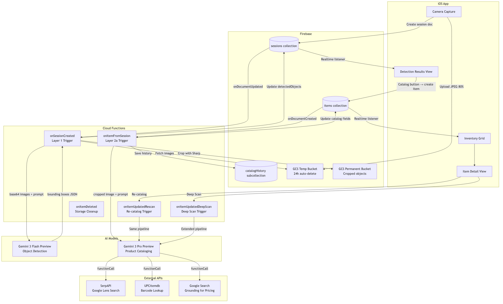

The system consists of five component groups:

### iOS App
- **Camera Capture** — AVFoundation-based capture with single (double-tap) and burst (long-press) modes
- **EdgeTAMFeature** — On-device CoreML segmentation module for sweep capture mode (A17 Pro+ devices). Runs EdgeTAM image encoder on keyframes, prompt encoder + mask decoder on user taps for real-time segment selection.
- **Detection Results View** — Displays bounding boxes over photos, allows object selection for cataloging
- **Inventory Grid** — LazyVGrid display of cataloged items with status indicators
- **Item Detail View** — Full item detail with re-catalog and deep scan actions

### Firebase
- **sessions/** collection — Capture sessions with detection results
- **items/** collection — Cataloged inventory items
- **catalogHistory** subcollection — Audit trail of catalog attempts per item
- **GCS Temp Bucket** — Original photos with 24h auto-delete lifecycle rule
- **GCS Permanent Bucket** — Cropped object images retained permanently

### Cloud Functions
| Function | Trigger | Purpose |
|----------|---------|---------|
| `onSessionCreated` | `sessions/{id}` updated, status=detecting | Layer 1 detection pipeline (sweep branch: skips detection, labeling only) |
| `onItemFromSession` | `items/{id}` created, fromDetection=true | Layer 2 cataloging pipeline |
| `onItemUpdatedRescan` | `items/{id}` updated, status→pending | Re-catalog with history context |
| `onItemUpdatedDeepScan` | `items/{id}` updated, deepScanRequested=true | Extended catalog with all tools |
| `onItemDeleted` | `items/{id}` deleted | Storage cleanup (crop files) |

### AI Models
- **Gemini 3 Flash Preview** — Object detection (Layer 1)
- **Gemini 3 Pro Preview** — Product cataloging (Layer 2)

### External APIs
- **SerpAPI** — Google Lens visual search for product identification
- **UPCitemdb** — Barcode/UPC lookup for product details
- **Google Search** — Grounding for current market pricing

---

## 2.5 On-Device Pre-Processing (Sweep Mode)

Sweep mode adds an on-device segmentation step that runs **before** the cloud pipeline. The user points their camera at a shelf and pans across it. EdgeTAM, a CoreML port of Meta's segment-anything model, runs per-frame segmentation and shows real-time object contours. The user taps segments to select items, and the selected crops flow through the existing Layer 1 (Flash) and Layer 2 (Pro) pipeline.

### Pipeline Position

```
                        ON-DEVICE                          CLOUD (existing)
                    +---------------------+          +---------------------+
                    |   Sweep Mode        |          |   Layer 1           |
Camera frames ----> |   EdgeTAM CoreML    |--crops-->|   Gemini 3 Flash    |
  (30 FPS)          |   (1-16 FPS)        |          |   (labeling only)   |
                    +---------------------+          +---------------------+
                              |                                |
                        User taps to                     +---------------------+
                        select segments                  |   Layer 2           |
                                                         |   Gemini 3 Pro      |
                                                         |   (cataloging)      |
                                                         +---------------------+
```

When `captureMode === "sweep"`, the `onSessionCreated` Cloud Function skips Layer 1 bounding box detection (crops are pre-provided by EdgeTAM) and runs Gemini Flash for **labeling only**, reducing Layer 1 cost by ~50%.

### EdgeTAM CoreML Architecture

EdgeTAM uses three CoreML models (~20 MB total), loaded lazily on sweep mode entry:

| Component | Input | Output | Size | Latency |
|-----------|-------|--------|------|---------|
| Image Encoder | 1024x1024 RGB image | 256-channel feature map (64x64) | ~10 MB | 60-900ms (bottleneck) |
| Prompt Encoder | Up to 4 points + 1 box + 1 mask | Sparse + dense embeddings | ~2 MB | <5ms |
| Mask Decoder | Encoder features + prompt embeddings | Segmentation mask + IoU score | ~8 MB | 5-15ms |

The key optimization is **encode-once/decode-on-tap**: the image encoder runs on keyframes only (~every 0.5s), while prompt encoder + mask decoder run per user tap (~15ms total, feels instant).

All models load with `computeUnits = .all` to leverage CPU + GPU + Neural Engine. The `EdgeTAMService` actor serializes all model access for thread safety.

### Device Eligibility

Sweep mode requires A17 Pro Neural Engine (35 TOPS) or later. `DeviceEligibility.isSweepModeAvailable` checks the hardware identifier:

| Device | Machine ID | Eligible |
|--------|-----------|----------|
| iPhone 15 Pro | iPhone16,1 | Yes |
| iPhone 15 Pro Max | iPhone16,2 | Yes |
| iPhone 16 Pro | iPhone17,1 / iPhone17,3 | Yes |
| iPhone 16 Pro Max | iPhone17,2 / iPhone17,4 | Yes |
| Future iPhone 18+ | iPhone18,x+ | Yes (future-proofed) |
| Non-Pro iPhones | any other | No |
| Simulator | any | Yes (for testing) |

The `SweepModeToggle` view only shows the sweep option on eligible devices.

### Frame Scheduling

`FrameScheduler` is an actor that decides which camera frames get encoded. At 30 FPS, running the image encoder every frame is impossible. Instead:

1. **First frame** is always a keyframe (encoded immediately).
2. **Subsequent frames** are encoded only if `keyframeInterval` (default 0.5s) has elapsed since the last keyframe.
3. Between keyframes, cached features from the most recent `encodeFrame()` call are reused for mask decoding.
4. The scheduler tracks a `currentFrameIndex` for associating segments with their source keyframe.

The feature cache in `EdgeTAMService` is capped at 3 entries (FIFO eviction).

### Sweep State Machine

`SweepCaptureViewModel` (`@MainActor @Observable`) manages the sweep lifecycle:

```
inactive -> loading -> scanning -> reviewing -> uploading -> processing -> complete
                                                                       -> error
```

| State | Description |
|-------|-------------|
| `inactive` | Sweep mode not active |
| `loading` | EdgeTAM models loading (~200ms) |
| `scanning` | Camera feed active, segments appearing as user pans |
| `reviewing` | User tapping segments to select/deselect |
| `uploading(progress)` | Cropping and uploading selected segments to GCS |
| `processing` | Firestore session created, waiting for cloud pipeline |
| `complete` | All items cataloged |
| `error` | Model load or upload failure |

Selection management provides haptic feedback: `.medium` impact on select, `.light` on deselect. The `canCatalog` flag enables the catalog button when at least one segment is selected.

### Spatial Deduplication

When the user pans across a shelf and back, the same object may appear in multiple frames. `ObjectDeduplicator` (actor-isolated) prevents double-selection with two tiers:

**Tier 1 -- VNFeaturePrint (visual similarity):**
- Uses `VNGenerateImageFeaturePrintRequest` (iOS 17+) to generate perceptual hashes.
- Compares fingerprints using `computeDistance()`. Objects within 10% distance (i.e., `similarityThreshold = 0.90`) are considered duplicates.
- Cache: Up to 50 entries, 2-minute TTL, automatic FIFO eviction.

**Tier 2 -- ARKit spatial position (3D world coordinates):**
- If `SweepARSessionManager` is active, each segment center is projected to a 3D world position via `ARSession.raycast()`.
- Segments within 15cm (`threshold = 0.15` meters) in world space are the same object regardless of visual appearance.
- Spatial cache: Up to 200 entries, same 2-minute TTL.

If ARKit is unavailable, the system falls back gracefully to visual-only deduplication.

### ARKit Session

`SweepARSessionManager` (`@MainActor`, `ARSessionDelegate`) manages an optional `ARWorldTrackingConfiguration` during sweep mode:

- Starts tracking on sweep mode entry with horizontal + vertical plane detection.
- Publishes `cameraTransform` (6DOF pose) and `trackingState` via `@Published` properties.
- Provides `worldPosition(for:)` to project normalized 2D points to 3D world coordinates using raycasting against estimated planes.
- Extracts only lightweight primitives (`simd_float4x4`, tracking state enum) from `ARFrame` delegate callbacks -- never retains the full `ARFrame` (~1-4 MB) across isolation boundaries.
- Stops and releases the AR session on sweep mode exit.

### Performance-Adaptive UX

The sweep UI degrades gracefully based on measured EdgeTAM inference FPS:

| Measured FPS | Tier | Experience |
|-------------|------|------------|
| 10+ FPS | `premium` | Segments update smoothly, real-time AR-like overlay |
| 4-10 FPS | `good` | Slight lag, fully usable |
| 1-4 FPS | `acceptable` | Segments appear in snapshots every ~1s; camera preview stays smooth at 30 FPS |
| <1 FPS | `fallback` | Auto-switch to tap-to-scan mode (user taps a region, EdgeTAM processes that single frame) |

`SweepCaptureViewModel.performanceTier` is a computed property derived from `measuredFPS`.

### Memory Pressure Handling

`EdgeTAMService` monitors `UIApplication.didReceiveMemoryWarningNotification` via an async notification stream:

- **On memory warning:** Clears the feature cache (up to 3 entries) but keeps models loaded. This releases cached `MLMultiArray` data while preserving the ability to encode new frames.
- **Feature cache budget:** 3 entries maximum, 200 MB memory cap.
- **On sweep mode exit:** `unload()` releases all three models and clears the cache entirely.
- **On `deinit`:** The memory monitoring task is cancelled.

---

## 3. Photo Capture & Upload

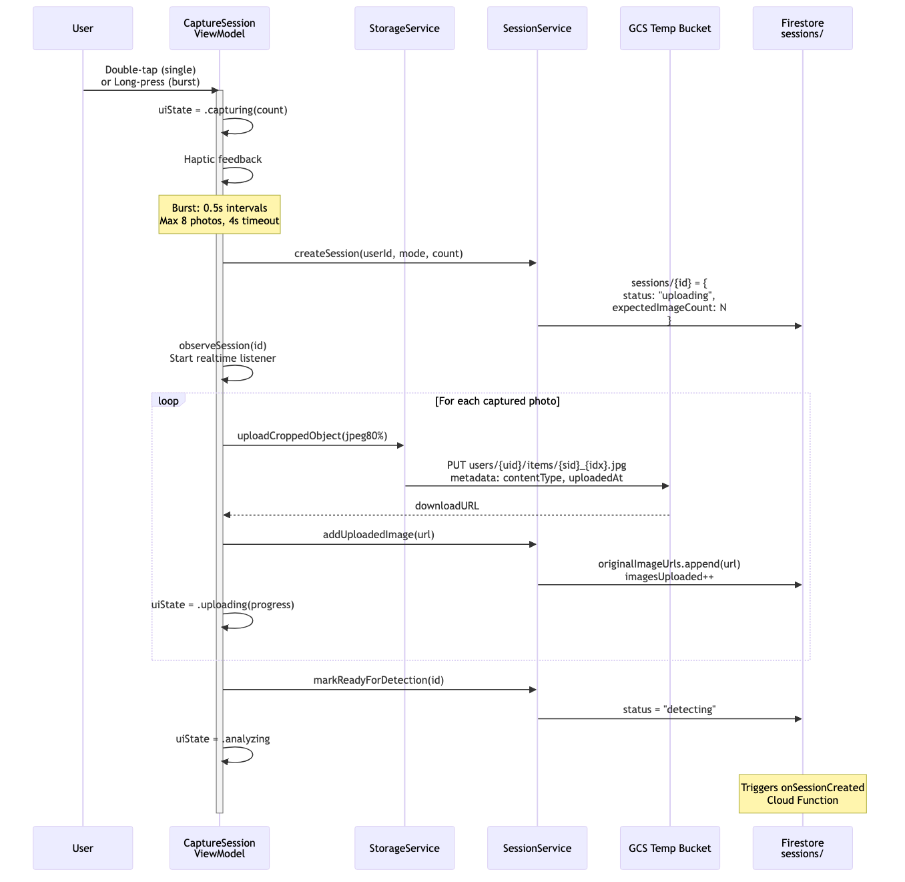

### Capture Modes

| Mode | Gesture | Behavior |
|------|---------|----------|
| Single | Double-tap | Captures one photo |
| Burst | Long-press | Captures up to 8 photos at 0.5s intervals, 4s timeout |
| Sweep | Toggle sweep mode | Real-time on-device segmentation, user taps segments to select |

### Upload Pipeline

1. **Capture:** `CaptureSessionViewModel` captures photos via AVFoundation
2. **Compress:** JPEG at 80% quality
3. **Create session:** Firestore document at `sessions/{id}` with:
   ```json
   {
     "userId": "string",
     "captureMode": "single|burst|sweep",
     "status": "uploading",
     "expectedImageCount": 1-8,
     "imagesUploaded": 0,
     "originalImageUrls": [],
     "sweepCrops": [
       {
         "cropUrl": "string",
         "boundingBox": [0, 0, 0, 0],
         "frameIndex": 0,
         "groupId": "string"
       }
     ],
     "createdAt": "timestamp"
   }
   ```
4. **Start listener:** `observeSession(id)` for realtime updates
5. **Upload loop:** For each photo:
   - Upload to GCS temp bucket: `sessions/{sessionId}/{imageIndex}.jpg`
   - Metadata: `contentType: image/jpeg`, `uploadedAt: timestamp`
   - Append download URL to `originalImageUrls`
   - Increment `imagesUploaded`
   - Update UI: `.uploading(progress)`
6. **Mark ready:** Set `status = "detecting"` → triggers `onSessionCreated`

### Status Transitions
`uploading` → `detecting` (all images uploaded)

---

## 4. Layer 1: Object Detection

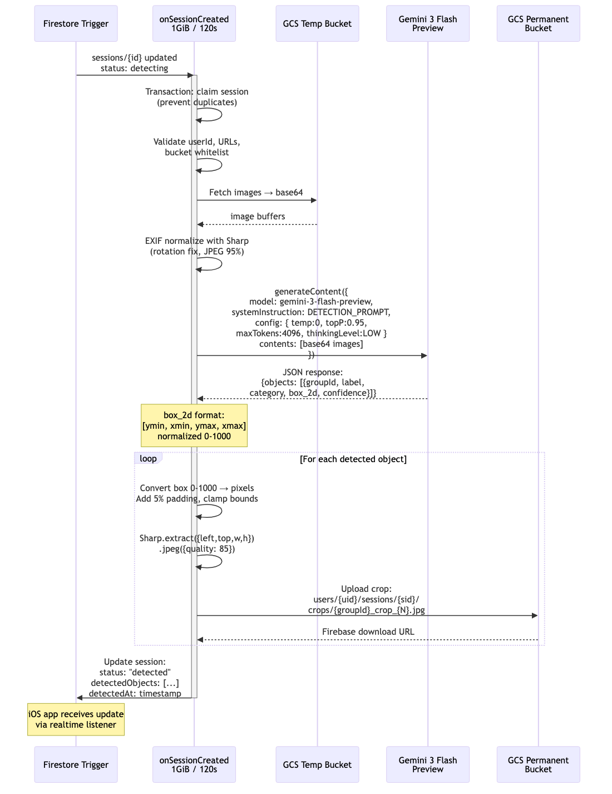
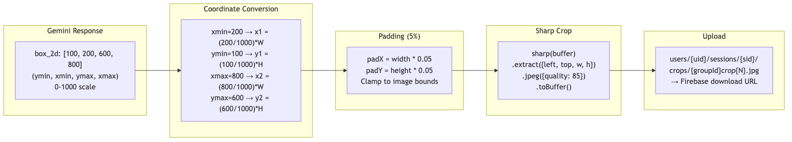

### Cloud Function: `onSessionCreated`
- **Runtime:** 1GiB memory, 120s timeout
- **Trigger:** `sessions/{id}` document updated with `status: "detecting"`
- **Sweep branch:** When `captureMode === "sweep"`, crops are pre-provided via `sweepCrops`. The function skips bounding box detection and runs Gemini Flash for labeling only, reducing Layer 1 cost by ~50%.

### Model Configuration
```
Model: gemini-3-flash-preview
Temperature: 0
Top-P: 0.95
Max Output Tokens: 4096
Thinking Level: LOW
```

### System Prompt

```
You are an object detection system for a home inventory app.

TASK: Analyze the provided image(s) and identify all distinct physical objects suitable for cataloging.

DETECTION RULES:
1. Detect objects that could be inventoried (furniture, electronics, appliances, tools, books, clothing, etc.)
2. Ignore: walls, floors, ceilings, windows, built-in fixtures, people, pets
3. For each object, provide a bounding box as [ymin, xmin, ymax, xmax] normalized to 0-1000
4. Provide a specific label (e.g., "leather armchair" not just "chair")

CRITICAL - BOUNDING BOX ACCURACY:
Each bounding box MUST accurately frame ONLY the specific object described by its label.
- Double-check that [ymin, xmin, ymax, xmax] coordinates enclose ONLY the labeled item
- Do NOT include adjacent objects in a bounding box
- If two objects are close together, draw SEPARATE tight boxes around each one
- Verify the label matches what is INSIDE the bounding box, not nearby objects

MULTI-IMAGE RULES:
When given multiple images:
1. Identify if the SAME object appears in multiple photos (different angles)
2. Assign matching objects the same groupId
3. Different objects get different groupIds
4. Use visual similarity, position context, and reasoning to group

BOUNDING BOX FORMAT:
- box_2d: [ymin, xmin, ymax, xmax] where values are 0-1000
- ymin: top edge, ymax: bottom edge
- xmin: left edge, xmax: right edge

IF NO CATALOGABLE OBJECTS FOUND:
Return an empty array with a "reasoning" field explaining why.
```

### Processing Pipeline

1. **Claim session:** Firestore transaction prevents duplicate processing
2. **Validate:** userId, URLs, bucket whitelist
3. **Fetch images:** Download from GCS temp bucket → buffers
4. **EXIF normalize:** Sharp library fixes rotation, outputs JPEG 95%
5. **Send to Gemini:** Base64 images + system prompt
6. **Parse response:** JSON with detected objects array

### Bounding Box Format
```
box_2d: [ymin, xmin, ymax, xmax]
```
Values normalized 0-1000 (not pixels).

### Coordinate Conversion
```
x1 = (xmin / 1000) * imageWidth
y1 = (ymin / 1000) * imageHeight
x2 = (xmax / 1000) * imageWidth
y2 = (ymax / 1000) * imageHeight
```

### Cropping
For each detected object:
1. Convert 0-1000 coordinates to pixel coordinates
2. Add 5% padding: `padX = width * 0.05`, `padY = height * 0.05`
3. Clamp to image bounds
4. Crop with Sharp: `.extract({left, top, width, height}).jpeg({quality: 85})`
5. Upload to permanent bucket: `users/{uid}/sessions/{sid}/crops/{groupId}_crop_{N}.jpg`

### Firestore Update
```json
{
  "status": "detected",
  "detectedObjects": [
    {
      "groupId": "string",
      "label": "string",
      "category": "string",
      "box_2d": [100, 200, 600, 800],
      "confidence": 0.95,
      "sourceImageIndex": 0,
      "croppedImageUrls": ["https://..."],
      "attributes": {}
    }
  ],
  "detectedAt": "timestamp"
}
```

### Error Handling
- Exponential backoff: 1s, 2s, 4s delays
- Max 4 retries
- On permanent failure: `status = "failed"`, `failureReason` populated

---

## 5. Catalog Button Action

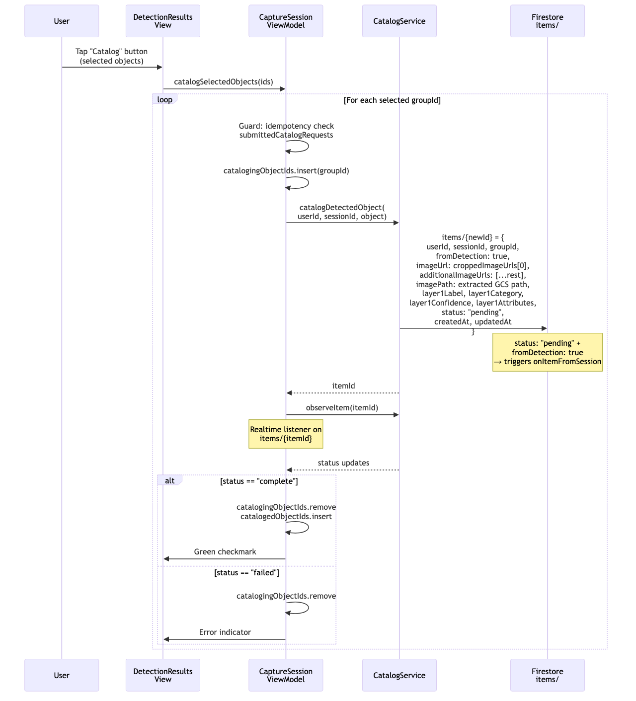

### User Flow
1. User views detection results with bounding boxes overlaid on photos
2. Selects one or more detected objects
3. Taps "Catalog" button

### Implementation

**Idempotency guard:** `submittedCatalogRequests` set tracks previously submitted groupIds to prevent duplicates.

For each selected `groupId`:

1. Add to `catalogingObjectIds` set (shows spinner in UI)
2. Call `CatalogService.catalogDetectedObject()` which creates item document:

```json
{
  "userId": "string",
  "sessionId": "string",
  "groupId": "string",
  "fromDetection": true,
  "imageUrl": "croppedImageUrls[0]",
  "additionalImageUrls": ["...rest"],
  "imagePath": "extracted GCS path",
  "layer1Label": "string",
  "layer1Category": "string",
  "layer1Confidence": 0.95,
  "layer1Attributes": {},
  "status": "pending",
  "createdAt": "timestamp",
  "updatedAt": "timestamp"
}
```

3. The combination `fromDetection: true` + `status: "pending"` routes to `onItemFromSession`
4. Start realtime listener on `items/{itemId}`
5. On `status == "complete"`: move from `catalogingObjectIds` to `catalogedObjectIds`, show green checkmark
6. On `status == "failed"`: remove from `catalogingObjectIds`, show error indicator

---

## 6. Layer 2: Product Cataloging

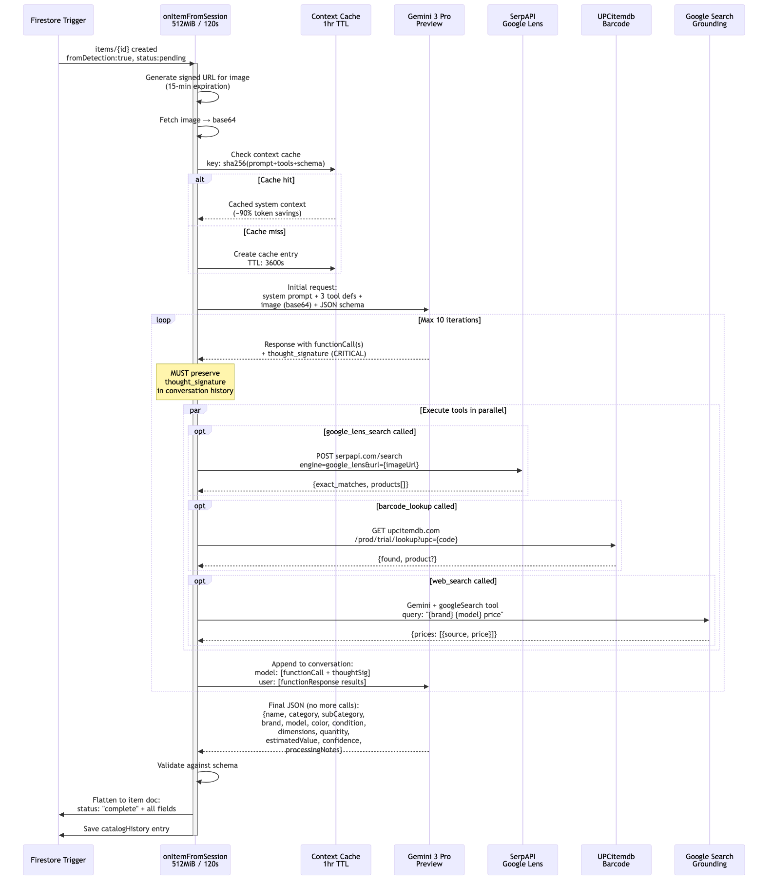

### Cloud Function: `onItemFromSession`
- **Runtime:** 512MiB memory, 120s timeout
- **Trigger:** `items/{id}` created with `fromDetection: true`, `status: "pending"`

### Model Configuration
```
Model: gemini-3-pro-preview
Temperature: 0.1
Top-P: 0.95
Max Output Tokens: 32768
```

### System Prompt

```
You are an expert product cataloger. Analyze the provided image and create detailed catalog entries.

WORKFLOW:
1. Examine the image carefully for:
   - Product type, category, and sub-category
   - Visible barcodes (if any)
   - Brand logos or text
   - Physical condition indicators
   - Size/dimension clues
   - Quantity (if multiple identical items)

2. If you see a barcode, use barcode_lookup to get product details.
   Always also use google_lens_search for verification and additional data.

3. Verify tool results against what you see:
   - Does the returned product match the image?
   - If mismatch, trust your visual analysis over tool results.

4. Once you have HIGH or MEDIUM confidence on product identity:
   - Use web_search to find current market prices
   - Search query format: "{brand} {model} {condition} price"

5. Return complete catalog entry(ies) with confidence level.

CONFIDENCE SCORING:
- "high": Google Lens returned exact_matches:true OR barcode lookup succeeded AND visual verification confirms
- "medium": Google Lens returned similar products but not exact, OR barcode lookup failed but Google Lens found likely match
- "low": Only related suggestions available, relying primarily on visual analysis

PRICING:
- Use SOLD prices when available (eBay sold listings)
- Apply condition multipliers to new retail price:
  - new: 1.0
  - like-new: 0.85
  - good: 0.65
  - fair: 0.45
  - poor: 0.25
- If no pricing found, set estimatedValue: null

OUTPUT FORMAT:
Return valid JSON matching the CatalogItem schema.
```

### Context Caching
- **Key:** `sha256(systemPrompt + toolDefinitions + outputSchema)`
- **TTL:** 3600s (1 hour)
- **Savings:** ~90% token reduction on cached system context
- Re-catalog with warm cache: $0.016 vs $0.04 cold

### Thought Signature Handling

> **CRITICAL Gemini 3 requirement:** When Gemini returns `thought_signature` in a response, it MUST be preserved exactly in the conversation history. Stripping or modifying thought signatures causes the model to lose reasoning context and produce degraded results.

Conversation history format:
```
model: [functionCall + thought_signature]
user:  [functionResponse results]
```

### Tool Definitions

#### `google_lens_search`
- **Provider:** SerpAPI
- **Request:** `POST serpapi.com/search?engine=google_lens&url={signedImageUrl}`
- **Response:** `{exact_matches: boolean, products: [{title, link, price, source}]}`

#### `barcode_lookup`
- **Provider:** UPCitemdb
- **Request:** `GET upcitemdb.com/prod/trial/lookup?upc={code}`
- **Response:** `{found: boolean, product?: {title, brand, category, description}}`

#### `web_search`
- **Provider:** Gemini + Google Search grounding
- **Request:** Gemini call with `googleSearch` tool, query: `"{brand} {model} price"`
- **Response:** `{prices: [{source, price, condition, url}]}`

### Tool Calling Loop
- **Max iterations:** 10
- Tools execute in parallel when multiple are called simultaneously
- Each iteration appends to conversation history (preserving thought signatures)
- Loop ends when Gemini returns final JSON with no function calls

### Confidence Scoring
| Level | Criteria |
|-------|----------|
| `high` | Google Lens exact match OR barcode lookup success + visual confirmation |
| `medium` | Similar products found, no exact match |
| `low` | Visual analysis only, no tool confirmation |

### Condition-Based Pricing Multipliers
| Condition | Multiplier |
|-----------|------------|
| new | 1.0 |
| like-new | 0.85 |
| good | 0.65 |
| fair | 0.45 |
| poor | 0.25 |

### Output Schema: CatalogItem
```json
{
  "name": "string",
  "category": "string",
  "subCategory": "string",
  "brand": "string|null",
  "model": "string|null",
  "color": "string|null",
  "condition": "new|like-new|good|fair|poor",
  "dimensions": "string|null",
  "quantity": 1,
  "estimatedValue": "number|null",
  "confidence": "high|medium|low",
  "processingNotes": "string"
}
```

### Firestore Write
The CatalogItem JSON is flattened directly onto the item document:
- All fields from the schema above are set at the top level
- `status` set to `"complete"`
- `completedAt` set to server timestamp

### Catalog History
Each catalog attempt creates a subcollection entry at `items/{id}/catalogHistory/{entryId}`:
```json
{
  "catalogedAt": "timestamp",
  "modelId": "gemini-3-pro-preview",
  "imageUrls": ["string"],
  "toolCalls": [
    {"tool": "google_lens_search", "input": {}, "output": {}},
    {"tool": "barcode_lookup", "input": {}, "output": {}},
    {"tool": "web_search", "input": {}, "output": {}}
  ],
  "result": { /* CatalogItem JSON */ },
  "metadata": {
    "inputTokens": 0,
    "outputTokens": 0,
    "totalTokens": 0,
    "cacheHit": true,
    "toolCallCount": 3,
    "iterationCount": 2
  }
}
```

---

## 7. Re-catalog (Rescan)

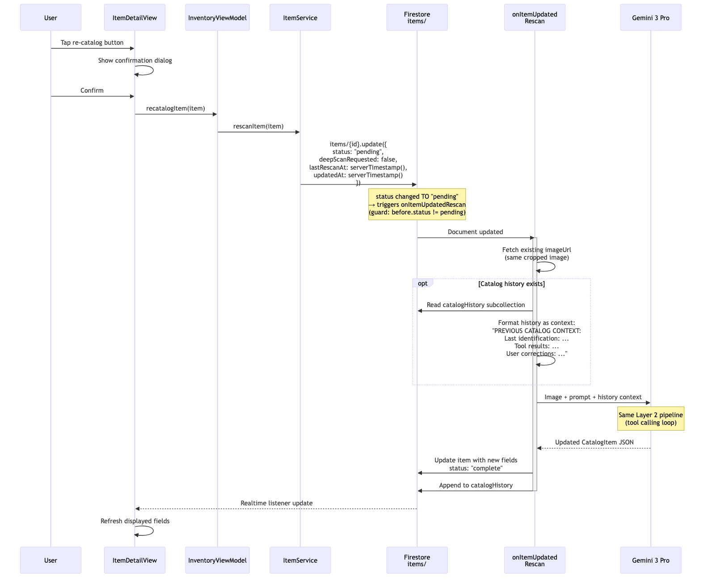

### Trigger
User taps re-catalog button in Item Detail View → confirmation dialog → `ItemService.rescanItem(item)`.

### Firestore Update
```json
{
  "status": "pending",
  "deepScanRequested": false,
  "lastRescanAt": "serverTimestamp()",
  "updatedAt": "serverTimestamp()"
}
```

### Cloud Function: `onItemUpdatedRescan`
- **Guard:** `before.status != "pending"` (prevents re-trigger loops)
- **Image:** Uses existing `imageUrl` — no new photo required
- **Pipeline:** Same Layer 2 tool calling loop

### History Context Injection
If catalog history exists, the prompt is prefixed with:

```
PREVIOUS CATALOG CONTEXT:
========================

Last identification ({timestamp}, confidence: {level}):
- Name: {name}
- Brand: {brand}
- Model: {model}
- Category: {category} > {subCategory}
- Condition: {condition}
- Estimated Value: ${value}

Tool results from previous attempt:
- barcode_lookup({code}): {result}
- google_lens_search: {result}
- web_search("{query}"): {result}

User corrections applied:
- {field}: "{old}" → "{new}" (user override)

========================

Now analyze the NEW image(s) below...
```

This gives Gemini Pro context about what was tried before and any user corrections, enabling it to make better-informed decisions on retry.

---

## 8. Deep Scan

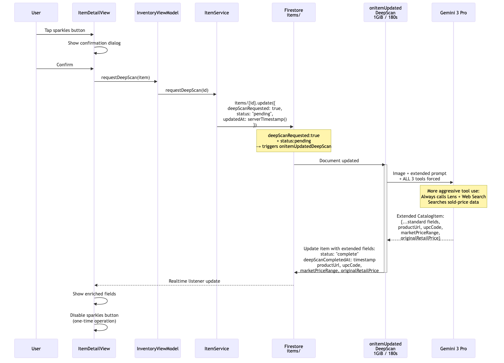

### Trigger
User taps sparkles button in Item Detail View → confirmation dialog → `ItemService.refreshItem(id)`.

### Firestore Update
```json
{
  "deepScanRequested": true,
  "status": "pending",
  "updatedAt": "serverTimestamp()"
}
```

### Cloud Function: `onItemUpdatedDeepScan`
- **Runtime:** 1GiB memory, 180s timeout (extended for thorough search)
- **Guard:** `deepScanRequested: true` + `status: "pending"`

### Differences from Standard Catalog
| Aspect | Standard (Layer 2a) | Deep Scan |
|--------|-------------------|-----------|
| Memory/Timeout | 512MiB / 120s | 1GiB / 180s |
| Tool usage | As needed | ALL 3 tools forced |
| Lens search | If helpful | Always executed |
| Web search | For pricing | Includes sold-price data |
| Extra fields | None | productUrl, upcCode, marketPriceRange, originalRetailPrice |

### Extended Output Fields
```json
{
  "...standard CatalogItem fields",
  "productUrl": "string|null",
  "upcCode": "string|null",
  "marketPriceRange": { "low": 0, "high": 0 },
  "originalRetailPrice": "number|null",
  "deepScanCompletedAt": "timestamp"
}
```

### One-Time Operation
Deep scan is a one-time operation per item. After completion:
- `deepScanCompletedAt` is set
- The sparkles button is disabled in the UI
- The item displays enriched fields (product URL, UPC, market range)

---

## 9. Data Model

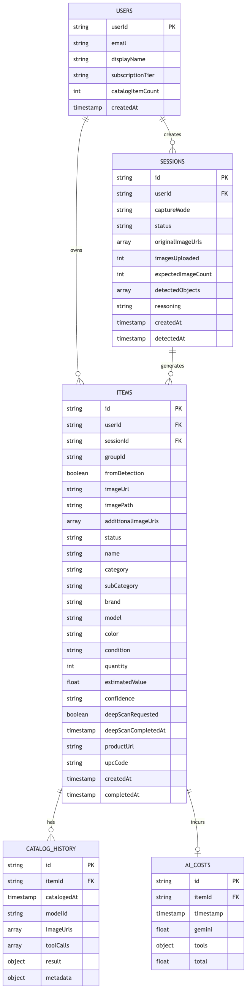

### `users/{userId}`
| Field | Type | Description |
|-------|------|-------------|
| `userId` | string | Firebase Auth UID |
| `email` | string | User email |
| `displayName` | string | Display name |
| `subscriptionTier` | string | `free`, `pro`, `premium` |
| `catalogItemCount` | int | Running count of items |
| `createdAt` | timestamp | Account creation time |

### `sessions/{sessionId}`
| Field | Type | Description |
|-------|------|-------------|
| `id` | string | Auto-generated document ID |
| `userId` | string | Owner's UID |
| `captureMode` | string | `single`, `burst`, or `sweep` |
| `status` | string | `uploading`, `detecting`, `detected`, `failed` |
| `originalImageUrls` | array[string] | Download URLs for original photos |
| `imagesUploaded` | int | Upload progress counter |
| `expectedImageCount` | int | Total photos to upload |
| `detectedObjects` | array[object] | Detection results (see Layer 1 output) |
| `sweepCrops` | array[object]? | Sweep mode crop metadata: `{cropUrl, boundingBox, frameIndex, groupId}` |
| `reasoning` | string | Gemini's detection reasoning |
| `createdAt` | timestamp | Session creation time |
| `detectedAt` | timestamp | Detection completion time |

### `items/{itemId}`
| Field | Type | Description |
|-------|------|-------------|
| `id` | string | Auto-generated document ID |
| `userId` | string | Owner's UID |
| `sessionId` | string | Source session ID |
| `groupId` | string | Detection group ID |
| `fromDetection` | boolean | True if created from detection pipeline |
| `imageUrl` | string | Primary cropped image URL |
| `imagePath` | string | GCS path for the image |
| `additionalImageUrls` | array[string] | Additional crop URLs |
| `status` | string | `pending`, `complete`, `failed`, `failed_layer2a`, `failed_layer2b` |
| `name` | string | Cataloged product name |
| `category` | string | Product category |
| `subCategory` | string | Product sub-category |
| `brand` | string? | Brand name |
| `model` | string? | Model identifier |
| `color` | string? | Color description |
| `condition` | string | `new`, `like-new`, `good`, `fair`, `poor` |
| `quantity` | int | Item count |
| `estimatedValue` | float? | Estimated market value (USD) |
| `confidence` | string | `high`, `medium`, `low` |
| `deepScanRequested` | boolean | Whether deep scan was requested |
| `deepScanCompletedAt` | timestamp? | Deep scan completion time |
| `productUrl` | string? | Product page URL (deep scan) |
| `upcCode` | string? | UPC/barcode (deep scan) |
| `createdAt` | timestamp | Item creation time |
| `completedAt` | timestamp? | Catalog completion time |

### `items/{itemId}/catalogHistory/{entryId}`
| Field | Type | Description |
|-------|------|-------------|
| `catalogedAt` | timestamp | When this catalog attempt ran |
| `modelId` | string | Gemini model used |
| `imageUrls` | array[string] | Images sent to model |
| `toolCalls` | array[object] | Tool invocations with inputs/outputs |
| `result` | object | Full CatalogItem JSON result |
| `metadata` | object | Token counts, cache hit, iteration count |

### `items/{itemId}/aiCosts/{costId}`
| Field | Type | Description |
|-------|------|-------------|
| `timestamp` | timestamp | When cost was incurred |
| `gemini` | float | Gemini API cost (USD) |
| `tools` | object | Per-tool costs: `{lens, barcode, web}` |
| `total` | float | Total cost for this operation |

---

## 10. Storage Architecture

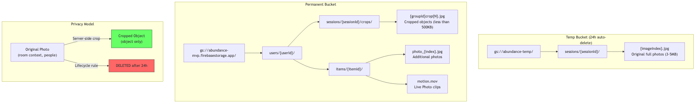

### Temp Bucket: `gs://abundance-temp/`
- **Purpose:** Original full-resolution photos
- **Lifecycle:** 24h auto-delete rule
- **Path format:** `sessions/{sessionId}/{imageIndex}.jpg`
- **File size:** 3-5MB per photo
- **Privacy:** Contains room context, potentially people — never retained long-term

### Permanent Bucket: `gs://abundance-mvp.firebasestorage.app/`
- **Purpose:** Cropped object images + additional user photos
- **Lifecycle:** Permanent (until item deleted)
- **Path formats:**
  - Crops: `users/{userId}/sessions/{sessionId}/crops/{groupId}_crop_{N}.jpg`
  - Additional photos: `users/{userId}/items/{itemId}/photo_{index}.jpg`
  - Live Photo clips: `users/{userId}/items/{itemId}/motion.mov`
- **File size:** <500KB per crop

### Privacy Model
1. **Original photos** (room context, potentially people) → stored in temp bucket
2. **Server-side cropping** extracts only the object → stored in permanent bucket
3. **Originals auto-deleted** after 24h via GCS lifecycle rule
4. Only **cropped objects** are retained — no room context or people

### URL Types
| Type | Expiration | Use Case |
|------|-----------|----------|
| Signed URL | 15 minutes | Gemini API image access during processing |
| Firebase Download URL | Permanent (with token) | iOS app display, stored in Firestore |

### Firebase Storage Security Rules
- Users can only read/write under their own `users/{userId}/` path
- Upload size limited per file
- Content type restricted to `image/*` and `video/*`

---

## 11. Status State Machine

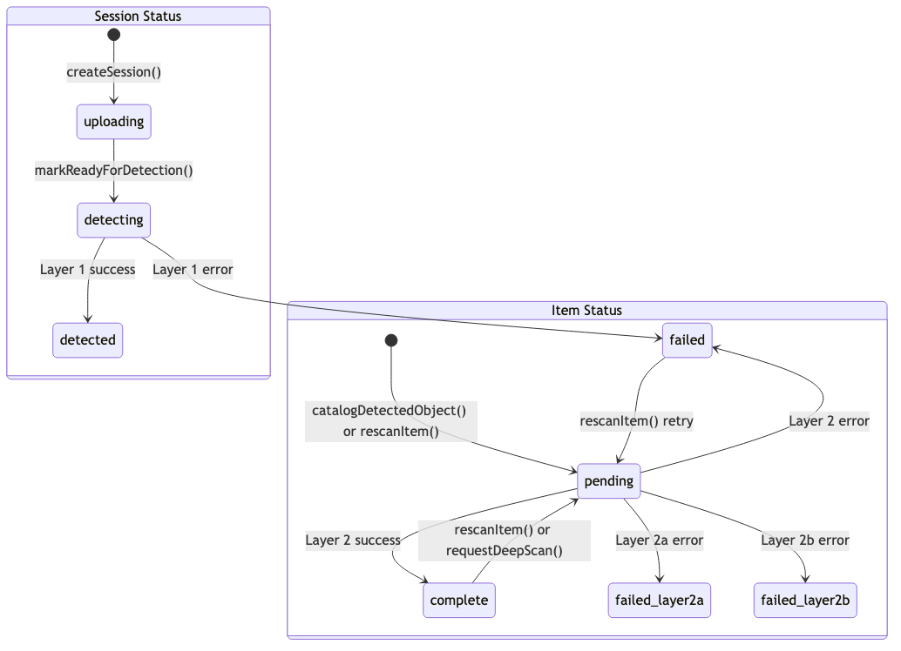

### Session Status Transitions
```
[created] → uploading → detecting → detected
                                   → failed
```

| Transition | Trigger |
|-----------|---------|
| → `uploading` | `createSession()` called |
| → `detecting` | `markReadyForDetection()` — all images uploaded |
| → `detected` | Layer 1 success — `detectedObjects` populated |
| → `failed` | Layer 1 error — max retries exceeded |

### Item Status Transitions
```
[created] → pending → complete → pending (rescan/deep scan)
                    → failed   → pending (retry)
                    → failed_layer2a
                    → failed_layer2b
```

| Transition | Trigger |
|-----------|---------|
| → `pending` | `catalogDetectedObject()`, `rescanItem()`, or `refreshItem()` |
| → `complete` | Layer 2 success — catalog fields populated |
| → `failed` | Layer 2 error — generic failure |
| → `failed_layer2a` | Layer 2a specific error (initial catalog) |
| → `failed_layer2b` | Layer 2b specific error (tool execution) |
| `complete` → `pending` | `rescanItem()` or `refreshItem()` |
| `failed` → `pending` | `rescanItem()` retry |

### Cloud Function Trigger Conditions
| Function | Trigger Condition |
|----------|-----------------|
| `onSessionCreated` | `status` changed TO `"detecting"` |
| `onItemFromSession` | Document created with `fromDetection: true` AND `status: "pending"` |
| `onItemUpdatedRescan` | `status` changed TO `"pending"` AND `before.status != "pending"` AND `deepScanRequested == false` |
| `onItemUpdatedDeepScan` | `deepScanRequested` changed TO `true` AND `status == "pending"` |

---

## 12. Cost Model

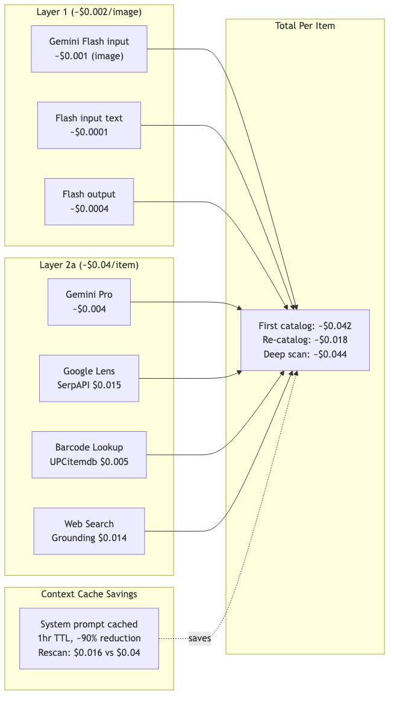

### Per-Component Costs

#### Layer 1 (Detection) — ~$0.002/image
| Component | Cost |
|-----------|------|
| Gemini Flash input (image) | ~$0.001 |
| Gemini Flash input (text/prompt) | ~$0.0001 |
| Gemini Flash output (JSON) | ~$0.0004 |

#### Layer 2 (Cataloging) — ~$0.04/item (first catalog)
| Component | Cost |
|-----------|------|
| Gemini Pro (input + output) | ~$0.004 |
| Google Lens (SerpAPI) | ~$0.015 |
| Barcode Lookup (UPCitemdb) | ~$0.005 |
| Web Search (grounding) | ~$0.014 |

### Context Cache Savings
- System prompt + tool definitions + output schema are cached
- Cache key: `sha256(prompt + tools + schema)`
- TTL: 1 hour
- Token savings: ~90% on cached content
- Over 3 consecutive catalogs: **37% total cost reduction**

### Total Per-Item Estimates
| Operation | Cost | Notes |
|-----------|------|-------|
| First catalog | ~$0.042 | Layer 1 + Layer 2a (cold cache) |
| Re-catalog | ~$0.018 | Layer 2 only, warm cache |
| Deep scan | ~$0.044 | Extended Layer 2, all tools forced |

---

## Appendix: Key Source Files

| Component | Source File |
|-----------|------------|
| Capture flow | `Sources/CameraFeature/ViewModels/CaptureSessionViewModel.swift` |
| Detection results UI | `Sources/CameraFeature/Views/DetectionResultsView.swift` |
| Catalog service | `Sources/CameraFeature/Services/CatalogService.swift` |
| Session service | `Sources/CameraFeature/Services/SessionService.swift` |
| Storage service | `Sources/Persistence/Firebase/StorageService.swift` |
| Item service | `Sources/Persistence/Firebase/ItemService.swift` |
| Item model | `Sources/Persistence/Models/Item.swift` |
| Session model | `Sources/CameraFeature/Models/CaptureSession.swift` |
| Layer 1 prompts | `functions/src/layer1/prompts.ts` |
| Layer 2 prompts | `functions/src/gemini/prompts.ts` |
| Layer 1 service | `functions/src/layer1/layer1-service.ts` |
| Layer 2 orchestrator | `functions/src/gemini/orchestrator.ts` |
| Tool: Google Lens | `functions/src/gemini/tools/google-lens.ts` |
| Tool: Barcode | `functions/src/gemini/tools/barcode-lookup.ts` |
| Tool: Web Search | `functions/src/gemini/tools/web-search.ts` |
| Context cache | `functions/src/gemini/context-cache-service.ts` |
| Catalog history | `functions/src/gemini/catalog-history-service.ts` |
| Session trigger | `functions/src/onSessionCreated.ts` |
| Item trigger | `functions/src/onItemFromSession.ts` |
| Rescan trigger | `functions/src/onItemUpdatedRescan.ts` |
| Deep scan trigger | `functions/src/onItemUpdatedDeepScan.ts` |
| Vertex AI config | `functions/src/vertexai-config.ts` |
| EdgeTAM service | `Sources/EdgeTAMFeature/Services/EdgeTAMService.swift` |
| EdgeTAM config | `Sources/EdgeTAMFeature/Models/EdgeTAMConfiguration.swift` |
| Frame scheduler | `Sources/EdgeTAMFeature/Services/FrameScheduler.swift` |
| Device eligibility | `Sources/EdgeTAMFeature/Utilities/DeviceEligibility.swift` |
| Sweep view model | `Sources/CameraFeature/ViewModels/SweepCaptureViewModel.swift` |
| Sweep capture view | `Sources/CameraFeature/Views/SweepCaptureView.swift` |
| Sweep mode toggle | `Sources/CameraFeature/Views/SweepModeToggle.swift` |
| Object deduplicator | `Sources/VisionCore/Services/ObjectDeduplicator.swift` |
| Sweep AR session | `Sources/CameraFeature/Services/SweepARSessionManager.swift` |
