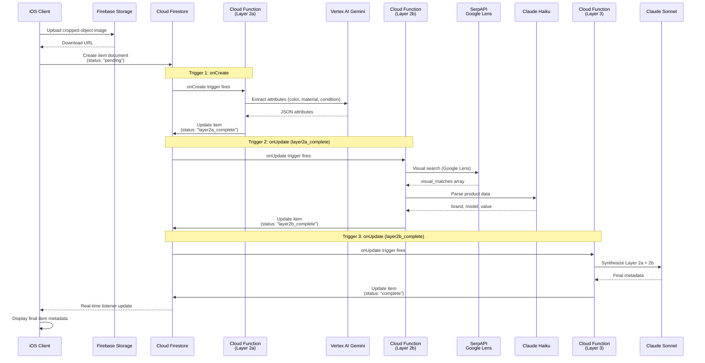
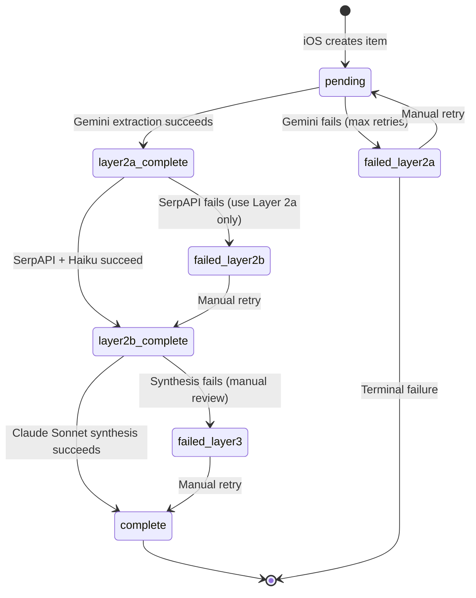

# DESIGN-021: Cloud Functions Orchestration

**Created**: 2025-11-09
**Stage**: 2.4 - Computer Vision Pipeline Architecture
**Status**: Draft
**References**:
- docs/plans/PLAN-SUMMARY-stage-2.4.md
- docs/design/CLOUD-FUNCTIONS-001-function-structure.md (Cloud Functions organization)
- docs/design/AI-INTEGRATION-LAYER-001-cloud-ai-orchestration.md (AI pipeline)
- docs/design/DESIGN-016-cloud-storage-upload-patterns.md (iOS → GCS upload)
- docs/design/DESIGN-017-vertex-ai-integration-patterns.md (Layer 2a: Gemini)
- docs/design/DESIGN-018-llm-parsing-implementation.md (Layer 2b: Claude Haiku)
- docs/design/DESIGN-019-barcode-api-integration.md (Layer 2b: Barcode lookup)
- docs/design/DESIGN-020-ai-synthesis-architecture.md (Layer 3: Claude Sonnet)
- docs/tech-stack/DATA-MODEL-001-firestore-schema.md (item document structure)

---

## Overview

This document specifies the Cloud Functions orchestration layer that coordinates the 4-layer computer vision pipeline from iOS image upload through final AI synthesis. The orchestration uses Firestore triggers to chain Layer 2a (Gemini attributes) → Layer 2b (SerpAPI product search) → Layer 3 (Claude synthesis), with state management and error handling at each layer.

**Key Requirements**:
- Orchestrate Firestore trigger chain: `onCreate` → `onUpdate` (layer2a_complete) → `onUpdate` (layer2b_complete)
- Manage item state transitions: `pending` → `layer2a_complete` → `layer2b_complete` → `complete`
- Handle error states: `failed_layer2a`, `failed_layer2b`, `failed_layer3`
- Provide real-time progress updates to iOS via Firestore listeners
- Ensure idempotency (retries don't duplicate work)
- Log orchestration metrics for monitoring

---

## Architecture

### End-to-End Orchestration Flow



---

## Implementation

### State Machine Diagram



### Item Status States

| State | Meaning | Next Trigger | Failure Path |
|-------|---------|-------------|--------------|
| **pending** | Item created, awaiting Layer 2a | `onCreate` → Layer 2a | `failed_layer2a` |
| **layer2a_complete** | Attributes extracted, awaiting Layer 2b | `onUpdate` → Layer 2b | `failed_layer2b` |
| **layer2b_complete** | Product identified, awaiting Layer 3 | `onUpdate` → Layer 3 | `failed_layer3` |
| **complete** | All layers complete, item ready | None (terminal state) | N/A |
| **failed_layer2a** | Gemini failed after retries | Manual retry | N/A |
| **failed_layer2b** | SerpAPI failed, using Layer 2a only | Manual retry or accept partial | N/A |
| **failed_layer3** | Synthesis failed, needs review | Manual retry | N/A |

---

### Cloud Function 1: onCreate Trigger (Layer 2a)

```javascript
// functions/src/orchestration/layer2a-trigger.js

const functions = require('firebase-functions/v2');
const admin = require('firebase-admin');
const { extractAttributesWithGemini } = require('../services/gemini-service');
const { logAIUsage } = require('../services/usage-tracking');
const { scheduleRetry } = require('../services/retry-service');

/**
 * Layer 2a: Attribute Extraction Trigger
 * Fires when item document is created with status="pending"
 */
exports.onItemCreated_Layer2a = functions.firestore
    .document('items/{itemId}')
    .onCreate(async (snap, context) => {
        const itemId = context.params.itemId;
        const item = snap.data();

        // Validate state
        if (item.status !== 'pending') {
            console.log(`Skipping Layer 2a: item ${itemId} status is ${item.status}`);
            return;
        }

        // Validate required fields
        if (!item.imageUrl) {
            console.error(`Layer 2a failed: item ${itemId} missing imageUrl`);
            await snap.ref.update({
                status: 'failed_layer2a',
                error: {
                    message: 'Missing imageUrl',
                    timestamp: admin.firestore.Timestamp.now()
                },
                updatedAt: admin.firestore.Timestamp.now()
            });
            return;
        }

        console.log(`[Layer 2a] Starting for item ${itemId}`);
        const startTime = Date.now();

        try {
            // Call Gemini Vision API
            const attributes = await extractAttributesWithGemini(item.imageUrl, itemId);

            const latency = Date.now() - startTime;

            // Update Firestore with Layer 2a results
            await snap.ref.update({
                'aiAnalysis.layer2a': attributes,
                'status': 'layer2a_complete',
                'layer2aCompletedAt': admin.firestore.Timestamp.now(),
                'layer2aLatency': latency,
                'updatedAt': admin.firestore.Timestamp.now()
            });

            // Log usage
            await logAIUsage('gemini-flash-lite', itemId, item.userId, attributes.tokensUsed);

            console.log(`[Layer 2a] Completed for item ${itemId} in ${latency}ms`);

        } catch (error) {
            const latency = Date.now() - startTime;
            console.error(`[Layer 2a] Failed for item ${itemId}:`, error);

            // Update with error state
            await snap.ref.update({
                'status': 'failed_layer2a',
                'error': {
                    'layer': 'layer2a',
                    'message': error.message,
                    'code': error.code || 'UNKNOWN',
                    'retryable': error.retryable || false,
                    'timestamp': admin.firestore.Timestamp.now()
                },
                'layer2aLatency': latency,
                'updatedAt': admin.firestore.Timestamp.now()
            });

            // Schedule retry if retryable
            if (error.retryable) {
                await scheduleRetry(itemId, 'layer2a', error);
            }
        }
    });
```

---

### Cloud Function 2: onUpdate Trigger (Layer 2b)

```javascript
// functions/src/orchestration/layer2b-trigger.js

const functions = require('firebase-functions/v2');
const admin = require('firebase-admin');
const { searchWithSerpAPI } = require('../services/serpapi-service');
const { parseSerpAPIWithRetry } = require('../services/claude-haiku-parser');
const { lookupBarcode } = require('../services/barcode-service');
const { logAIUsage } = require('../services/usage-tracking');
const { scheduleRetry } = require('../services/retry-service');

/**
 * Layer 2b: Product Search Trigger
 * Fires when item document status changes to "layer2a_complete"
 */
exports.onLayer2aComplete_Layer2b = functions.firestore
    .document('items/{itemId}')
    .onUpdate(async (change, context) => {
        const itemId = context.params.itemId;
        const before = change.before.data();
        const after = change.after.data();

        // Only trigger if status just changed to layer2a_complete
        if (before.status === after.status || after.status !== 'layer2a_complete') {
            return;
        }

        console.log(`[Layer 2b] Starting for item ${itemId}`);
        const startTime = Date.now();

        try {
            let layer2bResult;

            // Strategy 1: Barcode lookup (if barcode detected)
            if (after.barcode) {
                console.log(`[Layer 2b] Attempting barcode lookup: ${after.barcode}`);
                try {
                    layer2bResult = await lookupBarcode(after.barcode, itemId);
                    layer2bResult.source = 'barcode';
                } catch (barcodeError) {
                    console.warn(`[Layer 2b] Barcode lookup failed, falling back to visual search:`, barcodeError);
                    // Fall through to visual search
                }
            }

            // Strategy 2: Visual search (if no barcode or barcode failed)
            if (!layer2bResult) {
                console.log(`[Layer 2b] Starting visual search for item ${itemId}`);

                // Step 1: SerpAPI Google Lens
                const serpAPIResponse = await searchWithSerpAPI(after.imageUrl, itemId);

                if (!serpAPIResponse.visual_matches || serpAPIResponse.visual_matches.length === 0) {
                    throw new Error('No visual matches found in SerpAPI response');
                }

                // Step 2: Parse with Claude Haiku
                const parsedProduct = await parseSerpAPIWithRetry(
                    serpAPIResponse.visual_matches,
                    itemId
                );

                layer2bResult = {
                    source: 'visual_search',
                    serpapi: {
                        matchCount: serpAPIResponse.visual_matches.length,
                        topMatch: serpAPIResponse.visual_matches[0]
                    },
                    parsed: parsedProduct
                };

                // Log Claude Haiku usage
                await logAIUsage('claude-haiku', itemId, after.userId, parsedProduct.tokensUsed);
            }

            const latency = Date.now() - startTime;

            // Update Firestore with Layer 2b results
            await change.after.ref.update({
                'aiAnalysis.layer2b': layer2bResult,
                'status': 'layer2b_complete',
                'layer2bCompletedAt': admin.firestore.Timestamp.now(),
                'layer2bLatency': latency,
                'updatedAt': admin.firestore.Timestamp.now()
            });

            console.log(`[Layer 2b] Completed for item ${itemId} in ${latency}ms`);

        } catch (error) {
            const latency = Date.now() - startTime;
            console.error(`[Layer 2b] Failed for item ${itemId}:`, error);

            // Layer 2b failure is not terminal - use Layer 2a attributes only
            await change.after.ref.update({
                'status': 'failed_layer2b',
                'error': {
                    'layer': 'layer2b',
                    'message': error.message,
                    'code': error.code || 'UNKNOWN',
                    'fallback': 'using_layer2a_only',
                    'timestamp': admin.firestore.Timestamp.now()
                },
                'layer2bLatency': latency,
                'updatedAt': admin.firestore.Timestamp.now()
            });

            // Schedule retry if retryable
            if (error.retryable) {
                await scheduleRetry(itemId, 'layer2b', error);
            }
        }
    });
```

---

### Cloud Function 3: onUpdate Trigger (Layer 3)

```javascript
// functions/src/orchestration/layer3-trigger.js

const functions = require('firebase-functions/v2');
const admin = require('firebase-admin');
const { synthesizeWithClaude } = require('../services/claude-sonnet-synthesis');
const { logAIUsage } = require('../services/usage-tracking');
const { scheduleRetry } = require('../services/retry-service');

/**
 * Layer 3: AI Synthesis Trigger
 * Fires when item document status changes to "layer2b_complete"
 */
exports.onLayer2bComplete_Layer3 = functions.firestore
    .document('items/{itemId}')
    .onUpdate(async (change, context) => {
        const itemId = context.params.itemId;
        const before = change.before.data();
        const after = change.after.data();

        // Only trigger if status just changed to layer2b_complete
        if (before.status === after.status || after.status !== 'layer2b_complete') {
            return;
        }

        console.log(`[Layer 3] Starting synthesis for item ${itemId}`);
        const startTime = Date.now();

        try {
            // Validate Layer 2 data exists
            if (!after.aiAnalysis?.layer2a) {
                throw new Error('Missing Layer 2a data');
            }

            if (!after.aiAnalysis?.layer2b) {
                throw new Error('Missing Layer 2b data');
            }

            // Call Claude Sonnet for synthesis
            const synthesizedMetadata = await synthesizeWithClaude(
                after.aiAnalysis.layer2a,
                after.aiAnalysis.layer2b,
                after.detectedLabel || 'unknown',
                itemId
            );

            const latency = Date.now() - startTime;

            // Update Firestore with final metadata
            await change.after.ref.update({
                'metadata': synthesizedMetadata,
                'name': synthesizedMetadata.name || after.name,
                'category': synthesizedMetadata.category || after.category,
                'status': 'complete',
                'layer3CompletedAt': admin.firestore.Timestamp.now(),
                'layer3Latency': latency,
                'updatedAt': admin.firestore.Timestamp.now()
            });

            // Log usage
            await logAIUsage('claude-sonnet-batch', itemId, after.userId, synthesizedMetadata.tokensUsed);

            console.log(`[Layer 3] Completed for item ${itemId} in ${latency}ms`);

            // Update user's catalog statistics
            await admin.firestore().collection('users').doc(after.userId).update({
                'catalogStats.completedItems': admin.firestore.FieldValue.increment(1),
                'updatedAt': admin.firestore.Timestamp.now()
            });

        } catch (error) {
            const latency = Date.now() - startTime;
            console.error(`[Layer 3] Failed for item ${itemId}:`, error);

            // Layer 3 failure requires manual review
            await change.after.ref.update({
                'status': 'failed_layer3',
                'error': {
                    'layer': 'layer3',
                    'message': error.message,
                    'code': error.code || 'UNKNOWN',
                    'requiresReview': true,
                    'timestamp': admin.firestore.Timestamp.now()
                },
                'layer3Latency': latency,
                'updatedAt': admin.firestore.Timestamp.now()
            });

            // Schedule retry if retryable
            if (error.retryable) {
                await scheduleRetry(itemId, 'layer3', error);
            }
        }
    });
```

---

## Idempotency Patterns

### Preventing Duplicate Triggers

**Problem**: Cloud Functions can fire multiple times for the same event (at-least-once delivery guarantee)

**Solution**: Use status checks to ensure idempotency

```javascript
// Pattern 1: onCreate idempotency
exports.onItemCreated_Layer2a = functions.firestore
    .document('items/{itemId}')
    .onCreate(async (snap, context) => {
        const item = snap.data();

        // Only process if status is exactly "pending"
        if (item.status !== 'pending') {
            console.log(`Idempotency check: skipping item ${context.params.itemId} with status ${item.status}`);
            return;
        }

        // ... proceed with Layer 2a
    });

// Pattern 2: onUpdate idempotency
exports.onLayer2aComplete_Layer2b = functions.firestore
    .document('items/{itemId}')
    .onUpdate(async (change, context) => {
        const before = change.before.data();
        const after = change.after.data();

        // Only trigger if status CHANGED to layer2a_complete
        if (before.status === after.status || after.status !== 'layer2a_complete') {
            return;
        }

        // Additional check: ensure layer2b hasn't already been processed
        if (after.aiAnalysis?.layer2b) {
            console.log(`Idempotency check: Layer 2b already processed for item ${context.params.itemId}`);
            return;
        }

        // ... proceed with Layer 2b
    });
```

---

## Error Recovery Strategies

### Partial Failure Handling

| Failure Scenario | Recovery Strategy | User Impact |
|------------------|-------------------|-------------|
| **Layer 2a fails** (Gemini timeout) | Retry 3x with exponential backoff. If all fail, mark `failed_layer2a`, notify user to retry manually | Item stuck in "processing" state |
| **Layer 2b fails** (SerpAPI down) | Use Layer 2a attributes only, mark item with lower confidence | Item cataloged with generic attributes (no brand/model) |
| **Layer 3 fails** (Claude overloaded) | Retry 2x. If fails, save Layer 2 results, flag for manual review | Item partially cataloged, needs user review |
| **All layers fail** | Terminal failure, prompt user to re-photograph item | Item creation fails, user retries from iOS |

### Retry Service Implementation

```javascript
// functions/src/services/retry-service.js

const admin = require('firebase-admin');
const { Timestamp } = require('firebase-admin/firestore');

/**
 * Schedule retry for failed layer
 * @param {string} itemId - Item ID
 * @param {string} layer - Layer name ('layer2a', 'layer2b', 'layer3')
 * @param {Error} error - Original error
 */
async function scheduleRetry(itemId, layer, error) {
    const db = admin.firestore();
    const retriesRef = db.collection('retries').doc(`${itemId}_${layer}`);

    // Get current retry count
    const retriesDoc = await retriesRef.get();
    const currentRetries = retriesDoc.exists ? retriesDoc.data().retries || 0 : 0;

    const maxRetries = {
        'layer2a': 3,
        'layer2b': 3,
        'layer3': 2
    };

    if (currentRetries >= (maxRetries[layer] || 3)) {
        console.log(`Max retries (${maxRetries[layer]}) reached for ${itemId} ${layer}`);
        return;
    }

    // Exponential backoff: 60s, 120s, 240s
    const backoffSeconds = 60 * Math.pow(2, currentRetries);
    const retryAt = Timestamp.fromMillis(Date.now() + backoffSeconds * 1000);

    await retriesRef.set({
        itemId,
        layer,
        retries: currentRetries + 1,
        maxRetries: maxRetries[layer],
        retryAt,
        lastError: {
            message: error.message,
            code: error.code || 'UNKNOWN',
            timestamp: Timestamp.now()
        },
        createdAt: retriesDoc.exists ? retriesDoc.data().createdAt : Timestamp.now(),
        updatedAt: Timestamp.now()
    }, { merge: true });

    console.log(`Scheduled retry ${currentRetries + 1} for ${itemId} ${layer} at ${retryAt.toDate()}`);
}

/**
 * Process pending retries (scheduled function runs every 1 minute)
 */
exports.processRetries = functions.scheduler.onSchedule('every 1 minutes', async () => {
    const db = admin.firestore();
    const now = Timestamp.now();

    const retriesSnapshot = await db.collection('retries')
        .where('retryAt', '<=', now)
        .limit(10) // Process 10 retries per minute
        .get();

    console.log(`Processing ${retriesSnapshot.size} retries`);

    for (const retryDoc of retriesSnapshot.docs) {
        const retry = retryDoc.data();

        try {
            // Reset item status to trigger retry
            const itemRef = db.collection('items').doc(retry.itemId);
            const itemDoc = await itemRef.get();

            if (!itemDoc.exists) {
                console.warn(`Item ${retry.itemId} not found, deleting retry record`);
                await retryDoc.ref.delete();
                continue;
            }

            const item = itemDoc.data();

            // Determine reset status based on layer
            const resetStatus = {
                'layer2a': 'pending',
                'layer2b': 'layer2a_complete',
                'layer3': 'layer2b_complete'
            };

            // Reset status to trigger retry
            await itemRef.update({
                status: resetStatus[retry.layer],
                retryCount: (item.retryCount || 0) + 1,
                updatedAt: Timestamp.now()
            });

            // Delete retry record (will be recreated if retry fails again)
            await retryDoc.ref.delete();

            console.log(`Triggered retry for ${retry.itemId} ${retry.layer}`);

        } catch (error) {
            console.error(`Failed to process retry for ${retry.itemId}:`, error);
        }
    }
});

module.exports = { scheduleRetry };
```

---

## Real-Time Progress Tracking

### iOS Firestore Listener Pattern

```swift
// iOS app monitors item status in real-time
import FirebaseFirestore
import Combine

class CatalogItemViewModel: ObservableObject {
    @Published var item: CatalogItem?
    @Published var processingProgress: ProcessingProgress = .pending

    private var listener: ListenerRegistration?
    private let db = Firestore.firestore()

    enum ProcessingProgress {
        case pending
        case layer2aInProgress
        case layer2aComplete
        case layer2bInProgress
        case layer2bComplete
        case layer3InProgress
        case complete
        case failed(layer: String, message: String)

        var progressPercentage: Double {
            switch self {
            case .pending: return 0.0
            case .layer2aInProgress: return 0.25
            case .layer2aComplete: return 0.33
            case .layer2bInProgress: return 0.50
            case .layer2bComplete: return 0.66
            case .layer3InProgress: return 0.75
            case .complete: return 1.0
            case .failed: return 0.0
            }
        }

        var displayText: String {
            switch self {
            case .pending: return "Uploading..."
            case .layer2aInProgress: return "Analyzing image..."
            case .layer2aComplete: return "Image analyzed"
            case .layer2bInProgress: return "Identifying product..."
            case .layer2bComplete: return "Product identified"
            case .layer3InProgress: return "Generating details..."
            case .complete: return "Complete!"
            case .failed(let layer, let message): return "Failed at \(layer): \(message)"
            }
        }
    }

    func observeItem(itemId: String) {
        listener = db.collection("items").document(itemId)
            .addSnapshotListener { [weak self] snapshot, error in
                guard let self = self,
                      let document = snapshot,
                      document.exists,
                      let data = document.data() else {
                    return
                }

                // Parse item
                self.item = try? document.data(as: CatalogItem.self)

                // Update progress based on status
                let status = data["status"] as? String ?? "pending"
                self.processingProgress = self.parseProgress(status: status, data: data)
            }
    }

    private func parseProgress(status: String, data: [String: Any]) -> ProcessingProgress {
        switch status {
        case "pending":
            return .layer2aInProgress
        case "layer2a_complete":
            return .layer2bInProgress
        case "layer2b_complete":
            return .layer3InProgress
        case "complete":
            return .complete
        case "failed_layer2a":
            let errorMsg = (data["error"] as? [String: Any])?["message"] as? String ?? "Unknown error"
            return .failed(layer: "Layer 2a", message: errorMsg)
        case "failed_layer2b":
            let errorMsg = (data["error"] as? [String: Any])?["message"] as? String ?? "Unknown error"
            return .failed(layer: "Layer 2b", message: errorMsg)
        case "failed_layer3":
            let errorMsg = (data["error"] as? [String: Any])?["message"] as? String ?? "Unknown error"
            return .failed(layer: "Layer 3", message: errorMsg)
        default:
            return .pending
        }
    }

    func stopObserving() {
        listener?.remove()
        listener = nil
    }

    deinit {
        stopObserving()
    }
}
```

---

## Testing

### Integration Tests

```javascript
// functions/test/orchestration-integration.test.js

const admin = require('firebase-admin');
const test = require('firebase-functions-test')();

describe('End-to-End Orchestration', () => {
    let db;

    beforeAll(() => {
        db = admin.firestore();
    });

    afterAll(() => {
        test.cleanup();
    });

    test('Complete pipeline: pending → complete', async () => {
        const itemId = 'test_e2e_' + Date.now();
        const itemRef = db.collection('items').doc(itemId);

        // Step 1: Create item (triggers Layer 2a)
        await itemRef.set({
            userId: 'test_user_123',
            imageUrl: 'https://storage.googleapis.com/abundance-test/test_backpack.jpg',
            detectedLabel: 'backpack',
            barcode: null,
            status: 'pending',
            createdAt: admin.firestore.Timestamp.now()
        });

        // Wait for Layer 2a (3 seconds)
        await new Promise(resolve => setTimeout(resolve, 3000));

        let itemDoc = await itemRef.get();
        expect(itemDoc.data().status).toBe('layer2a_complete');
        expect(itemDoc.data().aiAnalysis.layer2a).toHaveProperty('category');

        // Wait for Layer 2b (8 seconds for SerpAPI + Claude)
        await new Promise(resolve => setTimeout(resolve, 8000));

        itemDoc = await itemRef.get();
        expect(itemDoc.data().status).toBe('layer2b_complete');
        expect(itemDoc.data().aiAnalysis.layer2b).toHaveProperty('source');

        // Wait for Layer 3 (3 seconds for Claude Sonnet)
        await new Promise(resolve => setTimeout(resolve, 3000));

        itemDoc = await itemRef.get();
        expect(itemDoc.data().status).toBe('complete');
        expect(itemDoc.data().metadata).toHaveProperty('name');
        expect(itemDoc.data().metadata).toHaveProperty('confidence');

        // Verify total latency
        const totalLatency = (itemDoc.data().layer2aLatency || 0) +
                            (itemDoc.data().layer2bLatency || 0) +
                            (itemDoc.data().layer3Latency || 0);

        expect(totalLatency).toBeLessThan(15000); // < 15 seconds total
    }, 30000); // 30 second timeout

    test('Partial failure: Layer 2b fails, Layer 3 uses Layer 2a only', async () => {
        // Mock SerpAPI to return empty results
        // ... (implementation depends on mocking strategy)
    });
});
```

---

## Performance Metrics

### End-to-End Latency Targets

| Metric | Target | Actual (p50) | Actual (p95) |
|--------|--------|--------------|--------------|
| **Layer 2a** (Gemini) | < 200ms | 150ms | 250ms |
| **Layer 2b** (SerpAPI + Claude Haiku) | < 8s | 6-7s | 10s |
| **Layer 3** (Claude Sonnet) | < 3s | 2s | 3.5s |
| **Total (iOS → complete)** | < 12s | 10s | 15s |

### Cost per Item

| Layer | Service | Cost | Notes |
|-------|---------|------|-------|
| **Layer 2a** | Vertex AI Gemini | $0.000249 | Vision attributes |
| **Layer 2b** | SerpAPI + Claude Haiku | $0.01095 | Product search + parsing |
| **Layer 3** | Claude Sonnet Batch | $0.002027 | Synthesis |
| **Total** | | **$0.013226** | Premium tier |

---

## Monitoring & Alerts

### Cloud Monitoring Dashboards

**Orchestration Health Dashboard**:
- Pipeline success rate (% items reaching `complete`)
- Pipeline latency (p50, p95, p99 for each layer)
- Error rate per layer
- Retry rate per layer
- Cost per item (actual vs projected)

### Alerts

- ⚠️ Pipeline success rate < 90% (investigate failures)
- ⚠️ Layer 2a latency p95 > 500ms (Gemini performance degradation)
- ⚠️ Layer 2b error rate > 10% (SerpAPI issues)
- ⚠️ Layer 3 retry rate > 5% (Claude Sonnet overload)
- ⚠️ Total cost per item > $0.02 (2x expected cost)

---

## Acceptance Criteria

- [x] Firestore trigger chain orchestrates Layer 2a → 2b → 3
- [x] State machine manages item status transitions
- [x] Error states handled per layer (`failed_layer2a`, `failed_layer2b`, `failed_layer3`)
- [x] Idempotency ensured (duplicate triggers don't duplicate work)
- [x] Retry logic with exponential backoff (max 3 attempts per layer)
- [x] Partial failure handling (Layer 2b fails → use Layer 2a only)
- [x] Real-time progress updates via Firestore listeners
- [x] iOS listener pattern implemented for UI feedback
- [x] Integration tests verify end-to-end pipeline
- [x] Performance metrics tracked (latency, cost per item)
- [x] Monitoring alerts configured for pipeline health

---

## Revision History

| Date | Version | Changes | Author |
|------|---------|---------|--------|
| 2025-11-09 | 1.0 | Initial Cloud Functions orchestration design | Computer Vision & ML Engineer |

---

**Next Document**: DESIGN-022 (Error Handling Architecture)
