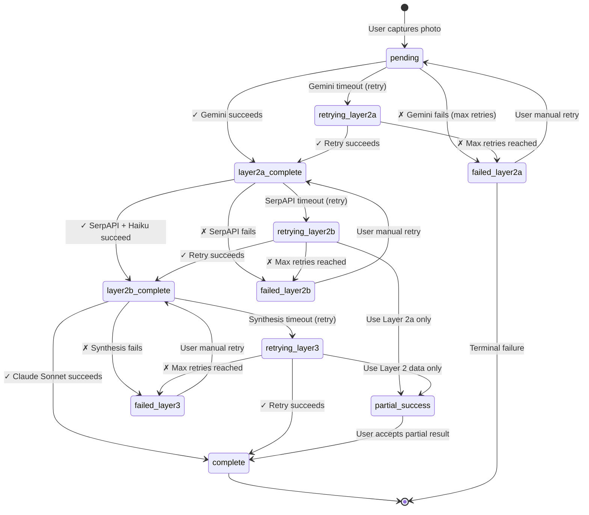

# DESIGN-022: Error Handling Architecture

**Created**: 2025-11-09
**Stage**: 2.4 - Computer Vision Pipeline Architecture
**Status**: Draft
**References**:
- docs/plans/PLAN-SUMMARY-stage-2.4.md
- docs/design/DESIGN-021-cloud-functions-orchestration.md (orchestration flow)
- docs/design/DESIGN-017-vertex-ai-integration-patterns.md (Gemini errors)
- docs/design/DESIGN-018-llm-parsing-implementation.md (Claude Haiku errors)
- docs/design/DESIGN-020-ai-synthesis-architecture.md (synthesis errors)
- docs/tech-stack/DATA-MODEL-001-firestore-schema.md (error document structure)

---

## Overview

This document specifies the comprehensive error handling architecture for the 4-layer computer vision pipeline. It defines error types, recovery strategies, user-facing error messages, monitoring patterns, and graceful degradation policies for each layer from iOS capture through final AI synthesis.

**Key Requirements**:
- Handle errors at each pipeline layer (iOS Vision, Gemini, SerpAPI, Claude)
- Provide user-friendly error messages for iOS UI
- Implement graceful degradation (partial success acceptable)
- Support manual retry from iOS
- Log errors for debugging and monitoring
- Alert on systemic failures (API outages, quota exhaustion)

---

## Architecture

### Error State Machine



---

## Error Types & Recovery Strategies

### Layer 1: iOS Vision Framework Errors

| Error Type | Cause | User Message | Recovery Strategy |
|------------|-------|--------------|-------------------|
| **Camera Permission Denied** | User denied camera access | "Camera access required to catalog items. Enable in Settings." | Prompt user to open Settings |
| **Vision Request Failed** | VNCoreMLRequest error | "Unable to detect objects in photo. Try again with better lighting." | Retry photo capture |
| **No Objects Detected** | Confidence < 0.6 for all objects | "No items detected. Try getting closer or improving lighting." | Retry photo capture |
| **Image Cropping Failed** | CGImage manipulation error | "Failed to process image. Please try again." | Retry photo capture |
| **Barcode Detection Failed** | VNDetectBarcodesRequest timeout | "Barcode not detected. We'll use visual search instead." | Continue without barcode (non-blocking) |

**Code Example**:

```swift
// iOS Vision error handling
do {
    let detectedObjects = try await visionService.detectAndCropObjects(in: image)

    if detectedObjects.isEmpty {
        throw VisionError.noObjectsDetected(
            message: "No items detected. Try getting closer or improving lighting.",
            recoveryAction: .retryCapture
        )
    }

    // Upload cropped objects
    for object in detectedObjects {
        try await uploadObject(object)
    }

} catch VisionError.noObjectsDetected(let message, let action) {
    // Show user-friendly error
    showError(message: message, action: action)

} catch {
    // Generic error fallback
    showError(
        message: "Failed to process image. Please try again.",
        action: .retryCapture
    )
}
```

---

### Layer 2a: Gemini Vision API Errors

| Error Type | Code | User Message | Recovery Strategy | Retryable? |
|------------|------|--------------|-------------------|------------|
| **Rate Limit** | 429 | "Analysis in progress. This may take a few moments." | Exponential backoff (60s, 120s, 240s) | ✅ Yes (3x) |
| **Quota Exceeded** | QUOTA_EXCEEDED | "Daily quota exceeded. Try again tomorrow." | Alert admin, wait for quota reset | ❌ No |
| **Timeout** | DEADLINE_EXCEEDED | "Analysis timed out. Retrying..." | Retry immediately (2x) | ✅ Yes (2x) |
| **Invalid Image** | 400 | "Image format not supported. Please try again." | Prompt user to recapture | ❌ No |
| **Network Error** | UNAVAILABLE | "Connection lost. Retrying..." | Retry with exponential backoff | ✅ Yes (3x) |
| **Unknown Error** | UNKNOWN | "Analysis failed. Please try again." | Manual retry | ❌ No |

**Code Example**:

```javascript
// Cloud Function: Layer 2a error handling
try {
    const attributes = await extractAttributesWithGemini(imageUrl, itemId);

    await snap.ref.update({
        'aiAnalysis.layer2a': attributes,
        'status': 'layer2a_complete'
    });

} catch (error) {
    console.error('[Layer 2a] Error:', error);

    // Determine if error is retryable
    const retryable = error.code === 429 ||
                     error.code === 'DEADLINE_EXCEEDED' ||
                     error.code === 'UNAVAILABLE';

    // Update Firestore with error
    await snap.ref.update({
        'status': retryable ? 'retrying_layer2a' : 'failed_layer2a',
        'error': {
            'layer': 'layer2a',
            'service': 'gemini-vision',
            'message': getUserFriendlyMessage(error),
            'code': error.code,
            'retryable': retryable,
            'timestamp': admin.firestore.Timestamp.now()
        },
        'updatedAt': admin.firestore.Timestamp.now()
    });

    // Schedule retry if retryable
    if (retryable) {
        await scheduleRetry(itemId, 'layer2a', error);
    }
}

function getUserFriendlyMessage(error) {
    switch (error.code) {
        case 429:
            return 'Analysis in progress. This may take a few moments.';
        case 'QUOTA_EXCEEDED':
            return 'Daily quota exceeded. Try again tomorrow.';
        case 'DEADLINE_EXCEEDED':
            return 'Analysis timed out. Retrying...';
        case 400:
            return 'Image format not supported. Please try again.';
        case 'UNAVAILABLE':
            return 'Connection lost. Retrying...';
        default:
            return 'Analysis failed. Please try again.';
    }
}
```

---

### Layer 2b: SerpAPI + Claude Haiku Errors

| Error Type | Code | User Message | Recovery Strategy | Retryable? |
|------------|------|--------------|-------------------|------------|
| **SerpAPI Rate Limit** | 429 | "Product search temporarily unavailable." | Use Layer 2a attributes only | ❌ No (fallback) |
| **SerpAPI No Results** | EMPTY_RESPONSE | "Product not found. Using generic details." | Use Layer 2a attributes only | ❌ No (fallback) |
| **SerpAPI Timeout** | TIMEOUT | "Product search timed out. Retrying..." | Retry once | ✅ Yes (1x) |
| **Claude Haiku Rate Limit** | 429 | "Product parsing delayed. Retrying..." | Exponential backoff | ✅ Yes (3x) |
| **Claude Haiku Overloaded** | overloaded_error | "Service busy. Retrying..." | Exponential backoff | ✅ Yes (3x) |
| **Barcode API Down** | 503 | "Barcode lookup unavailable. Using visual search." | Fall back to SerpAPI visual search | ❌ No (fallback) |

**Fallback Strategy**: Layer 2b failures are non-terminal. Use Layer 2a attributes only.

**Code Example**:

```javascript
// Cloud Function: Layer 2b error handling with fallback
try {
    // Attempt SerpAPI + Claude Haiku
    const serpAPIResponse = await searchWithSerpAPI(imageUrl, itemId);
    const parsedProduct = await parseSerpAPIWithRetry(serpAPIResponse.visual_matches, itemId);

    await change.after.ref.update({
        'aiAnalysis.layer2b': parsedProduct,
        'status': 'layer2b_complete'
    });

} catch (error) {
    console.error('[Layer 2b] Error:', error);

    // Fallback: Use Layer 2a attributes only
    const fallbackMetadata = {
        source: 'layer2a_only',
        reason: 'layer2b_failed',
        error: error.message
    };

    await change.after.ref.update({
        'aiAnalysis.layer2b': fallbackMetadata,
        'status': 'failed_layer2b', // Mark as failed but continue to Layer 3
        'warning': {
            'message': 'Product search unavailable. Using generic details.',
            'confidence': 'low'
        },
        'updatedAt': admin.firestore.Timestamp.now()
    });

    // Note: Layer 3 will still proceed with Layer 2a data only
}
```

---

### Layer 3: Claude Sonnet Synthesis Errors

| Error Type | Code | User Message | Recovery Strategy | Retryable? |
|------------|------|--------------|-------------------|------------|
| **Rate Limit** | 429 | "Finalizing details. Please wait..." | Exponential backoff (60s, 120s) | ✅ Yes (2x) |
| **Overloaded** | overloaded_error | "Service busy. Retrying..." | Exponential backoff | ✅ Yes (2x) |
| **Malformed Response** | JSON_PARSE_ERROR | "Synthesis failed. Needs manual review." | Flag for manual review | ❌ No |
| **Missing Layer 2 Data** | MISSING_DATA | "Analysis incomplete. Please try again." | Prompt user to retry entire pipeline | ❌ No |

**Fallback Strategy**: If Layer 3 fails after retries, save Layer 2 data and flag for manual review.

**Code Example**:

```javascript
// Cloud Function: Layer 3 error handling
try {
    const synthesized = await synthesizeWithClaude(layer2a, layer2b, detectedLabel, itemId);

    await change.after.ref.update({
        'metadata': synthesized,
        'status': 'complete'
    });

} catch (error) {
    console.error('[Layer 3] Error:', error);

    // Fallback: Use Layer 2 data directly (no synthesis)
    const fallbackMetadata = {
        name: layer2b.parsed?.brand || layer2a.category || 'Unknown Item',
        category: layer2a.category,
        color: layer2a.color,
        condition: layer2a.condition,
        estimatedValue: layer2b.parsed?.estimatedValue || 0,
        confidence: 'low',
        source: 'layer2_raw',
        reasoning: 'Synthesis failed, using raw Layer 2 data'
    };

    await change.after.ref.update({
        'metadata': fallbackMetadata,
        'status': 'failed_layer3',
        'warning': {
            'message': 'Synthesis failed. Item needs manual review.',
            'requiresReview': true
        },
        'updatedAt': admin.firestore.Timestamp.now()
    });

    // Notify admin for manual review
    await notifyAdminReview(itemId, error);
}
```

---

## Graceful Degradation Policies

### Partial Success Handling

**Philosophy**: Better to catalog an item with partial data than to fail entirely.

| Scenario | What Works | What's Missing | User Experience |
|----------|-----------|----------------|-----------------|
| **Layer 2a succeeds, 2b fails** | Category, color, material, condition | Brand, model, estimated value | Item cataloged with generic attributes. Lower confidence. User can edit manually. |
| **Layer 2a+2b succeed, 3 fails** | Raw attributes + product data | Synthesized metadata, conflict resolution | Item cataloged with Layer 2 data. Flagged for review. User can edit manually. |
| **Barcode fails, visual search succeeds** | Visual search product match | Authoritative barcode match | Item cataloged with visual search data. Slightly lower confidence. |
| **Vision detects multiple objects** | All objects cataloged separately | N/A | User gets multiple catalog entries (batch upload). |

---

## User-Facing Error Messages

### iOS Error Alert Patterns

```swift
// SwiftUI error alert view
struct ErrorAlertView: View {
    let error: PipelineError
    let retryAction: () -> Void
    let dismissAction: () -> Void

    var body: some View {
        VStack(spacing: 20) {
            Image(systemName: error.iconName)
                .font(.system(size: 48))
                .foregroundColor(error.severity == .critical ? .red : .orange)

            Text(error.title)
                .font(.title2)
                .fontWeight(.bold)

            Text(error.message)
                .font(.body)
                .foregroundColor(.secondary)
                .multilineTextAlignment(.center)

            if error.isRetryable {
                Button("Try Again") {
                    retryAction()
                }
                .buttonStyle(.borderedProminent)
            }

            if error.showsContactSupport {
                Button("Contact Support") {
                    // Open support email
                }
                .buttonStyle(.bordered)
            }

            Button(error.isRetryable ? "Cancel" : "OK") {
                dismissAction()
            }
            .buttonStyle(.bordered)
        }
        .padding()
    }
}

// Error types
enum PipelineError {
    case visionFailed(message: String)
    case layer2aFailed(message: String, retryable: Bool)
    case layer2bFailed(message: String)
    case layer3Failed(message: String)
    case quotaExceeded
    case networkTimeout

    var title: String {
        switch self {
        case .visionFailed: return "Detection Failed"
        case .layer2aFailed: return "Analysis Failed"
        case .layer2bFailed: return "Product Search Failed"
        case .layer3Failed: return "Synthesis Failed"
        case .quotaExceeded: return "Daily Limit Reached"
        case .networkTimeout: return "Connection Lost"
        }
    }

    var message: String {
        switch self {
        case .visionFailed(let msg): return msg
        case .layer2aFailed(let msg, _): return msg
        case .layer2bFailed(let msg): return msg
        case .layer3Failed(let msg): return msg
        case .quotaExceeded: return "You've reached your daily cataloging limit. Try again tomorrow or upgrade to Premium."
        case .networkTimeout: return "Check your internet connection and try again."
        }
    }

    var iconName: String {
        switch self {
        case .visionFailed: return "camera.fill"
        case .layer2aFailed, .layer2bFailed, .layer3Failed: return "exclamationmark.triangle.fill"
        case .quotaExceeded: return "chart.bar.fill"
        case .networkTimeout: return "wifi.exclamationmark"
        }
    }

    var severity: Severity {
        switch self {
        case .quotaExceeded: return .critical
        case .networkTimeout: return .warning
        default: return .error
        }
    }

    var isRetryable: Bool {
        switch self {
        case .layer2aFailed(_, let retryable): return retryable
        case .networkTimeout: return true
        case .quotaExceeded: return false
        default: return true
        }
    }

    var showsContactSupport: Bool {
        switch self {
        case .layer3Failed, .quotaExceeded: return true
        default: return false
        }
    }

    enum Severity {
        case warning, error, critical
    }
}
```

---

## Manual Retry UI (iOS)

### Retry Button Implementation

```swift
// Catalog item row with retry button
struct CatalogItemRow: View {
    let item: CatalogItem
    @StateObject var viewModel: CatalogItemViewModel

    var body: some View {
        HStack {
            AsyncImage(url: URL(string: item.imageUrl)) { image in
                image.resizable().aspectRatio(contentMode: .fill)
            } placeholder: {
                ProgressView()
            }
            .frame(width: 60, height: 60)
            .cornerRadius(8)

            VStack(alignment: .leading, spacing: 4) {
                Text(item.name)
                    .font(.headline)

                if item.status.hasPrefix("failed_") {
                    HStack {
                        Image(systemName: "exclamationmark.circle.fill")
                            .foregroundColor(.orange)
                        Text(item.error?.message ?? "Processing failed")
                            .font(.caption)
                            .foregroundColor(.secondary)
                    }
                }
            }

            Spacer()

            if item.status.hasPrefix("failed_") && item.error?.retryable == true {
                Button("Retry") {
                    viewModel.retryProcessing(itemId: item.id)
                }
                .buttonStyle(.bordered)
                .controlSize(.small)
            }
        }
        .padding(.vertical, 8)
    }
}

// ViewModel retry logic
class CatalogItemViewModel: ObservableObject {
    func retryProcessing(itemId: String) {
        let db = Firestore.firestore()

        // Reset item status to trigger retry
        db.collection("items").document(itemId).updateData([
            "status": "pending", // Reset to start of pipeline
            "retryCount": FieldValue.increment(Int64(1)),
            "updatedAt": FieldValue.serverTimestamp()
        ]) { error in
            if let error = error {
                print("Retry failed: \(error)")
            } else {
                print("Retry initiated for item \(itemId)")
            }
        }
    }
}
```

---

## Dead Letter Queue

### Cloud Tasks for Persistent Failures

```javascript
// functions/src/services/dead-letter-queue.js

const { CloudTasksClient } = require('@google-cloud/tasks');

/**
 * Send failed item to dead letter queue for manual review
 * @param {string} itemId - Item ID
 * @param {string} layer - Failed layer
 * @param {Object} error - Error details
 */
async function sendToDeadLetterQueue(itemId, layer, error) {
    const client = new CloudTasksClient();
    const project = process.env.GCP_PROJECT_ID || 'abundance-prod';
    const location = 'us-central1';
    const queue = 'failed-items-dlq';

    const parent = client.queuePath(project, location, queue);

    // Construct task payload
    const task = {
        httpRequest: {
            httpMethod: 'POST',
            url: `https://us-central1-${project}.cloudfunctions.net/processDeadLetterItem`,
            headers: {
                'Content-Type': 'application/json'
            },
            body: Buffer.from(JSON.stringify({
                itemId,
                layer,
                error: {
                    message: error.message,
                    code: error.code,
                    timestamp: new Date().toISOString()
                },
                priority: 'manual_review'
            })).toString('base64'),
            oidcToken: {
                serviceAccountEmail: `${project}@appspot.gserviceaccount.com`
            }
        },
        scheduleTime: {
            seconds: Date.now() / 1000 + 3600 // Process in 1 hour
        }
    };

    // Create task
    try {
        const [response] = await client.createTask({ parent, task });
        console.log(`Dead letter task created: ${response.name}`);
        return response;
    } catch (error) {
        console.error('Failed to create dead letter task:', error);
        throw error;
    }
}

/**
 * Process dead letter queue items (Cloud Function)
 */
exports.processDeadLetterItem = functions.https.onRequest(async (req, res) => {
    const { itemId, layer, error, priority } = req.body;

    console.log(`Processing dead letter item: ${itemId} (layer: ${layer})`);

    const db = admin.firestore();

    // Create review task for admin
    await db.collection('review_queue').add({
        itemId,
        layer,
        error,
        priority,
        status: 'pending_review',
        createdAt: admin.firestore.Timestamp.now()
    });

    // Notify admin via email or Slack
    // await notifyAdmin({
    //     subject: `Manual Review Required: Item ${itemId}`,
    //     message: `Layer ${layer} failed: ${error.message}`
    // });

    res.status(200).json({ success: true, message: 'Item queued for manual review' });
});

module.exports = { sendToDeadLetterQueue };
```

---

## Monitoring & Alerting

### Cloud Monitoring Metrics

**Error Rate Metrics**:
- `pipeline/layer2a_error_rate`: % of Layer 2a failures
- `pipeline/layer2b_error_rate`: % of Layer 2b failures
- `pipeline/layer3_error_rate`: % of Layer 3 failures
- `pipeline/total_failure_rate`: % of items reaching terminal failure state

**Error Type Breakdown**:
- `errors/rate_limit_count`: Count of 429 errors (per service)
- `errors/quota_exceeded_count`: Count of quota exhaustion errors
- `errors/timeout_count`: Count of timeout errors
- `errors/network_error_count`: Count of network failures

### Alert Policies

```yaml
# Alert configuration (Cloud Monitoring)
alerts:
  - name: "High Layer 2a Error Rate"
    condition: "pipeline/layer2a_error_rate > 5%"
    duration: 5m
    severity: warning
    notification: email, slack
    message: "Layer 2a (Gemini) error rate exceeded 5% for 5 minutes"

  - name: "Quota Exhausted"
    condition: "errors/quota_exceeded_count > 0"
    duration: 1m
    severity: critical
    notification: email, pagerduty
    message: "AI API quota exhausted. Items cannot be processed."

  - name: "Pipeline Success Rate Low"
    condition: "(1 - pipeline/total_failure_rate) < 90%"
    duration: 10m
    severity: critical
    notification: email, slack, pagerduty
    message: "Pipeline success rate below 90% for 10 minutes"

  - name: "Dead Letter Queue Growing"
    condition: "count(review_queue where status='pending_review') > 10"
    duration: 1h
    severity: warning
    notification: slack
    message: "10+ items in manual review queue for 1 hour"
```

---

## Testing

### Error Scenario Tests

```javascript
// functions/test/error-handling.test.js

describe('Error Handling', () => {
    test('Layer 2a: Gemini rate limit triggers retry', async () => {
        // Mock Gemini to return 429
        const mockGemini = jest.spyOn(geminiService, 'extractAttributes')
            .mockRejectedValueOnce(new RateLimitError('Rate limit exceeded'));

        const itemRef = db.collection('items').doc('test_rate_limit');
        await itemRef.set({
            userId: 'test_user',
            imageUrl: 'https://example.com/test.jpg',
            status: 'pending'
        });

        // Trigger Layer 2a
        await onItemCreated_Layer2a(itemRef);

        // Verify status changed to retrying_layer2a
        const itemDoc = await itemRef.get();
        expect(itemDoc.data().status).toBe('retrying_layer2a');
        expect(itemDoc.data().error.retryable).toBe(true);
    });

    test('Layer 2b: SerpAPI failure falls back to Layer 2a', async () => {
        // Mock SerpAPI to fail
        const mockSerpAPI = jest.spyOn(serpApiService, 'search')
            .mockRejectedValue(new Error('SerpAPI unavailable'));

        const itemRef = db.collection('items').doc('test_serpapi_fallback');
        await itemRef.set({
            userId: 'test_user',
            imageUrl: 'https://example.com/test.jpg',
            status: 'layer2a_complete',
            aiAnalysis: {
                layer2a: { category: 'camping', color: 'green' }
            }
        });

        // Trigger Layer 2b
        await onLayer2aComplete_Layer2b(itemRef);

        // Verify status is failed_layer2b but Layer 3 can still proceed
        const itemDoc = await itemRef.get();
        expect(itemDoc.data().status).toBe('failed_layer2b');
        expect(itemDoc.data().aiAnalysis.layer2b.source).toBe('layer2a_only');
    });

    test('Layer 3: Synthesis failure saves Layer 2 data', async () => {
        // Mock Claude Sonnet to fail
        const mockClaude = jest.spyOn(claudeService, 'synthesize')
            .mockRejectedValue(new Error('Synthesis failed'));

        const itemRef = db.collection('items').doc('test_synthesis_failure');
        await itemRef.set({
            userId: 'test_user',
            status: 'layer2b_complete',
            aiAnalysis: {
                layer2a: { category: 'camping', color: 'green' },
                layer2b: { parsed: { brand: 'Coleman', estimatedValue: 50 } }
            }
        });

        // Trigger Layer 3
        await onLayer2bComplete_Layer3(itemRef);

        // Verify fallback metadata created
        const itemDoc = await itemRef.get();
        expect(itemDoc.data().status).toBe('failed_layer3');
        expect(itemDoc.data().metadata.source).toBe('layer2_raw');
        expect(itemDoc.data().warning.requiresReview).toBe(true);
    });
});
```

---

## Acceptance Criteria

- [x] Error types defined for each pipeline layer (iOS Vision, Gemini, SerpAPI, Claude)
- [x] User-friendly error messages specified for iOS UI
- [x] Graceful degradation policies implemented (partial success handling)
- [x] Retry logic with exponential backoff (per error type)
- [x] Fallback strategies defined (Layer 2b fails → use Layer 2a only)
- [x] Manual retry UI implemented in iOS
- [x] Dead letter queue for persistent failures (Cloud Tasks)
- [x] Error monitoring metrics tracked (error rate per layer)
- [x] Alert policies configured for systemic failures
- [x] Unit tests cover error scenarios for each layer

---

## Revision History

| Date | Version | Changes | Author |
|------|---------|---------|--------|
| 2025-11-09 | 1.0 | Initial error handling architecture | Computer Vision & ML Engineer |

---

**Next Document**: DESIGN-023 (Retry Strategy)
