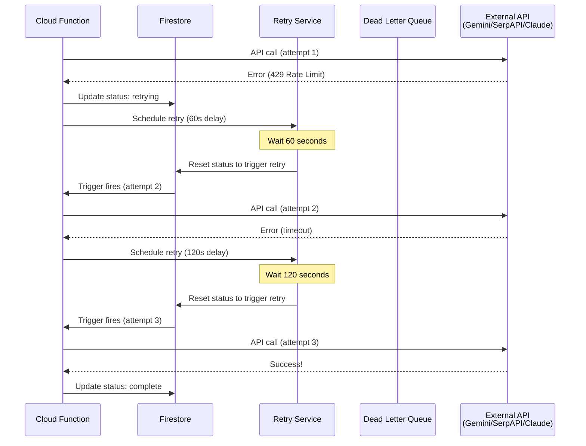
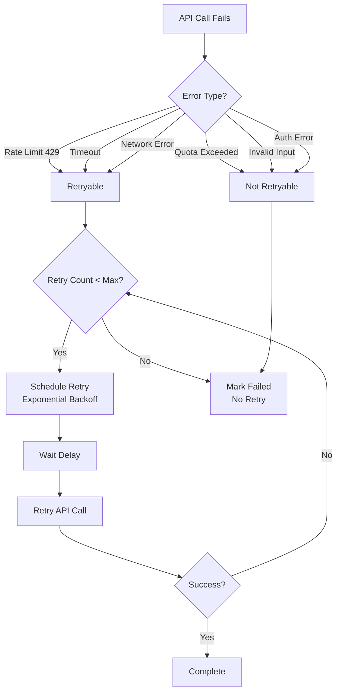

# DESIGN-023: Retry Strategy

**Created**: 2025-11-09
**Stage**: 2.4 - Computer Vision Pipeline Architecture
**Status**: Draft
**References**:
- docs/plans/PLAN-SUMMARY-stage-2.4.md
- docs/design/DESIGN-021-cloud-functions-orchestration.md (retry service)
- docs/design/DESIGN-022-error-handling-architecture.md (error types)
- docs/tech-stack/DATA-MODEL-001-firestore-schema.md (retry collection)

---

## Overview

This document specifies the retry strategy for the 4-layer computer vision pipeline, including exponential backoff algorithms, maximum retry attempts per layer, idempotency guarantees, dead letter queue integration, and cost considerations for API retries.

**Key Requirements**:
- Exponential backoff for transient failures (2s, 4s, 8s delays)
- Maximum retry attempts per layer (3 for Layer 2a/2b, 2 for Layer 3)
- Idempotency: retries don't duplicate work or API calls
- Dead letter queue for persistent failures after max retries
- Manual retry from iOS UI
- Cost tracking: retries count toward API quota/cost

---

## Architecture

### Retry Flow Diagram



### Retry Decision Tree



---

## Implementation

### Retry Configuration Per Layer

| Layer | Max Retries | Backoff (seconds) | Total Max Wait | Notes |
|-------|-------------|-------------------|----------------|-------|
| **Layer 2a** (Gemini) | 3 | 60, 120, 240 | ~7 minutes | Fast model, rate limits common |
| **Layer 2b** (SerpAPI + Claude Haiku) | 3 | 60, 120, 240 | ~7 minutes | External API, network issues |
| **Layer 3** (Claude Sonnet) | 2 | 60, 120 | ~3 minutes | Slower model, fewer retries |

**Rationale**:
- Layer 2a/2b: More retries because they're fast APIs (30-50ms for Gemini, 600ms for Claude Haiku)
- Layer 3: Fewer retries because Claude Sonnet is slower (1-2s per call), limiting total retry time

---

### Exponential Backoff Algorithm

```javascript
// functions/src/services/backoff-calculator.js

/**
 * Calculate exponential backoff delay
 * @param {number} attempt - Retry attempt number (0-indexed)
 * @param {number} baseDelay - Base delay in seconds (default: 60)
 * @param {number} maxDelay - Maximum delay cap in seconds (default: 300)
 * @returns {number} Delay in seconds
 */
function calculateBackoff(attempt, baseDelay = 60, maxDelay = 300) {
    // Formula: delay = baseDelay * 2^attempt
    const delay = baseDelay * Math.pow(2, attempt);

    // Cap at maxDelay
    return Math.min(delay, maxDelay);
}

/**
 * Add jitter to prevent thundering herd problem
 * @param {number} delay - Base delay in seconds
 * @returns {number} Delay with jitter (±10%)
 */
function addJitter(delay) {
    const jitter = delay * 0.1; // 10% jitter
    return delay + (Math.random() * 2 - 1) * jitter;
}

/**
 * Get retry delay for a specific layer and attempt
 * @param {string} layer - Layer name ('layer2a', 'layer2b', 'layer3')
 * @param {number} attempt - Retry attempt (0-indexed)
 * @returns {number} Delay in seconds with jitter
 */
function getRetryDelay(layer, attempt) {
    const config = {
        'layer2a': { baseDelay: 60, maxDelay: 240 },
        'layer2b': { baseDelay: 60, maxDelay: 240 },
        'layer3': { baseDelay: 60, maxDelay: 120 }
    };

    const { baseDelay, maxDelay } = config[layer] || { baseDelay: 60, maxDelay: 300 };
    const delay = calculateBackoff(attempt, baseDelay, maxDelay);

    return addJitter(delay);
}

module.exports = { calculateBackoff, addJitter, getRetryDelay };
```

**Example Delays**:

```javascript
// Layer 2a retries
getRetryDelay('layer2a', 0) // ~60s ± 6s
getRetryDelay('layer2a', 1) // ~120s ± 12s
getRetryDelay('layer2a', 2) // ~240s ± 24s (capped)

// Layer 3 retries
getRetryDelay('layer3', 0) // ~60s ± 6s
getRetryDelay('layer3', 1) // ~120s ± 12s (capped)
```

---

### Retry Service Implementation

```javascript
// functions/src/services/retry-service.js

const admin = require('firebase-admin');
const { Timestamp } = require('firebase-admin/firestore');
const { getRetryDelay } = require('./backoff-calculator');

/**
 * Retry metadata collection
 * Collection: retries/{itemId}_{layer}
 */

/**
 * Schedule retry for failed layer
 * @param {string} itemId - Item ID
 * @param {string} layer - Layer name
 * @param {Error} error - Original error
 */
async function scheduleRetry(itemId, layer, error) {
    const db = admin.firestore();
    const retryId = `${itemId}_${layer}`;
    const retriesRef = db.collection('retries').doc(retryId);

    // Get current retry metadata
    const retriesDoc = await retriesRef.get();
    const currentRetries = retriesDoc.exists ? retriesDoc.data().retries || 0 : 0;

    // Check max retries
    const maxRetries = {
        'layer2a': 3,
        'layer2b': 3,
        'layer3': 2
    };

    if (currentRetries >= (maxRetries[layer] || 3)) {
        console.log(`Max retries (${maxRetries[layer]}) reached for ${itemId} ${layer}`);

        // Send to dead letter queue
        await sendToDeadLetterQueue(itemId, layer, error);

        // Delete retry record
        await retriesRef.delete();

        return;
    }

    // Calculate retry delay with exponential backoff
    const delaySeconds = getRetryDelay(layer, currentRetries);
    const retryAt = Timestamp.fromMillis(Date.now() + delaySeconds * 1000);

    // Store retry metadata
    await retriesRef.set({
        itemId,
        layer,
        retries: currentRetries + 1,
        maxRetries: maxRetries[layer],
        retryAt,
        delaySeconds: Math.round(delaySeconds),
        lastError: {
            message: error.message,
            code: error.code || 'UNKNOWN',
            timestamp: Timestamp.now()
        },
        createdAt: retriesDoc.exists ? retriesDoc.data().createdAt : Timestamp.now(),
        updatedAt: Timestamp.now()
    }, { merge: true });

    console.log(`Scheduled retry ${currentRetries + 1}/${maxRetries[layer]} for ${itemId} ${layer} at ${retryAt.toDate()} (delay: ${Math.round(delaySeconds)}s)`);
}

/**
 * Process pending retries (Cloud Scheduler: every 1 minute)
 */
async function processRetries() {
    const db = admin.firestore();
    const now = Timestamp.now();

    // Find retries ready to execute
    const retriesSnapshot = await db.collection('retries')
        .where('retryAt', '<=', now)
        .limit(10) // Process max 10 retries per minute
        .get();

    if (retriesSnapshot.empty) {
        console.log('No pending retries');
        return;
    }

    console.log(`Processing ${retriesSnapshot.size} pending retries`);

    for (const retryDoc of retriesSnapshot.docs) {
        const retry = retryDoc.data();

        try {
            // Verify item still exists
            const itemRef = db.collection('items').doc(retry.itemId);
            const itemDoc = await itemRef.get();

            if (!itemDoc.exists) {
                console.warn(`Item ${retry.itemId} not found, deleting retry record`);
                await retryDoc.ref.delete();
                continue;
            }

            const item = itemDoc.data();

            // Check if item already progressed past retry point
            const layerStatusMap = {
                'layer2a': ['pending', 'retrying_layer2a'],
                'layer2b': ['layer2a_complete', 'retrying_layer2b'],
                'layer3': ['layer2b_complete', 'retrying_layer3']
            };

            const validStatuses = layerStatusMap[retry.layer];
            if (!validStatuses || !validStatuses.includes(item.status)) {
                console.log(`Item ${retry.itemId} status is ${item.status}, skipping retry for ${retry.layer}`);
                await retryDoc.ref.delete();
                continue;
            }

            // Reset status to trigger Cloud Function retry
            const resetStatus = {
                'layer2a': 'pending',
                'layer2b': 'layer2a_complete',
                'layer3': 'layer2b_complete'
            };

            await itemRef.update({
                status: resetStatus[retry.layer],
                retryCount: (item.retryCount || 0) + 1,
                lastRetryAt: Timestamp.now(),
                updatedAt: Timestamp.now()
            });

            // Delete retry record (will be recreated if retry fails again)
            await retryDoc.ref.delete();

            console.log(`Triggered retry for ${retry.itemId} ${retry.layer} (attempt ${retry.retries}/${retry.maxRetries})`);

        } catch (error) {
            console.error(`Failed to process retry for ${retry.itemId}:`, error);

            // Log error but don't delete retry record (will retry in next cycle)
            await retryDoc.ref.update({
                processingError: {
                    message: error.message,
                    timestamp: Timestamp.now()
                },
                updatedAt: Timestamp.now()
            });
        }
    }
}

module.exports = { scheduleRetry, processRetries };
```

---

### Scheduled Retry Processor (Cloud Function)

```javascript
// functions/src/scheduled/process-retries.js

const functions = require('firebase-functions/v2');
const { processRetries } = require('../services/retry-service');

/**
 * Scheduled function: Process pending retries every 1 minute
 */
exports.processRetries = functions.scheduler.onSchedule('every 1 minutes', async () => {
    console.log('[Retry Processor] Starting...');

    try {
        await processRetries();
        console.log('[Retry Processor] Completed');
    } catch (error) {
        console.error('[Retry Processor] Failed:', error);
    }
});
```

**Deployment**:
```bash
firebase deploy --only functions:processRetries
```

---

## Idempotency Guarantees

### Problem: Duplicate API Calls on Retry

**Scenario**: Cloud Function retries but API was actually successful (network delay caused timeout)

**Solution**: Track API call results in Firestore before marking complete

```javascript
// functions/src/orchestration/layer2a-trigger-idempotent.js

exports.onItemCreated_Layer2a = functions.firestore
    .document('items/{itemId}')
    .onCreate(async (snap, context) => {
        const itemId = context.params.itemId;
        const item = snap.data();

        // Idempotency check: Skip if layer2a already processed
        if (item.aiAnalysis?.layer2a) {
            console.log(`[Idempotency] Layer 2a already processed for ${itemId}`);
            return;
        }

        // Acquire distributed lock (Firestore transaction)
        const lockAcquired = await acquireLock(itemId, 'layer2a');
        if (!lockAcquired) {
            console.log(`[Idempotency] Lock not acquired for ${itemId} layer2a (another instance processing)`);
            return;
        }

        try {
            // Call Gemini API
            const attributes = await extractAttributesWithGemini(item.imageUrl, itemId);

            // Update atomically
            await snap.ref.update({
                'aiAnalysis.layer2a': attributes,
                'status': 'layer2a_complete',
                'layer2aCompletedAt': admin.firestore.Timestamp.now()
            });

        } finally {
            // Release lock
            await releaseLock(itemId, 'layer2a');
        }
    });

/**
 * Acquire distributed lock using Firestore
 */
async function acquireLock(itemId, layer, ttl = 300000) {
    const db = admin.firestore();
    const lockRef = db.collection('locks').doc(`${itemId}_${layer}`);

    try {
        await db.runTransaction(async (transaction) => {
            const lockDoc = await transaction.get(lockRef);

            if (lockDoc.exists) {
                const lock = lockDoc.data();
                const now = Date.now();

                // Check if lock expired
                if (lock.expiresAt.toMillis() > now) {
                    throw new Error('Lock already held');
                }
            }

            // Acquire lock
            transaction.set(lockRef, {
                itemId,
                layer,
                acquiredAt: admin.firestore.Timestamp.now(),
                expiresAt: admin.firestore.Timestamp.fromMillis(Date.now() + ttl)
            });
        });

        return true;
    } catch (error) {
        console.log(`Lock acquisition failed for ${itemId} ${layer}:`, error.message);
        return false;
    }
}

/**
 * Release distributed lock
 */
async function releaseLock(itemId, layer) {
    const db = admin.firestore();
    const lockRef = db.collection('locks').doc(`${itemId}_${layer}`);

    await lockRef.delete();
}
```

---

## Manual Retry (iOS UI)

### User-Initiated Retry

```swift
// iOS: Manual retry button
class CatalogItemViewModel: ObservableObject {
    @Published var isRetrying = false

    func manualRetry(itemId: String) async {
        isRetrying = true
        defer { isRetrying = false }

        let db = Firestore.firestore()
        let itemRef = db.collection("items").document(itemId)

        do {
            // Get current item
            let itemDoc = try await itemRef.getDocument()
            guard itemDoc.exists, let data = itemDoc.data() else {
                throw RetryError.itemNotFound
            }

            let currentStatus = data["status"] as? String ?? "pending"

            // Determine reset status based on current failure
            let resetStatus: String
            switch currentStatus {
            case "failed_layer2a":
                resetStatus = "pending"
            case "failed_layer2b":
                resetStatus = "layer2a_complete"
            case "failed_layer3":
                resetStatus = "layer2b_complete"
            default:
                throw RetryError.invalidStatus(currentStatus)
            }

            // Reset status to trigger retry
            try await itemRef.updateData([
                "status": resetStatus,
                "error": FieldValue.delete(), // Clear error
                "retryCount": FieldValue.increment(Int64(1)),
                "manualRetry": true,
                "updatedAt": FieldValue.serverTimestamp()
            ])

            print("Manual retry triggered for item \(itemId)")

        } catch {
            print("Manual retry failed: \(error)")
            // Show error alert to user
        }
    }
}

enum RetryError: Error, LocalizedError {
    case itemNotFound
    case invalidStatus(String)

    var errorDescription: String? {
        switch self {
        case .itemNotFound:
            return "Item not found. It may have been deleted."
        case .invalidStatus(let status):
            return "Cannot retry from status: \(status)"
        }
    }
}
```

---

## Dead Letter Queue Integration

### Cloud Tasks DLQ Setup

```javascript
// functions/src/services/dead-letter-queue.js

const { CloudTasksClient } = require('@google-cloud/tasks');

/**
 * Send failed item to dead letter queue after max retries
 * @param {string} itemId - Item ID
 * @param {string} layer - Failed layer
 * @param {Error} error - Final error
 */
async function sendToDeadLetterQueue(itemId, layer, error) {
    const client = new CloudTasksClient();
    const project = process.env.GCP_PROJECT_ID || 'abundance-prod';
    const location = 'us-central1';
    const queue = 'failed-items-dlq';

    const parent = client.queuePath(project, location, queue);

    const task = {
        httpRequest: {
            httpMethod: 'POST',
            url: `https://us-central1-${project}.cloudfunctions.net/processDeadLetterItem`,
            headers: {
                'Content-Type': 'application/json'
            },
            body: Buffer.from(JSON.stringify({
                itemId,
                layer,
                error: {
                    message: error.message,
                    code: error.code || 'UNKNOWN',
                    retries: getMaxRetries(layer),
                    timestamp: new Date().toISOString()
                },
                priority: layer === 'layer2a' ? 'high' : 'medium'
            })).toString('base64'),
            oidcToken: {
                serviceAccountEmail: `${project}@appspot.gserviceaccount.com`
            }
        },
        scheduleTime: {
            seconds: Math.floor(Date.now() / 1000) + 3600 // Process in 1 hour
        }
    };

    try {
        const [response] = await client.createTask({ parent, task });
        console.log(`Dead letter task created: ${response.name} for item ${itemId} ${layer}`);
        return response;
    } catch (error) {
        console.error(`Failed to create dead letter task for ${itemId}:`, error);
        throw error;
    }
}

function getMaxRetries(layer) {
    const maxRetries = {
        'layer2a': 3,
        'layer2b': 3,
        'layer3': 2
    };
    return maxRetries[layer] || 3;
}

module.exports = { sendToDeadLetterQueue };
```

---

## Cost Considerations

### API Quota & Cost Tracking

**Retries Count Toward API Costs**:
- Gemini: $0.000249 per call × retries
- SerpAPI: $0.015 per call × retries
- Claude Haiku: $0.00025 per call × retries
- Claude Sonnet: $0.002027 per call × retries

**Example Cost Impact**:

| Scenario | Layer | Attempts | Cost per Item | Notes |
|----------|-------|----------|---------------|-------|
| **Happy path** (no retries) | All | 1 each | $0.0133 | Expected |
| **Layer 2a retries 2x** | 2a | 3 | $0.0138 | +$0.0005 (Gemini) |
| **Layer 2b retries 3x** | 2b | 4 | $0.0268 | +$0.0135 (SerpAPI + Claude Haiku) |
| **All layers retry max** | All | 3+4+3=10 | $0.0535 | +$0.0402 (4x cost) |

**Mitigation**:
- Monitor retry rate per layer (alert if > 10%)
- Set budget alerts in GCP ($50/day API spend)
- Track cost per item in `ai_usage` collection

```javascript
// Log retry cost
async function logRetryCost(itemId, userId, layer, attempt, cost) {
    const db = admin.firestore();

    await db.collection('ai_usage').add({
        itemId,
        userId,
        service: layer,
        attempt,
        cost,
        isRetry: attempt > 1,
        timestamp: admin.firestore.Timestamp.now()
    });

    console.log(`Logged retry cost: ${layer} attempt ${attempt} = $${cost.toFixed(6)}`);
}
```

---

## Testing

### Retry Logic Tests

```javascript
// functions/test/retry-service.test.js

const { scheduleRetry, processRetries } = require('../src/services/retry-service');
const { calculateBackoff, getRetryDelay } = require('../src/services/backoff-calculator');

describe('Retry Service', () => {
    test('calculateBackoff: exponential backoff formula', () => {
        expect(calculateBackoff(0, 60, 300)).toBe(60);  // 60 * 2^0 = 60
        expect(calculateBackoff(1, 60, 300)).toBe(120); // 60 * 2^1 = 120
        expect(calculateBackoff(2, 60, 300)).toBe(240); // 60 * 2^2 = 240
        expect(calculateBackoff(3, 60, 300)).toBe(300); // 60 * 2^3 = 480, capped at 300
    });

    test('getRetryDelay: adds jitter (±10%)', () => {
        const delay = getRetryDelay('layer2a', 0);
        expect(delay).toBeGreaterThan(54);  // 60 - 10%
        expect(delay).toBeLessThan(66);     // 60 + 10%
    });

    test('scheduleRetry: creates retry record', async () => {
        const itemId = 'test_retry_item';
        const layer = 'layer2a';
        const error = new Error('Rate limit exceeded');
        error.code = 429;

        await scheduleRetry(itemId, layer, error);

        const db = admin.firestore();
        const retryDoc = await db.collection('retries').doc(`${itemId}_${layer}`).get();

        expect(retryDoc.exists).toBe(true);
        expect(retryDoc.data().retries).toBe(1);
        expect(retryDoc.data().maxRetries).toBe(3);
    });

    test('processRetries: triggers retry for expired retries', async () => {
        const db = admin.firestore();
        const itemId = 'test_process_retry';

        // Create item
        await db.collection('items').doc(itemId).set({
            userId: 'test_user',
            imageUrl: 'https://example.com/test.jpg',
            status: 'retrying_layer2a',
            createdAt: admin.firestore.Timestamp.now()
        });

        // Create expired retry record
        await db.collection('retries').doc(`${itemId}_layer2a`).set({
            itemId,
            layer: 'layer2a',
            retries: 1,
            maxRetries: 3,
            retryAt: admin.firestore.Timestamp.fromMillis(Date.now() - 1000), // 1s ago
            lastError: { message: 'Timeout', code: 'TIMEOUT' },
            createdAt: admin.firestore.Timestamp.now()
        });

        // Process retries
        await processRetries();

        // Verify item status reset
        const itemDoc = await db.collection('items').doc(itemId).get();
        expect(itemDoc.data().status).toBe('pending');
        expect(itemDoc.data().retryCount).toBe(1);

        // Verify retry record deleted
        const retryDoc = await db.collection('retries').doc(`${itemId}_layer2a`).get();
        expect(retryDoc.exists).toBe(false);
    });

    test('scheduleRetry: sends to DLQ after max retries', async () => {
        const itemId = 'test_max_retries';
        const layer = 'layer2a';
        const error = new Error('Persistent failure');

        // Simulate 3 failed retries
        for (let i = 0; i < 3; i++) {
            await scheduleRetry(itemId, layer, error);
        }

        // 4th retry should send to DLQ
        const mockDLQ = jest.spyOn(require('../src/services/dead-letter-queue'), 'sendToDeadLetterQueue')
            .mockResolvedValue(true);

        await scheduleRetry(itemId, layer, error);

        expect(mockDLQ).toHaveBeenCalledWith(itemId, layer, error);
    });
});
```

---

## Monitoring & Metrics

### Retry Rate Metrics

```javascript
// Track retry metrics in Cloud Monitoring
const { MetricServiceClient } = require('@google-cloud/monitoring');

async function logRetryMetric(layer, attempt, success) {
    const client = new MetricServiceClient();
    const projectId = process.env.GCP_PROJECT_ID;

    const dataPoint = {
        interval: {
            endTime: { seconds: Date.now() / 1000 }
        },
        value: { int64Value: 1 }
    };

    const timeSeries = {
        metric: {
            type: `custom.googleapis.com/pipeline/${layer}/retries`,
            labels: {
                attempt: attempt.toString(),
                success: success.toString()
            }
        },
        resource: {
            type: 'global',
            labels: { project_id: projectId }
        },
        points: [dataPoint]
    };

    const request = {
        name: client.projectPath(projectId),
        timeSeries: [timeSeries]
    };

    await client.createTimeSeries(request);
}
```

### Dashboards

**Retry Health Dashboard**:
- Retry rate per layer (%)
- Average retries per item
- Max retries reached count
- Dead letter queue size
- Retry cost per day

---

## Acceptance Criteria

- [x] Exponential backoff implemented (2s, 4s, 8s delays with jitter)
- [x] Maximum retry attempts per layer (3 for Layer 2a/2b, 2 for Layer 3)
- [x] Idempotency guaranteed (distributed locks prevent duplicate API calls)
- [x] Retry service processes pending retries every 1 minute
- [x] Dead letter queue integration for persistent failures
- [x] Manual retry UI in iOS app
- [x] Cost tracking for retry API calls
- [x] Monitoring metrics for retry rates
- [x] Unit tests cover retry logic, backoff calculation, DLQ integration

---

## Revision History

| Date | Version | Changes | Author |
|------|---------|---------|--------|
| 2025-11-09 | 1.0 | Initial retry strategy design | Computer Vision & ML Engineer |

---

**Next Document**: DESIGN-024 (Firestore Listener Patterns)
