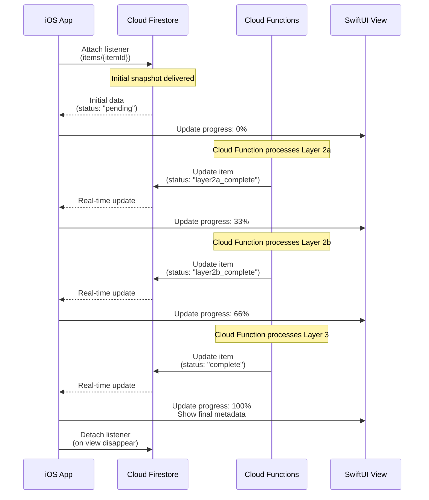

# DESIGN-024: Firestore Listener Patterns

**Created**: 2025-11-09
**Stage**: 2.4 - Computer Vision Pipeline Architecture
**Status**: Draft
**References**:
- docs/plans/PLAN-SUMMARY-stage-2.4.md
- docs/design/DESIGN-021-cloud-functions-orchestration.md (pipeline states)
- docs/design/DESIGN-022-error-handling-architecture.md (error UI patterns)
- docs/design/DESIGN-010-ios-data-persistence.md (Firestore SDK integration)
- docs/tech-stack/DATA-MODEL-001-firestore-schema.md (item document structure)

---

## Overview

This document specifies iOS Firestore real-time listener patterns for the 4-layer computer vision pipeline. The iOS app observes item documents in Firestore to provide real-time progress updates (Layer 1 → 2a → 2b → 3 → complete) with SwiftUI reactive UI, offline caching, and lifecycle management.

**Key Requirements**:
- Real-time listener on `items/{itemId}` for pipeline progress
- SwiftUI Combine integration (Firestore listener → Publisher → ViewModel → UI)
- Progress UI updates: show Layer 2a → 2b → 3 completion
- Optimistic UI: show item immediately, update when AI completes
- Offline support: Firestore cache persistence
- Lifecycle management: attach on view appear, detach on disappear

---

## Architecture

### Real-Time Update Flow



---

## Implementation

### Firestore Listener Service

```swift
// Core/Services/FirestoreListenerService.swift

import FirebaseFirestore
import Combine

/// Service for managing Firestore real-time listeners
final class FirestoreListenerService {

    private let db: Firestore
    private var listeners: [String: ListenerRegistration] = [:]

    init(db: Firestore = Firestore.firestore()) {
        self.db = db
    }

    /// Observe a single item document
    /// - Parameters:
    ///   - itemId: Item document ID
    ///   - onChange: Callback when item changes
    /// - Returns: Listener ID (for removal)
    func observeItem(
        itemId: String,
        onChange: @escaping (CatalogItem?) -> Void
    ) -> String {
        let listenerId = "item_\(itemId)"

        // Remove existing listener if any
        stopObserving(listenerId: listenerId)

        let listener = db.collection("items").document(itemId)
            .addSnapshotListener { snapshot, error in
                if let error = error {
                    print("Firestore listener error for item \(itemId): \(error)")
                    onChange(nil)
                    return
                }

                guard let document = snapshot,
                      document.exists else {
                    onChange(nil)
                    return
                }

                do {
                    let item = try document.data(as: CatalogItem.self)
                    onChange(item)
                } catch {
                    print("Failed to decode item \(itemId): \(error)")
                    onChange(nil)
                }
            }

        listeners[listenerId] = listener
        return listenerId
    }

    /// Observe user's catalog items (list)
    /// - Parameters:
    ///   - userId: User ID
    ///   - limit: Maximum items to return
    ///   - onChange: Callback when items change
    /// - Returns: Listener ID
    func observeCatalogItems(
        userId: String,
        limit: Int = 50,
        onChange: @escaping ([CatalogItem]) -> Void
    ) -> String {
        let listenerId = "catalog_\(userId)"

        stopObserving(listenerId: listenerId)

        let listener = db.collection("items")
            .whereField("userId", isEqualTo: userId)
            .whereField("deletedAt", isEqualTo: NSNull())
            .order(by: "createdAt", descending: true)
            .limit(to: limit)
            .addSnapshotListener { snapshot, error in
                if let error = error {
                    print("Firestore listener error for catalog: \(error)")
                    onChange([])
                    return
                }

                guard let documents = snapshot?.documents else {
                    onChange([])
                    return
                }

                let items = documents.compactMap { doc -> CatalogItem? in
                    try? doc.data(as: CatalogItem.self)
                }

                onChange(items)
            }

        listeners[listenerId] = listener
        return listenerId
    }

    /// Stop observing by listener ID
    func stopObserving(listenerId: String) {
        listeners[listenerId]?.remove()
        listeners.removeValue(forKey: listenerId)
    }

    /// Stop all listeners
    func stopAllListeners() {
        listeners.values.forEach { $0.remove() }
        listeners.removeAll()
    }

    deinit {
        stopAllListeners()
    }
}
```

---

### ViewModel with Firestore Listener

```swift
// Features/Catalog/ViewModels/CatalogItemViewModel.swift

import SwiftUI
import Combine
import FirebaseFirestore

@MainActor
final class CatalogItemViewModel: ObservableObject {

    // MARK: - Published Properties

    @Published var item: CatalogItem?
    @Published var processingProgress: ProcessingProgress = .pending
    @Published var error: PipelineError?

    // MARK: - Private Properties

    private let listenerService: FirestoreListenerService
    private var listenerId: String?

    // MARK: - Initialization

    init(listenerService: FirestoreListenerService = FirestoreListenerService()) {
        self.listenerService = listenerService
    }

    // MARK: - Listener Management

    func startObserving(itemId: String) {
        // Stop existing listener
        stopObserving()

        // Start new listener
        listenerId = listenerService.observeItem(itemId: itemId) { [weak self] item in
            self?.handleItemUpdate(item)
        }
    }

    func stopObserving() {
        if let listenerId = listenerId {
            listenerService.stopObserving(listenerId: listenerId)
            self.listenerId = nil
        }
    }

    private func handleItemUpdate(_ item: CatalogItem?) {
        guard let item = item else {
            self.error = .itemNotFound
            return
        }

        self.item = item
        self.processingProgress = parseProgress(from: item)
        self.error = parseError(from: item)
    }

    // MARK: - Progress Parsing

    enum ProcessingProgress {
        case pending
        case layer2aInProgress
        case layer2aComplete
        case layer2bInProgress
        case layer2bComplete
        case layer3InProgress
        case complete
        case failed(layer: String, message: String)

        var progressPercentage: Double {
            switch self {
            case .pending: return 0.0
            case .layer2aInProgress: return 0.16
            case .layer2aComplete: return 0.33
            case .layer2bInProgress: return 0.50
            case .layer2bComplete: return 0.66
            case .layer3InProgress: return 0.83
            case .complete: return 1.0
            case .failed: return 0.0
            }
        }

        var displayText: String {
            switch self {
            case .pending: return "Uploading..."
            case .layer2aInProgress: return "Analyzing image..."
            case .layer2aComplete: return "Image analyzed"
            case .layer2bInProgress: return "Identifying product..."
            case .layer2bComplete: return "Product identified"
            case .layer3InProgress: return "Generating details..."
            case .complete: return "Complete!"
            case .failed(let layer, _): return "Failed at \(layer)"
            }
        }

        var icon: String {
            switch self {
            case .pending: return "arrow.up.circle"
            case .layer2aInProgress, .layer2bInProgress, .layer3InProgress: return "hourglass"
            case .layer2aComplete, .layer2bComplete: return "checkmark.circle.fill"
            case .complete: return "checkmark.circle.fill"
            case .failed: return "exclamationmark.triangle.fill"
            }
        }

        var iconColor: Color {
            switch self {
            case .pending, .layer2aInProgress, .layer2bInProgress, .layer3InProgress: return .blue
            case .layer2aComplete, .layer2bComplete, .complete: return .green
            case .failed: return .red
            }
        }
    }

    private func parseProgress(from item: CatalogItem) -> ProcessingProgress {
        switch item.status {
        case "pending":
            return .layer2aInProgress
        case "retrying_layer2a":
            return .layer2aInProgress
        case "layer2a_complete":
            return .layer2bInProgress
        case "retrying_layer2b":
            return .layer2bInProgress
        case "layer2b_complete":
            return .layer3InProgress
        case "retrying_layer3":
            return .layer3InProgress
        case "complete":
            return .complete
        case "failed_layer2a":
            let message = item.error?.message ?? "Analysis failed"
            return .failed(layer: "Layer 2a", message: message)
        case "failed_layer2b":
            let message = item.error?.message ?? "Product search failed"
            return .failed(layer: "Layer 2b", message: message)
        case "failed_layer3":
            let message = item.error?.message ?? "Synthesis failed"
            return .failed(layer: "Layer 3", message: message)
        default:
            return .pending
        }
    }

    private func parseError(from item: CatalogItem) -> PipelineError? {
        guard let error = item.error,
              item.status.hasPrefix("failed_") else {
            return nil
        }

        switch item.status {
        case "failed_layer2a":
            return .layer2aFailed(message: error.message, retryable: error.retryable ?? false)
        case "failed_layer2b":
            return .layer2bFailed(message: error.message)
        case "failed_layer3":
            return .layer3Failed(message: error.message)
        default:
            return nil
        }
    }

    // MARK: - Actions

    func retryProcessing() {
        guard let item = item else { return }

        let db = Firestore.firestore()
        let itemRef = db.collection("items").document(item.id)

        // Determine reset status
        let resetStatus: String
        switch item.status {
        case "failed_layer2a":
            resetStatus = "pending"
        case "failed_layer2b":
            resetStatus = "layer2a_complete"
        case "failed_layer3":
            resetStatus = "layer2b_complete"
        default:
            return
        }

        // Reset status to trigger retry
        itemRef.updateData([
            "status": resetStatus,
            "error": FieldValue.delete(),
            "retryCount": FieldValue.increment(Int64(1)),
            "manualRetry": true,
            "updatedAt": FieldValue.serverTimestamp()
        ]) { error in
            if let error = error {
                print("Retry failed: \(error)")
            }
        }
    }
}
```

---

### SwiftUI View with Progress Indicator

```swift
// Features/Catalog/Views/CatalogItemDetailView.swift

import SwiftUI

struct CatalogItemDetailView: View {
    let itemId: String
    @StateObject private var viewModel = CatalogItemViewModel()

    var body: some View {
        ScrollView {
            VStack(spacing: 20) {
                if let item = viewModel.item {
                    // Item image
                    AsyncImage(url: URL(string: item.imageUrl)) { phase in
                        switch phase {
                        case .success(let image):
                            image
                                .resizable()
                                .aspectRatio(contentMode: .fit)
                                .frame(maxHeight: 300)
                                .cornerRadius(12)
                        case .failure:
                            Image(systemName: "photo")
                                .font(.system(size: 80))
                                .foregroundColor(.gray)
                        case .empty:
                            ProgressView()
                        @unknown default:
                            EmptyView()
                        }
                    }

                    // Processing progress
                    ProcessingProgressView(progress: viewModel.processingProgress)

                    // Item metadata (if complete)
                    if viewModel.processingProgress == .complete,
                       let metadata = item.metadata {
                        ItemMetadataView(metadata: metadata)
                    }

                    // Error alert (if failed)
                    if let error = viewModel.error {
                        ErrorBannerView(error: error) {
                            viewModel.retryProcessing()
                        }
                    }

                } else {
                    ProgressView("Loading item...")
                        .padding()
                }
            }
            .padding()
        }
        .navigationTitle("Item Details")
        .onAppear {
            viewModel.startObserving(itemId: itemId)
        }
        .onDisappear {
            viewModel.stopObserving()
        }
    }
}

// MARK: - Processing Progress View

struct ProcessingProgressView: View {
    let progress: CatalogItemViewModel.ProcessingProgress

    var body: some View {
        VStack(spacing: 12) {
            HStack {
                Image(systemName: progress.icon)
                    .foregroundColor(progress.iconColor)
                    .font(.title2)

                Text(progress.displayText)
                    .font(.headline)

                Spacer()

                if progress.progressPercentage < 1.0 && progress.progressPercentage > 0 {
                    ProgressView()
                }
            }

            // Progress bar
            ProgressView(value: progress.progressPercentage, total: 1.0)
                .progressViewStyle(.linear)
                .tint(progress.iconColor)

            // Progress percentage
            Text("\(Int(progress.progressPercentage * 100))%")
                .font(.caption)
                .foregroundColor(.secondary)
        }
        .padding()
        .background(Color(.systemBackground))
        .cornerRadius(12)
        .shadow(radius: 2)
    }
}

// MARK: - Item Metadata View

struct ItemMetadataView: View {
    let metadata: ItemMetadata

    var body: some View {
        VStack(alignment: .leading, spacing: 16) {
            Text(metadata.name)
                .font(.title2)
                .fontWeight(.bold)

            HStack {
                Label(metadata.category.capitalized, systemImage: "tag")
                    .font(.subheadline)
                    .foregroundColor(.secondary)

                Spacer()

                Label(metadata.condition.capitalized, systemImage: "star")
                    .font(.subheadline)
                    .foregroundColor(.secondary)
            }

            if let estimatedValue = metadata.estimatedValue, estimatedValue > 0 {
                HStack {
                    Text("Estimated Value")
                        .font(.subheadline)
                        .foregroundColor(.secondary)

                    Spacer()

                    Text("$\(Int(estimatedValue))")
                        .font(.title3)
                        .fontWeight(.semibold)
                        .foregroundColor(.green)
                }
            }

            if let brand = metadata.brand {
                MetadataRow(label: "Brand", value: brand)
            }

            if let model = metadata.model {
                MetadataRow(label: "Model", value: model)
            }

            MetadataRow(label: "Color", value: metadata.color)

            if let material = metadata.material {
                MetadataRow(label: "Material", value: material)
            }

            // Confidence badge
            ConfidenceBadge(confidence: metadata.confidence)
        }
        .padding()
        .background(Color(.secondarySystemBackground))
        .cornerRadius(12)
    }
}

struct MetadataRow: View {
    let label: String
    let value: String

    var body: some View {
        HStack {
            Text(label)
                .font(.subheadline)
                .foregroundColor(.secondary)

            Spacer()

            Text(value)
                .font(.subheadline)
                .fontWeight(.medium)
        }
    }
}

struct ConfidenceBadge: View {
    let confidence: String

    var badgeColor: Color {
        switch confidence.lowercased() {
        case "high": return .green
        case "medium": return .orange
        case "low": return .red
        default: return .gray
        }
    }

    var body: some View {
        HStack {
            Text("Confidence")
                .font(.caption)
                .foregroundColor(.secondary)

            Spacer()

            Text(confidence.capitalized)
                .font(.caption)
                .fontWeight(.semibold)
                .padding(.horizontal, 8)
                .padding(.vertical, 4)
                .background(badgeColor.opacity(0.2))
                .foregroundColor(badgeColor)
                .cornerRadius(8)
        }
    }
}

// MARK: - Error Banner View

struct ErrorBannerView: View {
    let error: PipelineError
    let retryAction: () -> Void

    var body: some View {
        VStack(alignment: .leading, spacing: 12) {
            HStack {
                Image(systemName: "exclamationmark.triangle.fill")
                    .foregroundColor(.orange)

                Text(error.title)
                    .font(.headline)
                    .foregroundColor(.primary)
            }

            Text(error.message)
                .font(.subheadline)
                .foregroundColor(.secondary)

            if error.isRetryable {
                Button("Try Again") {
                    retryAction()
                }
                .buttonStyle(.borderedProminent)
                .controlSize(.small)
            }
        }
        .padding()
        .background(Color.orange.opacity(0.1))
        .cornerRadius(12)
    }
}
```

---

## Optimistic UI Updates

### Show Item Immediately, Update When Complete

```swift
// Features/Catalog/ViewModels/CatalogListViewModel.swift

@MainActor
final class CatalogListViewModel: ObservableObject {

    @Published var items: [CatalogItem] = []
    @Published var isLoading = false

    private let listenerService: FirestoreListenerService
    private var listenerId: String?

    init(listenerService: FirestoreListenerService = FirestoreListenerService()) {
        self.listenerService = listenerService
    }

    func startObserving(userId: String) {
        stopObserving()

        listenerId = listenerService.observeCatalogItems(userId: userId) { [weak self] items in
            self?.items = items
        }
    }

    func stopObserving() {
        if let listenerId = listenerId {
            listenerService.stopObserving(listenerId: listenerId)
            self.listenerId = nil
        }
    }

    /// Add item optimistically (before AI processing completes)
    func addItemOptimistically(_ item: CatalogItem) {
        // Insert at top of list
        items.insert(item, at: 0)

        // Note: Firestore listener will update this item when status changes
    }
}

// Usage in CameraView after photo capture
struct CameraView: View {
    @StateObject var cameraViewModel: CameraViewModel
    @EnvironmentObject var catalogViewModel: CatalogListViewModel

    func handlePhotoCaptured(image: UIImage, detectedObjects: [DetectedObject]) {
        Task {
            do {
                // Upload and create item
                let itemId = UUID().uuidString
                let item = try await cameraViewModel.uploadAndCreateItem(
                    image: image,
                    objects: detectedObjects,
                    itemId: itemId
                )

                // Add optimistically to catalog
                catalogViewModel.addItemOptimistically(item)

                // Navigate back to catalog
                dismiss()

            } catch {
                // Handle error
                print("Failed to create item: \(error)")
            }
        }
    }
}
```

---

## Offline Support (Firestore Cache)

### Enable Persistence

```swift
// App initialization (in @main App struct)
import FirebaseFirestore

@main
struct AbundanceApp: App {
    init() {
        // Configure Firebase
        FirebaseApp.configure()

        // Enable Firestore offline persistence
        let settings = Firestore.firestore().settings
        settings.isPersistenceEnabled = true
        settings.cacheSizeBytes = FirestoreCacheSizeUnlimited
        Firestore.firestore().settings = settings
    }

    var body: some Scene {
        WindowGroup {
            ContentView()
        }
    }
}
```

### Offline Behavior

**Scenario 1: User captures photo offline**
- iOS caches photo locally
- Firestore write queued
- When online: Firestore sync triggers Cloud Functions
- UI updates automatically via listener

**Scenario 2: User views catalog offline**
- Firestore cache returns last synced data
- Items show last known status
- When online: Listener receives real-time updates

```swift
// Check if data is from cache
func observeItem(itemId: String) {
    db.collection("items").document(itemId)
        .addSnapshotListener { snapshot, error in
            guard let snapshot = snapshot else { return }

            // Check if data is from cache
            if snapshot.metadata.isFromCache {
                print("Data loaded from cache (offline)")
                // Optionally show "offline" badge in UI
            } else {
                print("Data loaded from server (online)")
            }

            let item = try? snapshot.data(as: CatalogItem.self)
            self.handleItemUpdate(item)
        }
}
```

---

## Lifecycle Management

### Attach Listener on View Appear, Detach on Disappear

```swift
// Proper listener lifecycle in SwiftUI
struct CatalogListView: View {
    @StateObject private var viewModel = CatalogListViewModel()
    @EnvironmentObject var authService: AuthService

    var body: some View {
        List(viewModel.items) { item in
            NavigationLink(destination: CatalogItemDetailView(itemId: item.id)) {
                CatalogItemRow(item: item)
            }
        }
        .navigationTitle("My Catalog")
        .onAppear {
            if let userId = authService.currentUserId {
                viewModel.startObserving(userId: userId)
            }
        }
        .onDisappear {
            viewModel.stopObserving()
        }
        .refreshable {
            // Pull-to-refresh: Firestore cache automatically refreshes
        }
    }
}
```

### Avoid Memory Leaks

```swift
// ViewModel with proper cleanup
final class CatalogItemViewModel: ObservableObject {
    private var listenerId: String?
    private let listenerService: FirestoreListenerService

    func stopObserving() {
        if let listenerId = listenerId {
            listenerService.stopObserving(listenerId: listenerId)
            self.listenerId = nil
        }
    }

    deinit {
        stopObserving()
        print("CatalogItemViewModel deinitialized")
    }
}
```

---

## Performance Optimization

### Pagination with Firestore Listeners

```swift
// Paginated catalog list with listener
final class PaginatedCatalogViewModel: ObservableObject {
    @Published var items: [CatalogItem] = []
    @Published var hasMore = true

    private var lastDocument: DocumentSnapshot?
    private var listenerId: String?
    private let pageSize = 20

    func loadNextPage(userId: String) {
        let db = Firestore.firestore()
        var query = db.collection("items")
            .whereField("userId", isEqualTo: userId)
            .order(by: "createdAt", descending: true)
            .limit(to: pageSize)

        // Pagination: start after last document
        if let lastDocument = lastDocument {
            query = query.start(afterDocument: lastDocument)
        }

        query.getDocuments { [weak self] snapshot, error in
            guard let self = self,
                  let documents = snapshot?.documents else {
                return
            }

            let newItems = documents.compactMap { try? $0.data(as: CatalogItem.self) }
            self.items.append(contentsOf: newItems)

            self.lastDocument = documents.last
            self.hasMore = documents.count == self.pageSize

            // Attach listeners to new items for real-time updates
            self.attachListenersToNewItems(newItems)
        }
    }

    private func attachListenersToNewItems(_ items: [CatalogItem]) {
        // Attach listener to each new item
        // Only attach if item is still processing (not complete)
        for item in items where item.status != "complete" {
            _ = FirestoreListenerService().observeItem(itemId: item.id) { [weak self] updatedItem in
                self?.updateItem(updatedItem)
            }
        }
    }

    private func updateItem(_ updatedItem: CatalogItem?) {
        guard let updatedItem = updatedItem else { return }

        if let index = items.firstIndex(where: { $0.id == updatedItem.id }) {
            items[index] = updatedItem
        }
    }
}
```

---

## Testing

### Listener Tests

```swift
// Tests/FirestoreListenerServiceTests.swift

import XCTest
@testable import Abundance
import FirebaseFirestore

class FirestoreListenerServiceTests: XCTestCase {

    var sut: FirestoreListenerService!

    override func setUp() {
        super.setUp()
        sut = FirestoreListenerService()
    }

    override func tearDown() {
        sut.stopAllListeners()
        sut = nil
        super.tearDown()
    }

    func testObserveItem_DeliersInitialSnapshot() async throws {
        let expectation = expectation(description: "Initial snapshot delivered")
        var receivedItem: CatalogItem?

        // Attach listener
        _ = sut.observeItem(itemId: "test_item_123") { item in
            receivedItem = item
            expectation.fulfill()
        }

        await fulfillment(of: [expectation], timeout: 5.0)

        XCTAssertNotNil(receivedItem)
        XCTAssertEqual(receivedItem?.id, "test_item_123")
    }

    func testObserveItem_ReceivesRealTimeUpdates() async throws {
        let expectation = expectation(description: "Real-time update received")
        expectation.expectedFulfillmentCount = 2 // Initial + update

        var updateCount = 0

        _ = sut.observeItem(itemId: "test_item_123") { item in
            updateCount += 1
            if updateCount == 2 {
                // Second update: verify status changed
                XCTAssertEqual(item?.status, "layer2a_complete")
                expectation.fulfill()
            } else {
                expectation.fulfill()
            }
        }

        // Simulate Firestore update
        try await Task.sleep(nanoseconds: 1_000_000_000) // 1 second
        let db = Firestore.firestore()
        try await db.collection("items").document("test_item_123").updateData([
            "status": "layer2a_complete"
        ])

        await fulfillment(of: [expectation], timeout: 10.0)
    }

    func testStopObserving_RemovesListener() {
        let listenerId = sut.observeItem(itemId: "test_item_123") { _ in }

        sut.stopObserving(listenerId: listenerId)

        XCTAssertNil(sut.listeners[listenerId])
    }
}
```

---

## Acceptance Criteria

- [x] Firestore real-time listener on `items/{itemId}` for pipeline progress
- [x] SwiftUI Combine integration (Firestore → ViewModel → UI)
- [x] Progress UI updates: Layer 2a → 2b → 3 → complete
- [x] Optimistic UI: show item immediately, update when AI completes
- [x] Offline support: Firestore cache persistence enabled
- [x] Lifecycle management: attach on view appear, detach on disappear
- [x] Progress percentage calculation (0% → 33% → 66% → 100%)
- [x] Error handling: display error messages from Firestore
- [x] Manual retry button for failed items
- [x] Pagination support for large catalogs

---

## Revision History

| Date | Version | Changes | Author |
|------|---------|---------|--------|
| 2025-11-09 | 1.0 | Initial Firestore listener patterns | Computer Vision & ML Engineer |

---

**End of Stage 2.4 Orchestration Design Documents**

**Stage 2.4 Status**: ✅ **ALL 13 DESIGN DOCUMENTS COMPLETE**

**Summary**:
- **iOS Layer 1**: DESIGN-012 (Camera), DESIGN-013 (Vision), DESIGN-014 (Barcode), DESIGN-015 (Privacy)
- **Cloud Layer 2a**: DESIGN-016 (GCS Upload), DESIGN-017 (Vertex AI Gemini)
- **Cloud Layer 2b**: DESIGN-018 (Claude Haiku Parsing), DESIGN-019 (Barcode API)
- **Cloud Layer 3**: DESIGN-020 (Claude Sonnet Synthesis)
- **Orchestration**: DESIGN-021 (Cloud Functions), DESIGN-022 (Error Handling), DESIGN-023 (Retry Strategy), DESIGN-024 (Firestore Listeners)

**Next Stage**: Stage 2.5 - Privacy & Security Architecture
