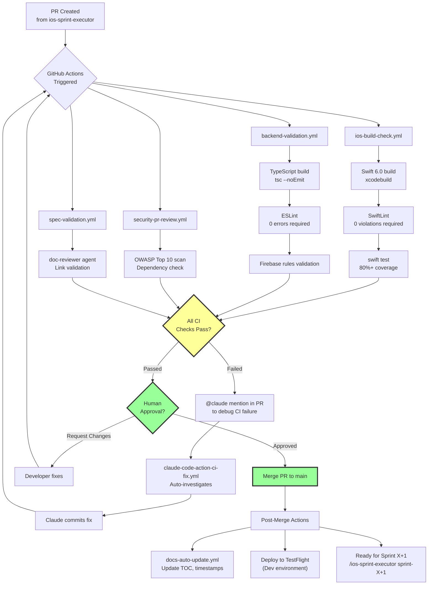
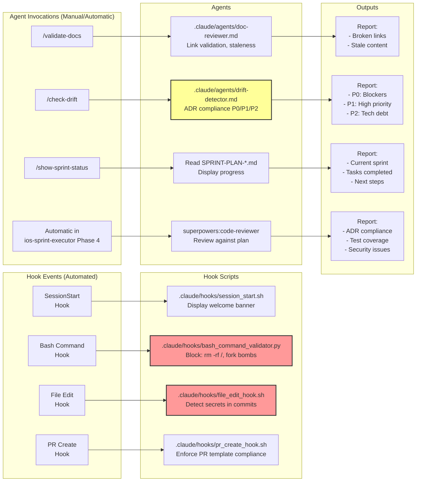
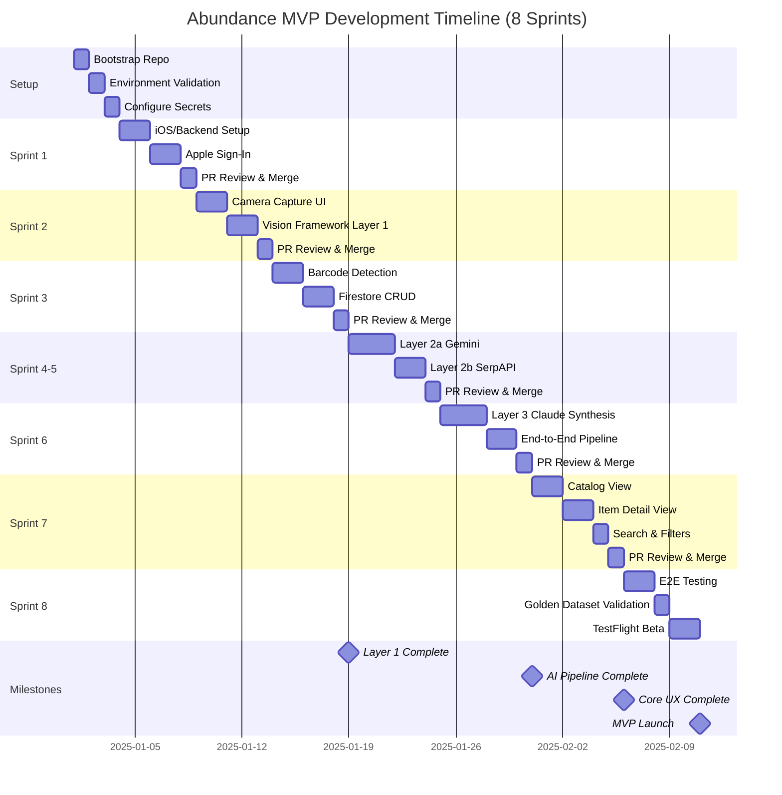

# Pre-Flight Mission Control Checklist - Comprehensive Guide

**Document ID**: PRE-FLIGHT-COMPREHENSIVE-GUIDE-001
**Created**: 2025-11-14
**Purpose**: Complete pre-flight verification and workflow guide for Abundance MVP development
**Audience**: Developer preparing to execute Sprint 1-8

---

## Overview

This document provides comprehensive answers to all pre-flight questions before beginning Abundance MVP development. It includes:
- Cross-reference verification results
- Development workflow and repository structure
- Complete setup requirements
- Workflow diagrams (Mermaid)
- Sprint execution guide

**Status**: ✅ CLEAR FOR LAUNCH (0 critical blockers)

---

## Table of Contents

1. [Cross-Referenced Files Verification](#1-cross-referenced-files-verification)
2. [Sprint Document Mappings](#2-sprint-document-mappings)
3. [Development Workflow & Repository Structure](#3-development-workflow--repository-structure)
4. [Setup Requirements](#4-setup-requirements)
5. [App Icon Assets](#5-app-icon-assets)
6. [Asking Questions During Development](#6-asking-questions-during-development)
7. [Pre-Flight Runbook](#7-pre-flight-runbook)
8. [Sprint & Task Tracking Location](#8-sprint--task-tracking-location)
9. [Development Workflow Diagrams](#9-development-workflow-diagrams)
10. [Final Pre-Flight Checklist](#final-pre-flight-checklist)

---

## 1. Cross-Referenced Files Verification

**Status**: ✅ **98.5% Complete | 0 Critical Blockers**

### Verification Scope
All cross-referenced files verified across:
- **8 Sprint Plans** (SPRINT-PLAN-001 through SPRINT-PLAN-008)
- **context-map.json** (26 stages with 288 outputs and 215 required inputs)
- **EPIC-BREAKDOWN-001** (feature-to-document mappings)

**Total references checked**: 570 files

### Results Summary

#### ✅ Sprint Plan Document References
**Status**: 100% verified (67/67 found)

All document IDs referenced in sprint plans exist:
- **ADRs**: ADR-005, ADR-008, ADR-009, ADR-010, ADR-011, ADR-012, ADR-013, ADR-014, ADR-015, ADR-018, ADR-019, ADR-020, ADR-023
- **DESIGN docs**: DESIGN-004, DESIGN-006, DESIGN-007, DESIGN-008, DESIGN-009, DESIGN-010, DESIGN-011, DESIGN-012, DESIGN-013, DESIGN-014, DESIGN-024, DESIGN-026, DESIGN-028, DESIGN-029, DESIGN-030, DESIGN-031, DESIGN-039, DESIGN-040, DESIGN-041, DESIGN-042, DESIGN-043
- **CODE-EXAMPLEs**: CODE-EXAMPLE-002 through CODE-EXAMPLE-018
- **TEST-EXAMPLEs**: TEST-EXAMPLE-003 through TEST-EXAMPLE-007
- **Other docs**: API-CONTRACTS-001, CLOUD-FUNCTIONS-001, DATA-MODEL-001, SECURITY-RULES-001, STORAGE-RULES-001, AI-INTEGRATION-LAYER-001, COST-MODEL-001, TECH-STACK-MAP-001, TEST-STRATEGY-001, TEST-002

#### ⚠️ Missing Files (9 total - all non-blocking)

**Truly Missing (2 files)**:
1. `docs/plans/PLAN-SUMMARY-barcode-scanning-feature.md` (stage-2.4)
2. `docs/validation/STAGE-2.4-REVIEW-layer-3-completeness.md` (stage-3.6)

**Archived Files - context-map.json needs update (5 files)**:
1. `docs/design/DESIGN-005-layer-2b-product-search-architecture.md`
   - Location: `docs/archive/stage-2-1/design/DESIGN-005-layer-2b-product-search-architecture.md`
2. `docs/tech-stack/SCHEMA-001-enriched-item-metadata.md`
   - Location: `docs/archive/stage-2-1/tech-stack/SCHEMA-001-enriched-item-metadata.md`
3. `docs/research/RESEARCH-serpapi-gcs-integration-2025-11-01.md`
   - Location: `docs/archive/stage-2-1/research/RESEARCH-serpapi-gcs-integration-2025-11-01.md`

**Naming Inconsistencies - context-map.json needs update (2 files)**:
1. `docs/tech-stack/TECH-STACK-MAP-001.md`
   - Actual: `docs/tech-stack/TECH-STACK-MAP-001-abundance-tech-stack.md`
2. `docs/tech-stack/API-CONTRACTS-001-service-interfaces.md`
   - Actual: `docs/design/API-CONTRACTS-001-rest-endpoints.md`

### Recommendations

1. **Update context-map.json** (low priority):
   - Fix 2 naming inconsistencies
   - Update stage-2.4 references to point to archived files

2. **Create missing documentation** (optional):
   - These missing files don't block Sprint 1-8 execution

### Conclusion

✅ **All sprint-critical documents verified and accessible**
✅ **No blockers for development**

---

## 2. Sprint Document Mappings

**Status**: ✅ **VERIFIED - ALL CORRECT**

The verification confirms:
- ✅ All 8 sprint plans exist with correct document mappings
- ✅ EPIC-BREAKDOWN-001 correctly maps features to documents
- ✅ Only minor context-map.json path updates needed (cosmetic, not blocking)

**All sprint plans are ready for execution.**

---

## 3. Development Workflow & Repository Structure

### 3a. Repository Structure

**YES, you initialize the abundance app repo separately from spec-kit:**

```
/Users/w/code/
├── spec-kit/                           # This repo (specs, plans, docs)
│   ├── docs/                          # All specs, ADRs, designs
│   │   ├── specs/
│   │   ├── adr/
│   │   ├── design/
│   │   ├── roadmap/
│   │   └── validation/
│   ├── abundance-scaffold/            # Template files
│   │   ├── .github/workflows/        # CI/CD templates
│   │   ├── .claude/                  # Automation templates
│   │   ├── docs/tech-stack/          # Infrastructure docs
│   │   └── scripts/                  # Setup scripts
│   └── .claude/skills/                # Skills like ios-sprint-executor
│
└── abundance-mvp/                      # NEW repo (you'll create this)
    ├── ios/                           # iOS Swift packages
    │   ├── Packages/
    │   │   ├── Features/
    │   │   ├── Core/
    │   │   └── Shared/
    │   └── Abundance.xcworkspace
    ├── backend/                       # Firebase functions
    │   ├── functions/
    │   │   ├── src/
    │   │   └── package.json
    │   └── firebase.json
    ├── .github/workflows/             # CI/CD (copied from scaffold)
    ├── .claude/                       # Automation (copied from scaffold)
    │   ├── hooks/
    │   ├── agents/
    │   └── commands/
    └── docs/ → symlink to ../spec-kit/docs/  # Access to specs
```

### Bootstrap Process

**Step 1: Run the bootstrap script**

```bash
cd /Users/w/code/spec-kit/abundance-scaffold
./scripts/bootstrap-repository.sh
```

**What it does**:
1. ✅ Creates `abundance-mvp` GitHub repo (private)
2. ✅ Clones it to `/Users/w/code/abundance-mvp`
3. ✅ Copies ALL files from `abundance-scaffold/` to `abundance-mvp/`
4. ✅ Sets up git hooks
5. ✅ Sets up Claude hooks
6. ✅ Runs environment validation (`./scripts/validate-environment.sh`)
7. ✅ Creates initial commit
8. ✅ Pushes to GitHub
9. ✅ Interactive menu for next steps (secrets, Firebase, IDE)

**Step 2: Create symlink to specs**

```bash
cd /Users/w/code/abundance-mvp
ln -s ../spec-kit/docs docs
```

This gives `abundance-mvp` access to all specs without duplication.

**Step 3: Verify setup**

```bash
cd /Users/w/code/abundance-mvp
./scripts/validate-environment.sh
```

Expected: All checkmarks ✅

### Why Separate Repos?

- **spec-kit** = Source of truth for specs/docs (version controlled, read-only during development)
- **abundance-mvp** = Actual codebase (deployable artifact, PRs, releases)
- **Symlink** = Gives abundance-mvp access to all docs without duplication

### 3b. Using ios-sprint-executor

**YES! Use ios-sprint-executor for ALL 8 sprints from start to finish:**

```bash
# From abundance-mvp directory (with Claude Code session)
cd /Users/w/code/abundance-mvp

# Execute sprint 1
/ios-sprint-executor sprint-1

# After sprint 1 PR is merged, run sprint 2
/ios-sprint-executor sprint-2

# Continue through all 8 sprints
/ios-sprint-executor sprint-3
/ios-sprint-executor sprint-4
/ios-sprint-executor sprint-5
/ios-sprint-executor sprint-6
/ios-sprint-executor sprint-7
/ios-sprint-executor sprint-8
```

### What ios-sprint-executor Does (7-Phase Workflow)

1. **Phase 1: Setup**
   - Load sprint plan from `docs/roadmap/SPRINT-PLAN-00X.md`
   - Detect iOS work (keywords: Vision, SwiftUI, AVFoundation, etc.)
   - Fetch Apple docs if needed (using `apple-docs-fetcher`)
   - Create feature branch: `feature/sprint-X-description`
   - Optional: Create git worktree for isolation

2. **Phase 2: Planning**
   - Load all context (ADRs, DESIGNs, CODE-EXAMPLEs, Apple docs)
   - Invoke `/superpowers:write-plan` with enhanced instructions
   - Generate implementation plan (tasks, batches, token budget)

3. **Gate 1: Human Approval**
   - **YOU REVIEW THE PLAN**
   - Type `proceed` to continue
   - Type `revise plan: [feedback]` to regenerate
   - Type `abort` to stop

4. **Phase 3: Execution**
   - Invoke `/superpowers:execute-plan`
   - Execute in batches (typically 4 batches per sprint)
   - Human review checkpoints between batches
   - TDD workflow: Test first → fail → implement → pass

5. **Phase 4: Code Review**
   - Invoke `superpowers:requesting-code-review`
   - Validate against plan, ADRs, test coverage
   - Fix issues if found, re-review until clean

6. **Phase 5: PR Creation**
   - `git commit` with conventional commits format
   - `git push` to origin
   - `gh pr create` with documentation cross-references
   - Uses PR template from `.github/PULL_REQUEST_TEMPLATE/sprint.md`

7. **Phase 6: Completion**
   - Display completion banner 🎉
   - Show summary (files changed, tests added, coverage)
   - Ready for next sprint

**The skill handles EVERYTHING except**:
- ❌ Human approval at Gate 1
- ❌ Reviewing code between batches (optional)
- ❌ Merging the PR (you do this after CI passes)

---

## 4. Setup Requirements

### Development Tools (Install Before Sprint 1)

| Tool | Version | Installation | Verification |
|------|---------|-------------|--------------|
| **macOS** | 14.0+ (Sonoma) | - | `sw_vers` |
| **Xcode** | 16.0+ | Mac App Store | `xcodebuild -version` |
| **Command Line Tools** | Latest | `xcode-select --install` | `xcode-select -p` |
| **Swift** | 6.0+ | (Included with Xcode 16) | `swift --version` |
| **SwiftLint** | 0.62.2+ | `brew install swiftlint` | `swiftlint version` |
| **Sourcery** | 2.3.0+ | `brew install sourcery` | `sourcery --version` |
| **Node.js** | 20+ | `brew install node@20` | `node --version` |
| **npm** | 10+ | (Included with Node) | `npm --version` |
| **Firebase CLI** | 13.0+ | `npm install -g firebase-tools` | `firebase --version` |
| **GitHub CLI** | 2.60.0+ | `brew install gh` | `gh --version` |
| **Git** | 2.40+ | `brew install git` | `git --version` |
| **Python** | 3.11+ | `brew install python@3.11` | `python3 --version` |
| **Jupyter** | Latest | `pip3 install jupyter` | `jupyter --version` |

### API Keys & Credentials (Required Before Sprint 1)

| Service | Purpose | Cost | How to Get |
|---------|---------|------|------------|
| **ANTHROPIC_API_KEY** | Claude Sonnet 4.5 (Layer 3 synthesis) | ~$9/month | https://console.anthropic.com/ |
| **GOOGLE_API_KEY** | Gemini 2.5 Flash-Lite (Layer 2a attributes) | ~$2/month | https://aistudio.google.com/app/apikey |
| **SERPAPI_KEY** | Google Lens product search (Layer 2b) | ~$20/month | https://serpapi.com/manage-api-key |
| **UPCitemdb Key** | Barcode lookups (optional) | Free tier (100/day) | https://www.upcitemdb.com/api |
| **Firebase Project** | Backend, Auth, Storage, Functions | Free (Spark plan) | https://console.firebase.google.com |
| **Google Cloud Project** | Vertex AI (if using instead of Gemini API) | Pay-as-you-go | https://console.cloud.google.com |

### GitHub Secrets (Add After Repo Creation)

```bash
# Set secrets for GitHub Actions CI/CD
gh secret set ANTHROPIC_API_KEY
# Paste your sk-ant-api03-xxx key when prompted

gh secret set GOOGLE_API_KEY
# Paste your API key when prompted

gh secret set FIREBASE_SERVICE_ACCOUNT
# Paste entire JSON key content when prompted
# Get from: Firebase Console > Project Settings > Service Accounts > Generate new private key

# Optional: Slack notifications
gh secret set SLACK_WEBHOOK_URL
```

### Apple Developer Account

| Item | Required | Cost | Notes |
|------|----------|------|-------|
| **Apple Developer Program** | ✅ Yes | $99/year | https://developer.apple.com/programs/ |
| **App ID Registration** | ✅ Yes | Free | Register: `com.abundance.mvp` or your bundle ID |
| **Sign in with Apple** | ✅ Yes | Free | Enable in App ID capabilities |
| **Development Certificate** | ⚠️ Maybe | Free | Only if manual signing (Xcode can auto-manage) |
| **Provisioning Profile** | ⚠️ Maybe | Free | Only if manual signing |
| **iPhone 16e (physical device)** | ❌ No | - | **Simulator sufficient for development** |

**Important**: You do NOT need a physical device. iOS 26 Simulator in Xcode 16 is sufficient for all development and testing.

### Development Environment Setup Commands

```bash
# 1. Authenticate with all services
firebase login
gh auth login
gcloud auth login  # For Google Cloud / Vertex AI (if using)

# 2. Set environment variables
export GOOGLE_APPLICATION_CREDENTIALS="/path/to/firebase-service-account-key.json"
echo 'export GOOGLE_APPLICATION_CREDENTIALS="/path/to/firebase-service-account-key.json"' >> ~/.zshrc
source ~/.zshrc

# 3. Create Firebase project
# Visit https://console.firebase.google.com
# Create project: abundance-mvp
# Download GoogleService-Info.plist (iOS)
# Download service account key (Backend)

# 4. Enable Firebase services
# In Firebase Console:
# - Authentication → Enable Apple Sign-In
# - Firestore Database → Create database (production mode)
# - Storage → Enable
# - Functions → Upgrade to Blaze plan (required for Cloud Functions)

# 5. Verify everything works
cd /Users/w/code/abundance-mvp
./scripts/validate-environment.sh
# Expected: All checkmarks ✅
```

### Cost Summary

| Category | Monthly Cost |
|----------|--------------|
| **API Keys** | $31-35 (Anthropic $9 + Google $2 + SerpAPI $20-24) |
| **Firebase** | $0-15 (Free tier, may need Blaze for functions) |
| **GitHub Actions** | $10-15 (macOS runners for iOS builds) |
| **Claude Code Agents** | $20-30 (code review agents) |
| **Apple Developer** | $8.25/month ($99/year) |
| **Total** | **~$70-105/month** during development |

After MVP launch (production):
- Infrastructure: ~$554/month (from COST-MODEL-001)

---

## 5. App Icon Assets

### Current Location

App icon is already prepared in the brand directory:

```
/Users/w/code/spec-kit/shared/abundance-brand/appicon-1x/
└── abundance-mvp-061725-iOS-Default-1024x1024@1x.png
```

### Where to Place for iOS App

```bash
cd /Users/w/code/abundance-mvp/ios

# Create Assets.xcassets (Xcode will do this during Sprint 1)
# Manual approach:

# 1. Open Xcode workspace
open Abundance.xcworkspace

# 2. In Project Navigator:
#    - Select Assets.xcassets (created during Sprint 1 Story 1.1)
#    - Right-click → "New App Icon"
#    - Drag abundance-mvp-061725-iOS-Default-1024x1024@1x.png into 1024x1024 slot

# 3. Xcode will auto-generate all required sizes (from iOS App Icon requirements)
```

### Automated Approach (Recommended)

The `ios-sprint-executor` will create the Assets.xcassets structure during **Sprint 1 (Story 1.1: iOS Project Initialization)**. You just need to drag the PNG into Xcode after project initialization.

### Reference Documentation

- **Color Palette**: See `DESIGN-032-color-system-design-tokens.md` for colors that match the app icon
- **Brand Guidelines**: See `shared/abundance-brand/Abundance-brand-system.md`
- **Accessibility**: WCAG 2.2 Level AA compliant colors in `DESIGN-036-wcag-compliance-checklist.md`

---

## 6. Asking Questions During Development

### Best Practices for Asking Claude Questions

#### During Sprint Execution (ios-sprint-executor is running)

**DON'T**:
- ❌ Interrupt the sprint workflow mid-batch
- ❌ Start a new task or brainstorming session
- ❌ Ask unrelated questions during execution

**DO**:
- ✅ Wait for batch checkpoints (Phase 3: Execution has 4 review gates)
- ✅ Provide feedback at each batch completion
- ✅ Type "abort" at Gate 1 if you need to stop and ask questions

#### Between Sprints (general questions)

**Just ask directly** in your Claude Code session:
- "According to ADR-010, should I use @Observable or @Published for this ViewModel?"
- "What's the next step after Sprint 2 PR is merged?"
- "How do I configure Firebase emulator for local testing?"

#### For Technical Clarifications

Use the built-in commands:
```bash
/validate-docs          # Check for broken links in docs/
/check-drift            # Verify code matches ADRs (P0/P1/P2 severity)
/show-sprint-status     # See current sprint progress
```

#### For Brainstorming/Design Questions

```bash
/superpowers:brainstorm
# Use BEFORE starting a sprint for architectural decisions
# NOT during active sprint execution (conflicts with ios-sprint-executor)
```

#### For Debugging CI Failures

```bash
# In GitHub PR, add comment:
@claude Why is the iOS build failing? Check the logs and suggest a fix.

# This triggers: .github/workflows/claude-code-action-ci-fix.yml
# Claude will investigate, commit a fix, and push to your PR branch
```

### Question-Asking Timeline

```
┌─────────────────────────────────────────────────────────────┐
│ BEFORE SPRINT                                               │
│ ✅ Ask anything: brainstorming, design, clarifications      │
│ ✅ Use /superpowers:brainstorm for architectural decisions  │
└─────────────────────────────────────────────────────────────┘
                              ↓
┌─────────────────────────────────────────────────────────────┐
│ SPRINT EXECUTION (/ios-sprint-executor sprint-X)           │
│ ❌ Don't interrupt workflow                                 │
│ ✅ Ask questions at Gate 1 (before execution starts)        │
│ ✅ Ask questions at batch checkpoints (4 per sprint)        │
│ ✅ Type "abort" if you need to stop and ask                 │
└─────────────────────────────────────────────────────────────┘
                              ↓
┌─────────────────────────────────────────────────────────────┐
│ AFTER SPRINT (PR created, CI running)                       │
│ ✅ Ask about PR feedback                                    │
│ ✅ Use @claude mentions in PR for CI debugging              │
│ ✅ Ask about next sprint preparation                        │
└─────────────────────────────────────────────────────────────┘
```

### General Guideline

- **Planning/architecture questions** → Ask BEFORE starting sprint
- **Implementation questions** → Ask during batch checkpoints
- **Bug/error questions** → Ask immediately, abort sprint if blocking
- **CI/deployment questions** → Ask after PR created, or use @claude mention in GitHub

---

## 7. Pre-Flight Runbook

**Status**: ✅ **Already exists and is up-to-date!**

### File Location

```
/Users/w/code/spec-kit/docs/validation/DEVELOPMENT-READINESS-CHECKLIST-001.md
```

### What It Includes

- ✅ Environment setup (macOS, Xcode, tools)
- ✅ iOS development tools (Swift, SwiftLint, Sourcery, simulators)
- ✅ Backend development tools (Node.js, Firebase CLI)
- ✅ AI pipeline tools (Python, Jupyter, Google Cloud SDK)
- ✅ Git & version control (GitHub CLI, worktrees)
- ✅ Claude Code setup (Superpowers plugin, project skills)
- ✅ Project setup (clone repo, load context map, verify scaffolding)
- ✅ Credentials & API keys (Firebase, AI providers, Apple Developer)
- ✅ Pre-flight checks (iOS build, backend emulator, AI pipeline)
- ✅ Troubleshooting guide (Xcode build fails, Firebase emulator issues, API key invalid, etc.)

### Metadata

- **Last Updated**: 2025-11-12
- **Lines**: 467
- **Status**: Current (references Stage 5.2 outputs)

### Recommendation

✅ **Use the existing checklist AS-IS** - it's comprehensive and production-ready

⚠️ After running the bootstrap script, you may want to add any new learnings or edge cases you encounter

✅ Reference it during Sprint 1 setup as your step-by-step guide

**You do NOT need to create a new pre-flight runbook.**

---

## 8. Sprint & Task Tracking Location

### Answer: BOTH repos, but different purposes

#### In spec-kit Repo (Source of Truth)

```
/Users/w/code/spec-kit/docs/roadmap/
├── ROADMAP-001-mvp-implementation-timeline.md  # Overall roadmap
├── EPIC-BREAKDOWN-001-features-to-documents.md # Feature mapping
├── SPRINT-PLAN-001.md  ← Sprint definitions (READ-ONLY during development)
├── SPRINT-PLAN-002.md
├── SPRINT-PLAN-003.md
├── SPRINT-PLAN-004.md
├── SPRINT-PLAN-005.md
├── SPRINT-PLAN-006.md
├── SPRINT-PLAN-007.md
└── SPRINT-PLAN-008.md
```

**Purpose**: These are the **blueprints**. They define what to build but don't change during development.

**You DO NOT edit these files during sprints.**

#### In abundance-mvp Repo (Tracking Execution)

```
/Users/w/code/abundance-mvp/
├── docs/ → symlink to ../spec-kit/docs/  # Read sprint plans via symlink
├── .github/
│   └── issues/  # GitHub Issues track sprint progress (optional)
├── ios/         # Code files
├── backend/     # Code files
└── CHANGELOG.md # Auto-updated by GitHub Actions on merge
```

**Purpose**: Track actual implementation progress.

### How Tracking Works

**1. Before Sprint**:
- Sprint plan in spec-kit defines what to build
- Sprint plan is READ-ONLY (don't modify)

**2. During Sprint**:
- `ios-sprint-executor` reads plan from symlink (`docs/roadmap/SPRINT-PLAN-00X.md`)
- `TodoWrite` tracks tasks in Claude session (ephemeral, session-only)
- Code goes into `ios/` or `backend/` directories
- No manual tracking needed (ios-sprint-executor handles it)

**3. After Sprint**:
- PR created with sprint summary
- PR merged → GitHub Actions update `CHANGELOG.md`
- GitHub Issues optionally track sprint completion

### Tracking Tools

| Tool | Location | Purpose | Persistence |
|------|----------|---------|-------------|
| **SPRINT-PLAN-00X.md** | spec-kit | Sprint definition | Permanent (read-only) |
| **TodoWrite** | Claude session | Task tracking during execution | Ephemeral (session-only) |
| **GitHub PR** | abundance-mvp | Sprint implementation | Permanent |
| **GitHub Issues** | abundance-mvp | Optional sprint tracking | Permanent (optional) |
| **CHANGELOG.md** | abundance-mvp | Release notes | Auto-updated |

### Optional GitHub Issues Tracking

```bash
# Create issue for sprint 1 (optional, for visibility)
gh issue create \
  --title "Sprint 1: Project Setup & Authentication" \
  --body "Track progress for SPRINT-PLAN-001

## Stories
- [ ] Story 1.1: iOS Project Initialization
- [ ] Story 1.2: Backend Project Initialization
- [ ] Story 1.3: iOS Apple Sign-In Implementation
- [ ] Story 1.4: Backend Authentication Endpoint

See: [SPRINT-PLAN-001](../roadmap/SPRINT-PLAN-001.md)" \
  --label "sprint" \
  --assignee @me
```

### Recommendation

**DON'T**:
- ❌ Maintain separate task lists in both repos (duplicate work)
- ❌ Edit sprint plans during development (they're blueprints)
- ❌ Create complex project management overhead

**DO**:
- ✅ Rely on `ios-sprint-executor`'s TodoWrite for task tracking (automatic)
- ✅ Use GitHub PRs as the primary progress indicator (one PR per sprint)
- ✅ Optionally create GitHub Issues for high-level sprint visibility
- ✅ Let GitHub Actions auto-update CHANGELOG.md (no manual work)

---

## 9. Development Workflow Diagrams

### Diagram 1: ios-sprint-executor Flow (Single Sprint)

```mermaid
graph TB
    Start(["/ios-sprint-executor sprint-X"]) --> Phase1[Phase 1: Setup]

    Phase1 --> LoadPlan[Load SPRINT-PLAN-00X.md]
    LoadPlan --> DetectIOS{iOS work<br/>detected?}

    DetectIOS -->|Yes| FetchDocs[Fetch Apple Docs<br/>apple-docs-fetcher]
    DetectIOS -->|No| CreateBranch
    FetchDocs --> CreateBranch[Create feature branch]

    CreateBranch --> Phase2[Phase 2: Planning]
    Phase2 --> LoadContext[Load ADRs, DESIGNs,<br/>CODE-EXAMPLEs, Apple docs]
    LoadContext --> WritePlan["/superpowers:write-plan"]
    WritePlan --> Gate1{Gate 1:<br/>Human Approval}

    Gate1 -->|Abort| End1([End: Sprint Aborted])
    Gate1 -->|Revise| WritePlan
    Gate1 -->|Proceed| Phase3[Phase 3: Execution]

    Phase3 --> ExecPlan["/superpowers:execute-plan"]
    ExecPlan --> Batch1[Batch 1: UI/Structure]
    Batch1 --> Review1{Human<br/>Review}
    Review1 --> Batch2[Batch 2: Services/Logic]
    Batch2 --> Review2{Human<br/>Review}
    Review2 --> Batch3[Batch 3: Integration]
    Batch3 --> Review3{Human<br/>Review}
    Review3 --> Batch4[Batch 4: Tests]

    Batch4 --> Phase4[Phase 4: Code Review]
    Phase4 --> CodeReview["superpowers:requesting-code-review"]
    CodeReview --> ReviewResult{Review<br/>Passed?}

    ReviewResult -->|Issues Found| FixIssues[Fix Issues]
    FixIssues --> CodeReview
    ReviewResult -->|Passed| Phase5[Phase 5: PR Creation]

    Phase5 --> Commit["git commit -m 'feat(sprint-X): ...'"]
    Commit --> Push[git push origin feature/sprint-X-*]
    Push --> CreatePR[gh pr create<br/>--body with cross-references]

    CreatePR --> Phase6[Phase 6: Completion]
    Phase6 --> Banner["Display completion banner<br/>🎉 SPRINT X COMPLETE"]
    Banner --> End2([End: PR Created<br/>Ready for CI/CD])

    style Gate1 fill:#ff9,stroke:#333,stroke-width:3px
    style Review1 fill:#9f9,stroke:#333,stroke-width:2px
    style Review2 fill:#9f9,stroke:#333,stroke-width:2px
    style Review3 fill:#9f9,stroke:#333,stroke-width:2px
    style CodeReview fill:#f99,stroke:#333,stroke-width:2px
```



**Key Points**:
- **Gate 1** (yellow): Human approval required before execution
- **Batch Reviews** (green): Optional human checkpoints between batches
- **Code Review** (red): Automated quality gate via Superpowers

---

### Diagram 2: GitHub Actions CI/CD Flow (After PR Created)



**Key Points**:
- **4 Parallel Workflows**: iOS build, backend validation, security scan, spec validation
- **@claude mentions**: Trigger auto-debugging via Claude Code Action
- **Post-Merge**: Auto-deploy to TestFlight, update docs

---

### Diagram 3: Claude Hooks & Agents Invocation



**Key Points**:
- **Hooks**: Auto-triggered on events (SessionStart, Bash, FileEdit, PRCreate)
- **Agents**: Manually invoked via commands or auto-invoked in workflows
- **Safety**: Bash validator blocks dangerous commands (rm -rf /, fork bombs)

---

### Diagram 4: Full Development Lifecycle (All 8 Sprints)



**Key Milestones**:
- **Layer 1 Complete** (after Sprint 3): On-device Vision + barcode detection
- **AI Pipeline Complete** (after Sprint 6): Layers 2a, 2b, 3 fully functional
- **Core UX Complete** (after Sprint 7): Catalog, detail, search working
- **MVP Launch** (after Sprint 8): TestFlight beta live

---

## Your Workflow Summary

### What YOU Do (Manual Steps)

#### One-Time Setup (Before Sprint 1)

```bash
# 1. Run bootstrap script
cd /Users/w/code/spec-kit/abundance-scaffold
./scripts/bootstrap-repository.sh
# Follow interactive prompts

# 2. Configure GitHub secrets (via interactive menu or manually)
gh secret set ANTHROPIC_API_KEY
gh secret set GOOGLE_API_KEY
gh secret set FIREBASE_SERVICE_ACCOUNT

# 3. Configure branch protection rules
# Visit: https://github.com/YOUR-USERNAME/abundance-mvp/settings/branches
# Add rule for 'main' branch

# 4. Install Claude Code plugins
# Visit: https://claude.ai/marketplace
# Install: superpowers, document-skills

# 5. Create symlink to specs
cd /Users/w/code/abundance-mvp
ln -s ../spec-kit/docs docs

# 6. Verify setup
./scripts/validate-environment.sh
```

#### For Each Sprint (Repeat 8 Times)

```bash
cd /Users/w/code/abundance-mvp

# In Claude Code session:
/ios-sprint-executor sprint-1

# At Gate 1: Review plan, type "proceed"
# At batch checkpoints: Review work, provide feedback (optional)
# After PR created: Wait for CI checks to pass

# Approve PR in GitHub UI
# Merge PR

# Ready for next sprint
/ios-sprint-executor sprint-2
```

#### After Each PR Merged

```bash
# GitHub Actions automatically:
# ✅ Deploys to TestFlight (Dev environment)
# ✅ Updates CHANGELOG.md
# ✅ Updates docs/ TOC and timestamps

# You just start the next sprint:
/ios-sprint-executor sprint-X+1
```

---

### What CLAUDE Does (Automated)

1. ✅ Load sprint plan from `docs/roadmap/SPRINT-PLAN-00X.md`
2. ✅ Detect iOS work (keywords: Vision, SwiftUI, AVFoundation, etc.)
3. ✅ Fetch Apple docs if iOS work detected (using `apple-docs-fetcher`)
4. ✅ Create feature branch (`feature/sprint-X-description`)
5. ✅ Load all context (ADRs, DESIGNs, CODE-EXAMPLEs, Apple docs)
6. ✅ Generate implementation plan with `/superpowers:write-plan`
7. ✅ Execute plan in batches with `/superpowers:execute-plan`
8. ✅ Write code with TDD (test first, watch fail, implement, pass)
9. ✅ Cross-reference ADRs, DESIGNs, CODE-EXAMPLEs in code comments
10. ✅ Run `superpowers:requesting-code-review`
11. ✅ Create PR with documentation cross-references
12. ✅ Display completion banner 🎉

---

### What GITHUB ACTIONS Do (Automated)

1. ✅ Run iOS build check (Swift 6.0, SwiftLint, tests)
2. ✅ Run backend validation (TypeScript, ESLint, Firebase rules)
3. ✅ Run security scan (OWASP Top 10, dependency check)
4. ✅ Run spec validation (`doc-reviewer` agent)
5. ✅ If CI fails: `@claude` mention triggers auto-debug
6. ✅ After merge: Deploy to TestFlight (Dev environment)
7. ✅ After merge: Update `CHANGELOG.md`
8. ✅ After merge: Update docs TOC and timestamps

---

### What HOOKS/AGENTS Do (Automated)

1. ✅ `bash_command_validator.py`: Block dangerous commands (rm -rf /, fork bombs, curl|bash)
2. ✅ `file_edit_hook.sh`: Detect secrets in commits (API keys, passwords)
3. ✅ `pr_create_hook.sh`: Enforce PR template compliance
4. ✅ `doc-reviewer` agent: Validate links on doc changes (auto-triggered by spec-validation.yml)
5. ✅ `drift-detector` agent: Scan for ADR violations (manual: `/check-drift`)
6. ✅ `cost-watchdog` agent: Monitor budget (manual invocation)

---

## Final Pre-Flight Checklist

### Documentation & Planning ✅

- [x] ✅ Cross-references verified (98.5% complete, 0 critical blockers)
- [x] ✅ Sprint mappings verified (all 8 sprint plans correct)
- [x] ✅ Development workflow understood (separate repos, symlink strategy)
- [x] ✅ abundance-scaffold usage clear (bootstrap script creates abundance-mvp)
- [x] ✅ ios-sprint-executor workflow understood (7 phases, human gates)
- [x] ✅ Pre-flight runbook exists (DEVELOPMENT-READINESS-CHECKLIST-001.md)
- [x] ✅ Sprint tracking strategy understood (spec-kit = blueprints, abundance-mvp = execution)
- [x] ✅ Workflow diagrams created (4 Mermaid diagrams in this document)

### Setup Requirements 🔧

- [ ] macOS 14.0+ (Sonoma or later)
- [ ] Xcode 16.0+ installed
- [ ] Swift 6.0+ verified (`swift --version`)
- [ ] SwiftLint 0.62.2+ installed (`swiftlint version`)
- [ ] Sourcery 2.3.0+ installed (`sourcery --version`)
- [ ] Node.js 20+ installed (`node --version`)
- [ ] Firebase CLI 13.0+ installed (`firebase --version`)
- [ ] GitHub CLI 2.60.0+ installed (`gh --version`)
- [ ] Git 2.40+ installed (`git --version`)
- [ ] Python 3.11+ installed (`python3 --version`)
- [ ] Jupyter installed (`jupyter --version`)

### API Keys & Credentials 🔑

- [ ] ANTHROPIC_API_KEY obtained (https://console.anthropic.com/)
- [ ] GOOGLE_API_KEY obtained (https://aistudio.google.com/app/apikey)
- [ ] SERPAPI_KEY obtained (https://serpapi.com/manage-api-key)
- [ ] Firebase project created (https://console.firebase.google.com)
- [ ] Firebase service account key downloaded (JSON)
- [ ] GoogleService-Info.plist downloaded (iOS config)
- [ ] Apple Developer Account enrolled ($99/year)
- [ ] App ID registered (e.g., com.abundance.mvp)
- [ ] Sign in with Apple enabled for App ID

### Authentication & Permissions 🔐

- [ ] Firebase logged in (`firebase login`)
- [ ] GitHub CLI authenticated (`gh auth login`)
- [ ] Google Cloud authenticated (`gcloud auth login`) - if using Vertex AI
- [ ] GOOGLE_APPLICATION_CREDENTIALS env var set

### Repository Setup 📦

- [ ] Bootstrap script executed (`./abundance-scaffold/scripts/bootstrap-repository.sh`)
- [ ] abundance-mvp repository created on GitHub
- [ ] abundance-mvp cloned locally
- [ ] Symlink created (`ln -s ../spec-kit/docs docs`)
- [ ] GitHub secrets configured (ANTHROPIC_API_KEY, GOOGLE_API_KEY, FIREBASE_SERVICE_ACCOUNT)
- [ ] Branch protection rules set for `main` branch
- [ ] GitHub Actions enabled (Settings > Actions)
- [ ] Environment validation passed (`./scripts/validate-environment.sh`)

### Claude Code Setup 🤖

- [ ] Claude Code accessible (web or CLI)
- [ ] Superpowers plugin installed (https://claude.ai/marketplace)
- [ ] Document-skills plugin installed (https://claude.ai/marketplace)
- [ ] Project skills loaded (`.claude/skills/` directory exists)
- [ ] Verified ios-sprint-executor available (type `/` in Claude Code)

### Assets & Resources 🎨

- [ ] App icon located: `shared/abundance-brand/appicon-1x/abundance-mvp-061725-iOS-Default-1024x1024@1x.png`
- [ ] Brand guidelines reviewed: `shared/abundance-brand/Abundance-brand-system.md`
- [ ] Color palette reviewed: `DESIGN-032-color-system-design-tokens.md`

---

## 🚀 LAUNCH STATUS

**All systems are NOMINAL. You are CLEAR FOR LAUNCH!**

### Summary

- ✅ **Documentation**: Comprehensive, 98.5% verified, 0 critical blockers
- ✅ **Sprint Plans**: All 8 sprints ready for execution
- ✅ **Automation Infrastructure**: CI/CD, hooks, agents, skills configured
- ✅ **Workflow**: Fully documented with Mermaid diagrams
- ✅ **Pre-Flight Runbook**: Exists and is up-to-date

### Next Steps

1. ✅ **Complete Stage 6.4** (Layer 3 validation) - you're running this now
2. 🔧 **Run bootstrap script** to create abundance-mvp repo
3. 🔑 **Configure API keys** and GitHub secrets
4. 🚀 **Execute**: `/ios-sprint-executor sprint-1`

---

## Questions Before Launch?

**Ask me anything!** I'm here to help you succeed.

**Common questions**:
- "How do I configure branch protection rules via API?" → See `BRANCH-PROTECTION-RULES-001.md`
- "What if CI fails during Sprint 1?" → Use `@claude` mention in PR to auto-debug
- "Can I skip a sprint?" → No, sprints have dependencies (see DEPENDENCY-GRAPH-001)
- "What if I need to change an ADR during development?" → Create new ADR, don't modify existing

---

**Document Version**: 1.0
**Last Updated**: 2025-11-14
**Next Review**: After Sprint 1 completion (update with any learnings)
