# Catalog Pipeline Documentation Plan

> **For Claude:** REQUIRED SUB-SKILL: Use superpowers:executing-plans to implement this plan task-by-task.

**Goal:** Create comprehensive visual documentation of the Abundance catalog pipeline with rendered Mermaid diagrams (PNG) covering every stage from photo capture to inventory display.

**Architecture:** Documentation-only task. Uses the `mcp-mermaid` MCP server to render Mermaid syntax into PNG images stored in `docs/architecture/diagrams/`. A single master document (`docs/architecture/catalog-pipeline.md`) ties everything together with inline diagram references, exact prompts, schemas, and data flow descriptions.

**Tech Stack:** Mermaid (via mcp-mermaid MCP server), Markdown, PNG output

---

## Prerequisites

- mcp-mermaid MCP server is configured in `.claude.json` (already done)
- Claude session restarted to pick up MCP server
- Load the mermaid tool via `ToolSearch` query `"mermaid"` before first use

## File Layout

```
docs/architecture/
  catalog-pipeline.md              ← Master document
  diagrams/
    01-system-overview.png         ← High-level system architecture
    02-capture-upload-flow.png     ← Camera → GCS → Firestore
    03-layer1-detection.png        ← Gemini Flash object detection
    04-layer1-cropping.png         ← Server-side crop + storage
    05-catalog-button-flow.png     ← User catalogs → item creation
    06-layer2-tool-calling.png     ← Gemini Pro tool calling loop
    07-rescan-flow.png             ← Re-catalog button flow
    08-deep-scan-flow.png          ← Deep scan button flow
    09-firestore-schema.png        ← Entity relationship diagram
    10-storage-paths.png           ← GCS bucket/path diagram
    11-status-state-machine.png    ← Item + Session status transitions
    12-cost-breakdown.png          ← Per-item cost flow
```

---

### Task 1: Create Directory Structure

**Files:**
- Create: `docs/architecture/` directory
- Create: `docs/architecture/diagrams/` directory

**Step 1: Create directories**

```bash
mkdir -p docs/architecture/diagrams
```

**Step 2: Verify**

```bash
ls -la docs/architecture/diagrams/
```
Expected: empty directory exists

**Step 3: Commit**

```bash
git add docs/architecture/
git commit -m "docs: scaffold architecture documentation directories"
```

---

### Task 2: Load MCP Tool & Render Diagram 01 — System Overview

**Step 1: Load the mermaid MCP tool**

Use `ToolSearch` with query `"mermaid"` to discover and load the rendering tool.

**Step 2: Render the system overview diagram**

Use the mermaid MCP tool to render this diagram to `docs/architecture/diagrams/01-system-overview.png`:

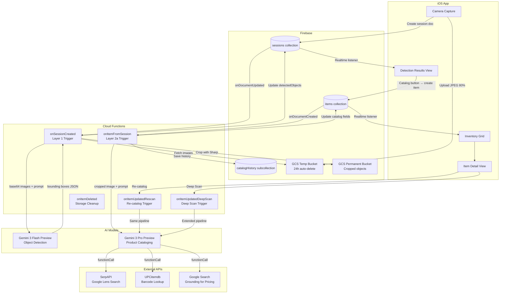

**Step 3: Verify the PNG was created**

```bash
ls -la docs/architecture/diagrams/01-system-overview.png
```

---

### Task 3: Render Diagram 02 — Capture & Upload Flow

**Step 1: Render to `docs/architecture/diagrams/02-capture-upload-flow.png`**

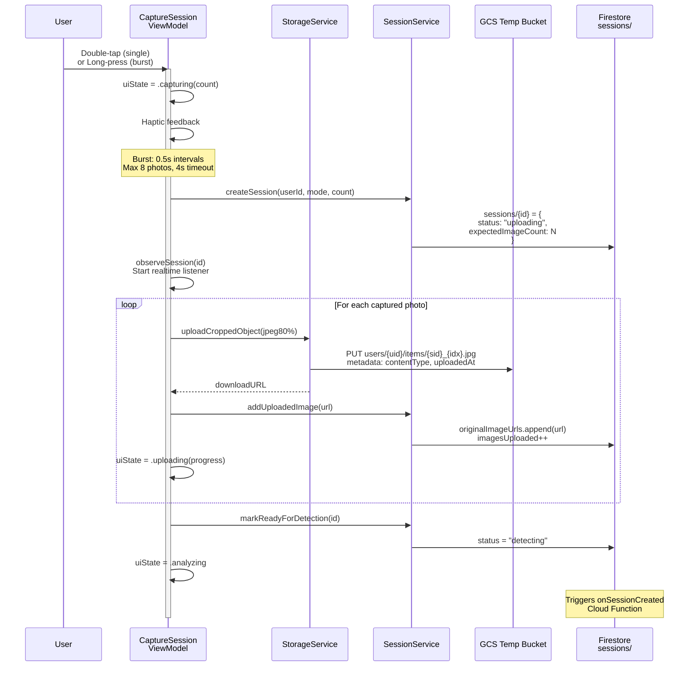

---

### Task 4: Render Diagram 03 — Layer 1 Detection

**Step 1: Render to `docs/architecture/diagrams/03-layer1-detection.png`**

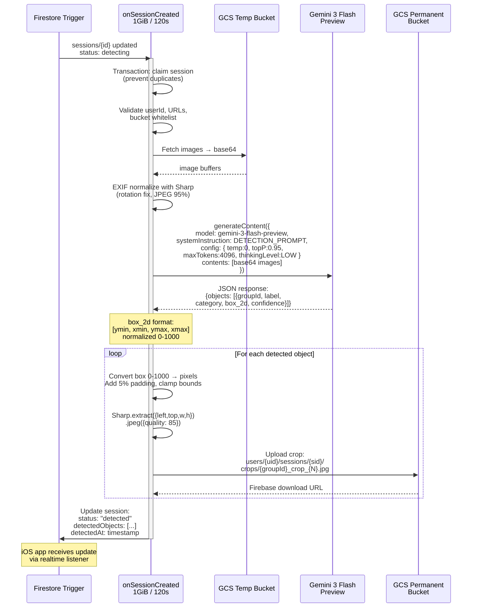

---

### Task 5: Render Diagram 04 — Layer 1 Cropping Detail

**Step 1: Render to `docs/architecture/diagrams/04-layer1-cropping.png`**

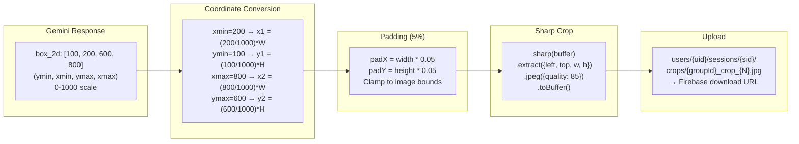

---

### Task 6: Render Diagram 05 — Catalog Button Flow

**Step 1: Render to `docs/architecture/diagrams/05-catalog-button-flow.png`**

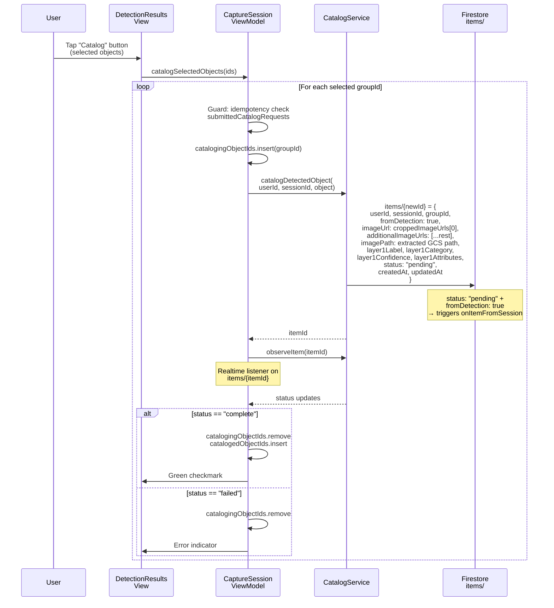

---

### Task 7: Render Diagram 06 — Layer 2 Tool Calling Loop

**Step 1: Render to `docs/architecture/diagrams/06-layer2-tool-calling.png`**

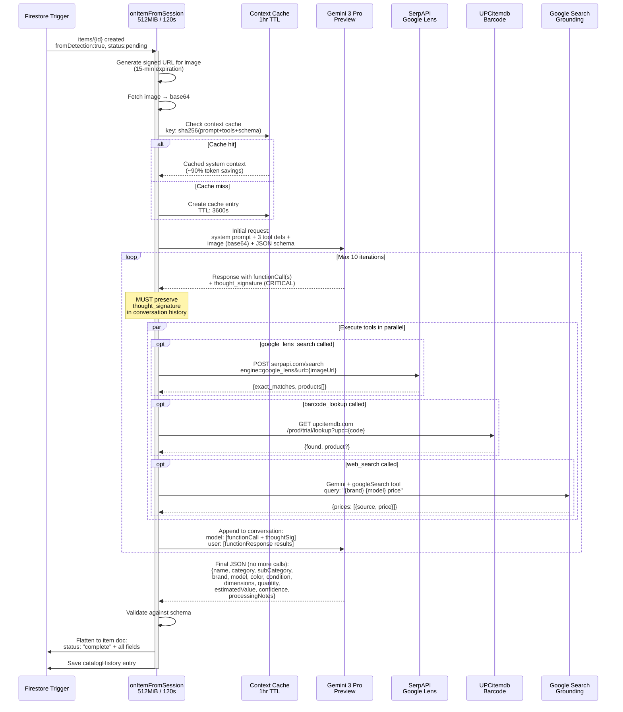

---

### Task 8: Render Diagram 07 — Re-catalog Flow

**Step 1: Render to `docs/architecture/diagrams/07-rescan-flow.png`**

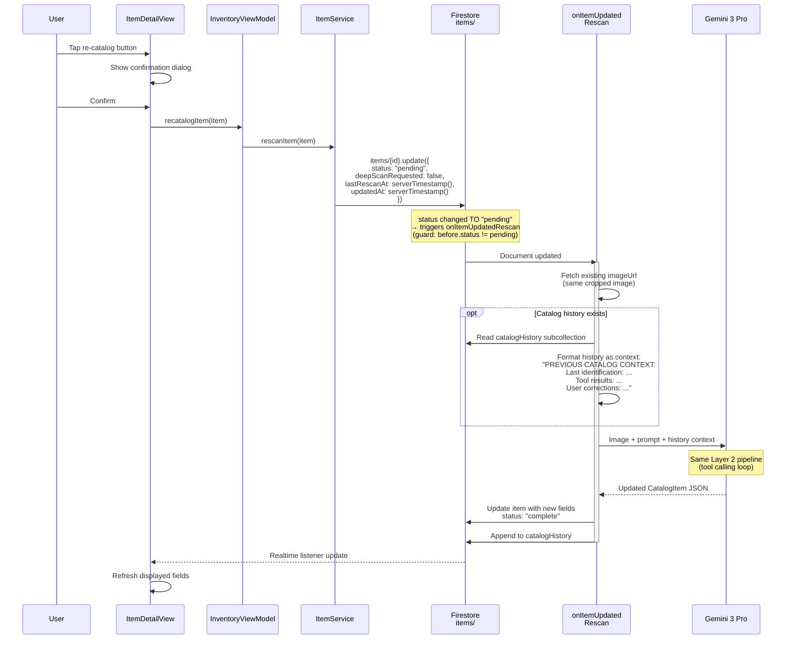

---

### Task 9: Render Diagram 08 — Deep Scan Flow

**Step 1: Render to `docs/architecture/diagrams/08-deep-scan-flow.png`**

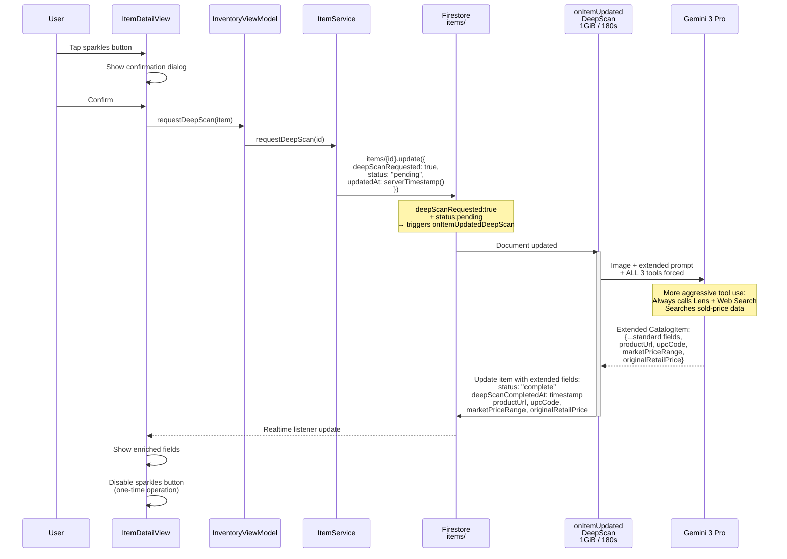

---

### Task 10: Render Diagram 09 — Firestore Schema ERD

**Step 1: Render to `docs/architecture/diagrams/09-firestore-schema.png`**

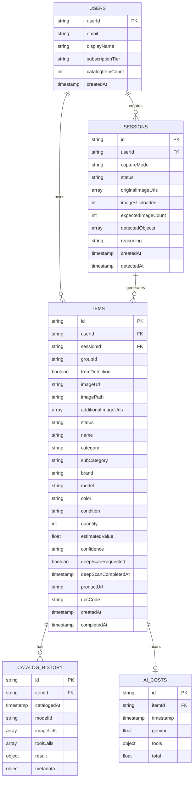

---

### Task 11: Render Diagram 10 — Storage Paths

**Step 1: Render to `docs/architecture/diagrams/10-storage-paths.png`**

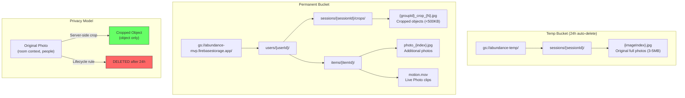

---

### Task 12: Render Diagram 11 — Status State Machines

**Step 1: Render to `docs/architecture/diagrams/11-status-state-machine.png`**

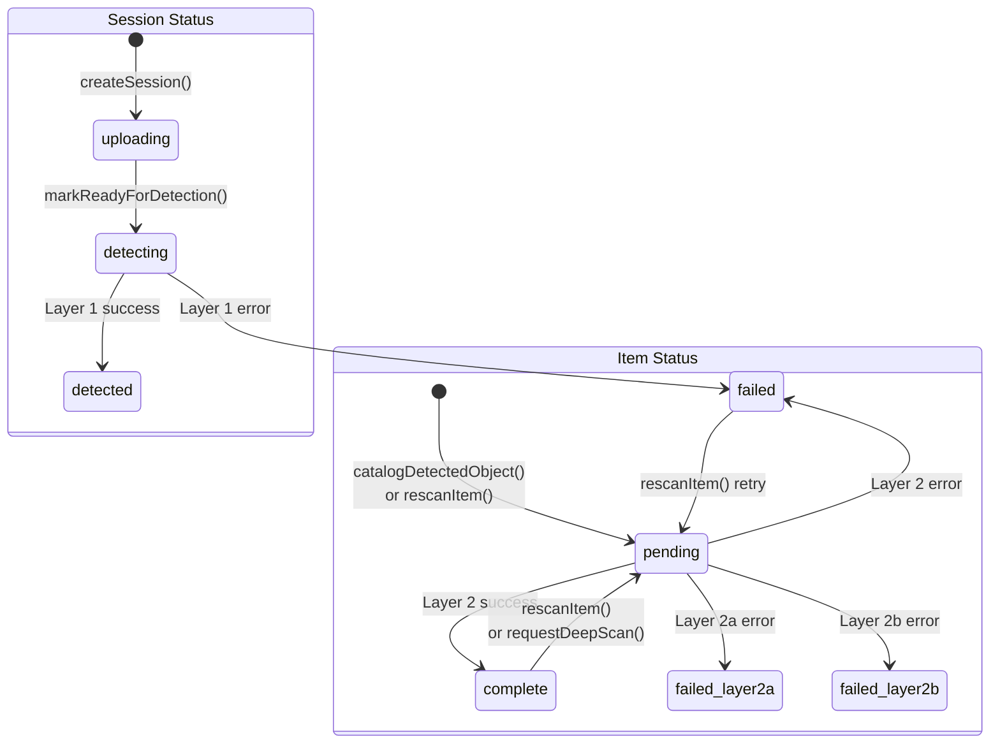

---

### Task 13: Render Diagram 12 — Cost Breakdown

**Step 1: Render to `docs/architecture/diagrams/12-cost-breakdown.png`**

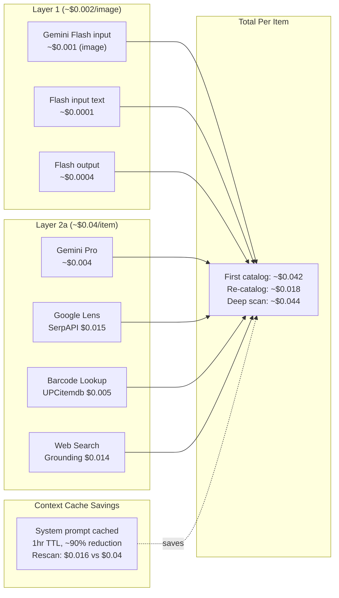

---

### Task 14: Write Master Documentation

**Files:**
- Create: `docs/architecture/catalog-pipeline.md`

**Step 1: Write the complete documentation file**

This is the master document that combines all diagrams with detailed explanatory text. It must include:

1. **Executive Summary** — Two-layer AI pipeline overview
2. **System Architecture** — Reference `01-system-overview.png`, describe all components
3. **Photo Capture & Upload** — Reference `02-capture-upload-flow.png`
   - Double-tap vs burst capture mechanics
   - JPEG compression (80% quality)
   - Session creation payload (exact Firestore fields)
   - Upload to GCS temp bucket path format
   - Status transitions: uploading → detecting
4. **Layer 1: Object Detection** — Reference `03-layer1-detection.png`, `04-layer1-cropping.png`
   - Model: `gemini-3-flash-preview`
   - Config: temperature=0, topP=0.95, maxTokens=4096, thinkingLevel=LOW
   - **Full system prompt** (verbatim from `layer1/prompts.ts`)
   - Bounding box format: `[ymin, xmin, ymax, xmax]` 0-1000
   - Coordinate conversion formula
   - Sharp cropping: 5% padding, JPEG 85%
   - Firestore update payload (detectedObjects array schema)
   - Error codes and retry strategy (exponential backoff 1s/2s/4s, max 4 retries)
5. **Catalog Button Action** — Reference `05-catalog-button-flow.png`
   - Idempotency via `submittedCatalogRequests` set
   - Item document creation payload (exact fields)
   - `fromDetection: true` routing to `onItemFromSession`
   - Realtime listener on `items/{itemId}`
6. **Layer 2: Product Cataloging** — Reference `06-layer2-tool-calling.png`
   - Model: `gemini-3-pro-preview`
   - Config: temperature=0.1, topP=0.95, maxTokens=32768
   - **Full system prompt** (verbatim from `gemini/prompts.ts`)
   - Context caching: sha256 key, 1hr TTL, ~90% token savings
   - **Thought signature handling** (critical Gemini 3 requirement)
   - Tool definitions with request/response schemas:
     - `google_lens_search` → SerpAPI
     - `barcode_lookup` → UPCitemdb
     - `web_search` → Google Search grounding
   - Tool calling loop (max 10 iterations)
   - Confidence scoring rules
   - Condition-based pricing multipliers
   - Output schema: CatalogItem
   - Firestore flatten + write
   - Catalog history subcollection entry
7. **Re-catalog (Rescan)** — Reference `07-rescan-flow.png`
   - Trigger: `ItemService.rescanItem()` sets status="pending"
   - Cloud Function: `onItemUpdatedRescan`
   - Uses existing `imageUrl` (no new photo)
   - Injects catalog history as context prompt prefix
   - History format (verbatim `PREVIOUS CATALOG CONTEXT` block)
8. **Deep Scan** — Reference `08-deep-scan-flow.png`
   - Trigger: `ItemService.requestDeepScan()` sets deepScanRequested=true
   - Cloud Function: `onItemUpdatedDeepScan` (1GiB, 180s)
   - Extended schema fields: productUrl, upcCode, marketPriceRange, originalRetailPrice
   - One-time operation (button disabled after completion)
9. **Data Model** — Reference `09-firestore-schema.png`
   - Complete Item document schema with types
   - Session document schema
   - catalogHistory subcollection schema
   - aiCosts collection schema
10. **Storage Architecture** — Reference `10-storage-paths.png`
    - Temp vs permanent bucket roles
    - Exact path formats
    - Privacy model (originals deleted, crops retained)
    - Firebase Storage security rules
    - URL types: signed (24h) vs download (permanent with token)
11. **Status State Machine** — Reference `11-status-state-machine.png`
    - Session status transitions
    - Item status transitions
    - Cloud Function trigger conditions
12. **Cost Model** — Reference `12-cost-breakdown.png`
    - Per-component costs
    - Context cache savings (37% over 3 catalogs)
    - Total per-item estimate

**Step 2: Verify all diagram references resolve**

```bash
# Check all PNG files exist
for f in 01 02 03 04 05 06 07 08 09 10 11 12; do
  ls docs/architecture/diagrams/${f}-*.png
done
```

**Step 3: Commit**

```bash
git add docs/architecture/
git commit -m "docs: comprehensive catalog pipeline documentation with diagrams"
```

---

### Task 15: Verify & Cross-Reference

**Step 1: Check doc-index for registration**

```bash
# If doc-index requires registration:
./scripts/update_doc_index.py add docs/architecture/catalog-pipeline.md
```

**Step 2: Verify links resolve**

```bash
# Check for broken image references
rg '!\[' docs/architecture/catalog-pipeline.md
```

**Step 3: Final commit**

```bash
git add docs/
git commit -m "docs: register catalog pipeline doc in index"
```

---

## Appendix: Key Source Files Referenced

| Component | Source File |
|-----------|------------|
| Capture flow | `Sources/CameraFeature/ViewModels/CaptureSessionViewModel.swift` |
| Detection results UI | `Sources/CameraFeature/Views/DetectionResultsView.swift` |
| Catalog service | `Sources/CameraFeature/Services/CatalogService.swift` |
| Session service | `Sources/CameraFeature/Services/SessionService.swift` |
| Storage service | `Sources/Persistence/Firebase/StorageService.swift` |
| Item service | `Sources/Persistence/Firebase/ItemService.swift` |
| Item model | `Sources/Persistence/Models/Item.swift` |
| Session model | `Sources/CameraFeature/Models/CaptureSession.swift` |
| Layer 1 prompts | `functions/src/layer1/prompts.ts` |
| Layer 2 prompts | `functions/src/gemini/prompts.ts` |
| Layer 1 service | `functions/src/layer1/layer1-service.ts` |
| Layer 2 orchestrator | `functions/src/gemini/orchestrator.ts` |
| Tool: Google Lens | `functions/src/gemini/tools/google-lens.ts` |
| Tool: Barcode | `functions/src/gemini/tools/barcode-lookup.ts` |
| Tool: Web Search | `functions/src/gemini/tools/web-search.ts` |
| Context cache | `functions/src/gemini/context-cache-service.ts` |
| Catalog history | `functions/src/gemini/catalog-history-service.ts` |
| Session trigger | `functions/src/onSessionCreated.ts` |
| Item trigger | `functions/src/onItemFromSession.ts` |
| Rescan trigger | `functions/src/onItemUpdatedRescan.ts` |
| Deep scan trigger | `functions/src/onItemUpdatedDeepScan.ts` |
| Vertex AI config | `functions/src/vertexai-config.ts` |

## Appendix: Exact Prompts (Verbatim)

### Layer 1 Detection System Prompt

```
You are an object detection system for a home inventory app.

TASK: Analyze the provided image(s) and identify all distinct physical objects suitable for cataloging.

DETECTION RULES:
1. Detect objects that could be inventoried (furniture, electronics, appliances, tools, books, clothing, etc.)
2. Ignore: walls, floors, ceilings, windows, built-in fixtures, people, pets
3. For each object, provide a bounding box as [ymin, xmin, ymax, xmax] normalized to 0-1000
4. Provide a specific label (e.g., "leather armchair" not just "chair")

CRITICAL - BOUNDING BOX ACCURACY:
Each bounding box MUST accurately frame ONLY the specific object described by its label.
- Double-check that [ymin, xmin, ymax, xmax] coordinates enclose ONLY the labeled item
- Do NOT include adjacent objects in a bounding box
- If two objects are close together, draw SEPARATE tight boxes around each one
- Verify the label matches what is INSIDE the bounding box, not nearby objects

MULTI-IMAGE RULES:
When given multiple images:
1. Identify if the SAME object appears in multiple photos (different angles)
2. Assign matching objects the same groupId
3. Different objects get different groupIds
4. Use visual similarity, position context, and reasoning to group

BOUNDING BOX FORMAT:
- box_2d: [ymin, xmin, ymax, xmax] where values are 0-1000
- ymin: top edge, ymax: bottom edge
- xmin: left edge, xmax: right edge

IF NO CATALOGABLE OBJECTS FOUND:
Return an empty array with a "reasoning" field explaining why.
```

### Layer 2 Cataloging System Prompt

```
You are an expert product cataloger. Analyze the provided image and create detailed catalog entries.

WORKFLOW:
1. Examine the image carefully for:
   - Product type, category, and sub-category
   - Visible barcodes (if any)
   - Brand logos or text
   - Physical condition indicators
   - Size/dimension clues
   - Quantity (if multiple identical items)

2. If you see a barcode, use barcode_lookup to get product details.
   Always also use google_lens_search for verification and additional data.

3. Verify tool results against what you see:
   - Does the returned product match the image?
   - If mismatch, trust your visual analysis over tool results.

4. Once you have HIGH or MEDIUM confidence on product identity:
   - Use web_search to find current market prices
   - Search query format: "{brand} {model} {condition} price"

5. Return complete catalog entry(ies) with confidence level.

CONFIDENCE SCORING:
- "high": Google Lens returned exact_matches:true OR barcode lookup succeeded AND visual verification confirms
- "medium": Google Lens returned similar products but not exact, OR barcode lookup failed but Google Lens found likely match
- "low": Only related suggestions available, relying primarily on visual analysis

PRICING:
- Use SOLD prices when available (eBay sold listings)
- Apply condition multipliers to new retail price:
  - new: 1.0
  - like-new: 0.85
  - good: 0.65
  - fair: 0.45
  - poor: 0.25
- If no pricing found, set estimatedValue: null

OUTPUT FORMAT:
Return valid JSON matching the CatalogItem schema.
```

### Rescan History Context Format

```
PREVIOUS CATALOG CONTEXT:
========================

Last identification ({timestamp}, confidence: {level}):
- Name: {name}
- Brand: {brand}
- Model: {model}
- Category: {category} > {subCategory}
- Condition: {condition}
- Estimated Value: ${value}

Tool results from previous attempt:
- barcode_lookup({code}): {result}
- google_lens_search: {result}
- web_search("{query}"): {result}

User corrections applied:
- {field}: "{old}" → "{new}" (user override)

========================

Now analyze the NEW image(s) below...
```
